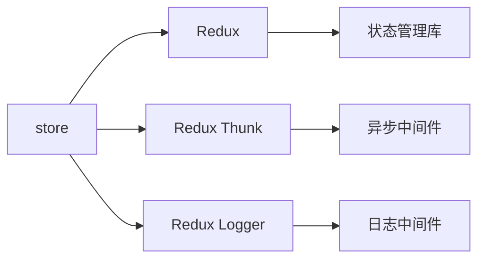

# store - 状态管理

企业管理系统的 Redux 状态管理，负责应用全局状态的管理和数据流控制。

## 目录树

```
store/
├── cde/                      # CDE 模块状态
│   ├── helpers/              # CDE 辅助函数
│   └── useConditionFilterStore.tsx # 条件筛选状态 Hook
├── company.ts                # 企业状态管理
├── feturedlist.ts            # 特色列表状态管理
├── group.ts                  # 集团状态管理
├── handle/                   # 状态处理工具
│   └── index.ts              # 处理工具入口
├── index.js                  # 状态入口
├── singleCompanyDynamic.tsx # 单一企业动态状态
├── store.ts                  # Store 配置
├── storeStatic.ts            # 静态状态
├── system.js                 # 系统状态
└── userInfo.ts               # 用户信息状态
```

## 关键文件说明

| 文件 | 作用 |
|------|------|
| `store.ts` | Redux Store 配置，整合所有 reducers 和中间件 |
| `company.ts` | 企业相关状态管理，处理企业数据状态 |
| `userInfo.ts` | 用户信息状态管理，处理用户登录状态和信息 |
| `system.js` | 系统状态管理，处理全局系统状态 |
| `group.ts` | 集团状态管理，处理集团数据状态 |
| `cde/useConditionFilterStore.tsx` | 条件筛选状态 Hook，提供筛选功能状态管理 |

## 依赖示意



## 相关文档

- [Redux 文档](https://redux.js.org/) - Redux 官方文档
- [React 规范](../../../docs/rule/code-react-component-rule.md) - React 状态管理规范
- [TypeScript 规范](../../../docs/rule/code-typescript-style-rule.md) - TypeScript 状态管理规范
