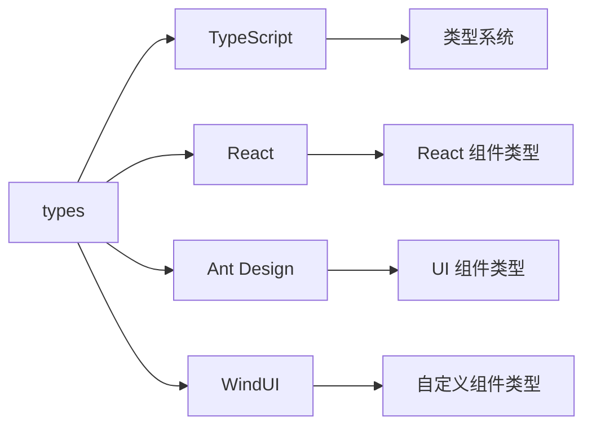

# types - TypeScript 类型定义

企业管理系统的 TypeScript 类型定义，提供全局类型、组件类型、API 响应类型等，确保类型安全。

## 目录树

```
types/
├── WindUI.d.ts               # WindUI 组件库类型定义
├── WindUI/                   # WindUI 组件类型
│   └── horizontalTable.ts    # 横向表格类型
├── configDetail/             # 配置详情类型
│   ├── chart.ts              # 图表类型
│   ├── common.ts             # 通用类型
│   ├── index.ts              # 入口文件
│   ├── module.ts             # 模块类型
│   ├── node.ts               # 节点类型
│   ├── search.ts             # 搜索类型
│   └── table.ts              # 表格类型
├── corpDetail/               # 企业详情类型
│   ├── basicNum.ts           # 基础数据类型
│   ├── index.ts              # 入口文件
│   ├── menu.ts               # 菜单类型
│   ├── module.ts             # 模块类型
│   └── node/                 # 节点类型目录
├── global.d.ts               # 全局类型定义
├── img.d.ts                  # 图片模块类型
├── less.d.ts                 # Less 样式类型
├── misc.ts                   # 杂项类型
└── utils.d.ts                # 工具函数类型
```

## 关键文件说明

| 文件 | 作用 |
|------|------|
| `global.d.ts` | 全局类型定义，扩展全局对象类型 |
| `configDetail/` | 配置详情相关类型，包括图表、表格、搜索等类型定义 |
| `corpDetail/` | 企业详情相关类型，包括基础数据、菜单、模块等类型定义 |
| `WindUI.d.ts` | WindUI 组件库类型定义，提供组件属性类型 |
| `misc.ts` | 杂项类型，包含各种通用类型定义 |
| `utils.d.ts` | 工具函数类型，定义工具函数的参数和返回类型 |

## 依赖示意



## 相关文档

- [TypeScript 官方文档](https://www.typescriptlang.org/docs/) - TypeScript 官方文档
- [TypeScript 规范](../../../docs/rule/code-typescript-style-rule.md) - TypeScript 类型定义规范
- [React 规范](../../../docs/rule/code-react-component-rule.md) - React 类型定义规范
