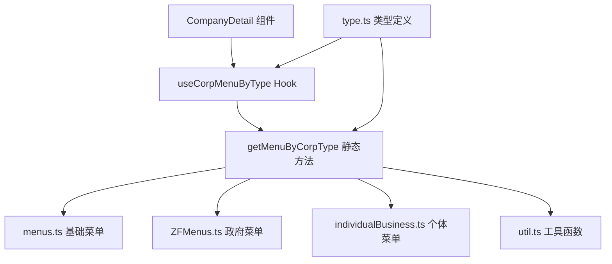

# 企业菜单配置模块

负责根据企业类型动态返回对应的菜单配置，支持个体工商户、政府机构、社会组织等不同类型的菜单差异化展示。

## 目录结构

```
menu/
├── index.ts                    # 统一导出入口
├── type.ts                     # 菜单配置类型定义
├── menus.ts                    # 普通企业基础菜单配置
├── ZFMenus.ts                  # 政府机构/事业单位菜单配置
├── individualBusiness.ts       # 个体工商户菜单配置
├── getMenuByCorpType.ts        # 菜单获取静态方法
├── useCorpMenu.tsx             # 菜单处理 Hook
├── useCorpMenuByType.ts        # 菜单类型判断 Hook
├── util.ts                     # 工具函数
└── README.md                   # 模块说明文档
```

## 核心文件说明

| 文件 | 作用 | 导出内容 |
|------|------|----------|
| `type.ts` | 定义菜单配置类型 | `ICorpMenuCfg` |
| `getMenuByCorpType.ts` | 核心菜单获取逻辑 | `getMenuByCorpType()` |
| `useCorpMenuByType.ts` | React Hook 封装 | `useCorpMenuByType()` |
| `menus.ts` | 基础菜单配置 | `CompanyDetailBaseMenus` |

## 依赖关系



## 相关文档

- [企业详情菜单重构方案](../../../docs/issues/company-detail-menu-issues.md)
- [TypeScript 开发规范](../../../../docs/rule/typescript-rule.md)
- [React 开发规范](../../../../docs/rule/react-rule.md)
