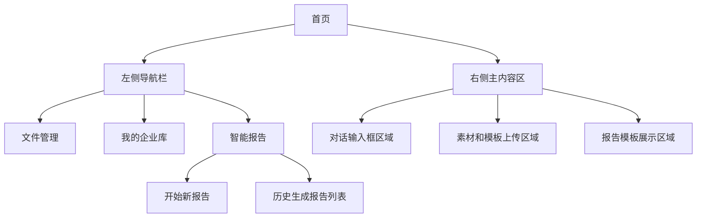
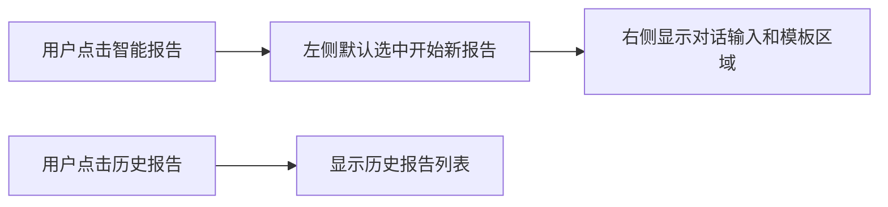
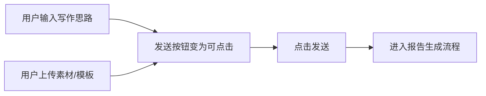
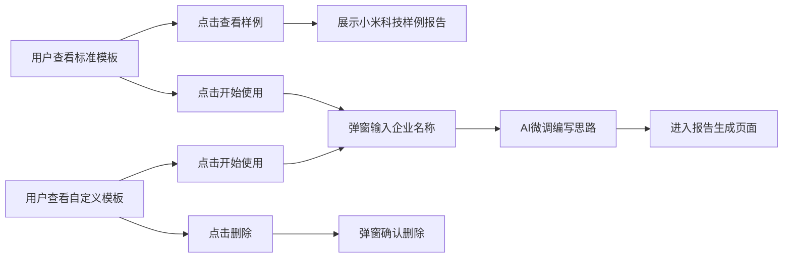

# 首页模块需求文档

## 功能概述

首页模块是智能报告生成系统的入口页面，用户通过输入写作思路、上传素材文件、选择模板来生成报告。页面采用左右分栏布局，支持智能对话和模板管理。

## 界面设计

### 页面布局

### 导航栏结构

- **一级菜单**: 文件管理、我的企业库、智能报告
- **智能报告子菜单**: 开始新报告、历史生成报告列表
- **默认选中**: 点击智能报告时自动选中"开始新报告"

### 主内容区域

- **上方区域**: 对话输入框、素材和模板上传入口
- **下方区域**: 全部报告模板展示区域

## 用户操作

### 导航操作流程

### 输入和上传操作流程

### 模板使用操作流程

## 数据展示

### 对话输入框信息

对话输入框使用ChatSenderReport公共组件，具体功能需求请参考：[ChatSenderReport需求文档](../components/ChatSenderReport/requirements.md)

| 字段             | 内容                                                                                | 格式要求                |
| ---------------- | ----------------------------------------------------------------------------------- | ----------------------- |
| 默认占位符文本   | "告诉我您的写作思路，您也可以直接上传附件或者输入@引用文件，我将为您自动生成报告。" | 灰色提示文字            |
| 上传文件后占位符 | "告诉我您的写作思路，根据文件内容为您生成报告"                                      | 灰色提示文字            |
| 输入内容         | 用户的写作思路描述                                                                  | 多行文本，支持@引用文件 |
| 发送按钮状态     | 根据输入和上传内容动态变化                                                          | 无内容时置灰不可点击    |

### 模板展示信息

| 字段     | 内容                     | 格式要求                                       |
| -------- | ------------------------ | ---------------------------------------------- |
| 模板标题 | 模板名称                 | 文本显示                                       |
| 模板标签 | "标准模板"或"自定义模板" | 不同颜色的标签                                 |
| 排序规则 | 使用时间倒序展示         | 后端提供排序数据，标准模板和自定义模板分别排序 |
| 操作按钮 | 查看样例/开始使用/删除   | 根据模板类型显示不同按钮                       |

### 历史报告信息

| 字段     | 内容               | 格式要求                       |
| -------- | ------------------ | ------------------------------ |
| 报告标题 | 历史生成的报告名称 | 文本显示                       |
| 生成时间 | 报告创建时间       | 时间格式显示                   |
| 排序规则 | 生成时间倒序展示   | 后端提供排序数据，最新的在顶部 |

## 业务规则

### 导航显示规则

- 点击智能报告时，左侧菜单默认选中"开始新报告"
- 历史报告列表展示在左侧导航栏中
- 智能报告为二级菜单结构

### 输入框状态规则

输入框的详细交互规则和状态管理请参考：[ChatSenderReport需求文档](../components/ChatSenderReport/requirements.md)

主要规则：

- 发送按钮在未输入任何内容且未上传任何文件时置灰
- 用户输入内容或上传文件后，发送按钮变为可点击状态
- 支持@符号引用文件功能

### 模板操作规则

| 模板类型   | 可执行操作         | 限制条件       |
| ---------- | ------------------ | -------------- |
| 标准模板   | 查看样例、开始使用 | 不可删除       |
| 自定义模板 | 开始使用、删除     | 可删除，需确认 |

### 模板使用规则

- 标准模板查看样例：展示小米科技有限责任公司的样例报告
- 点击开始使用：弹窗要求输入企业名称
- 输入企业名称后：系统后端自动获取企业基础信息，连同模板大纲和编写思路一起提交给AI
- AI判断逻辑：保持大纲不变，根据行业等因素微调编写思路
- 处理完成后：直接进入报告生成页面，无需用户再次确认

### 删除确认规则

- 自定义模板删除提示：「请确认要删除该报告模板，删除后不可恢复。」
- 标准模板不显示删除按钮
- 删除操作需要用户二次确认

### 排序显示规则

- 报告模板：后端提供使用时间倒序的数据，标准模板和自定义模板分别排序展示
- 历史报告：后端提供生成时间倒序的数据，展示在左侧导航栏

---

_最后更新时间: 2024年12月_
