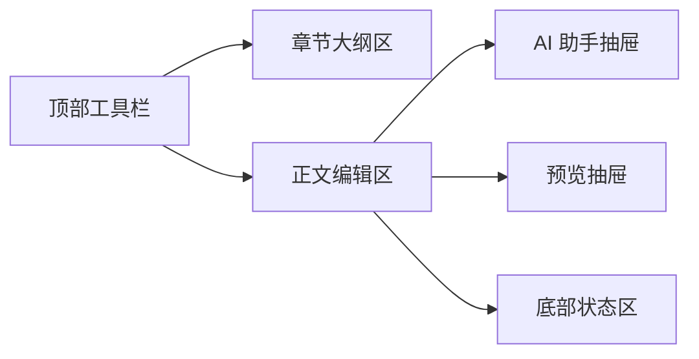
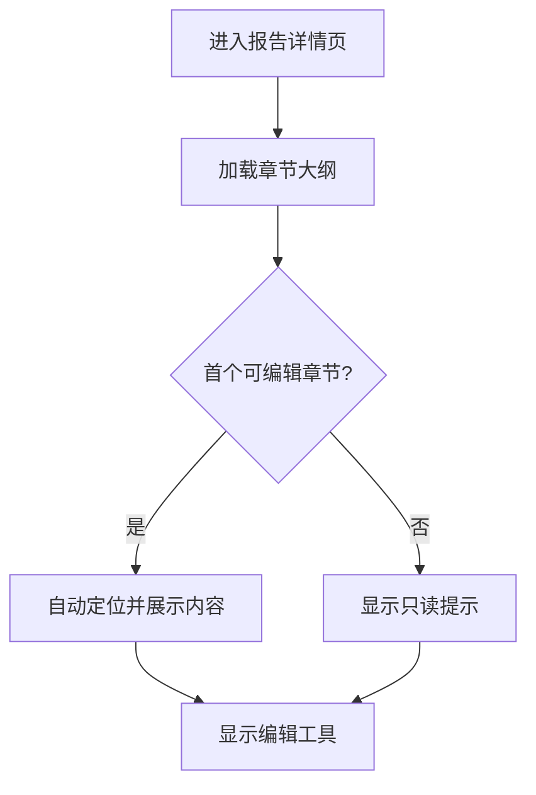
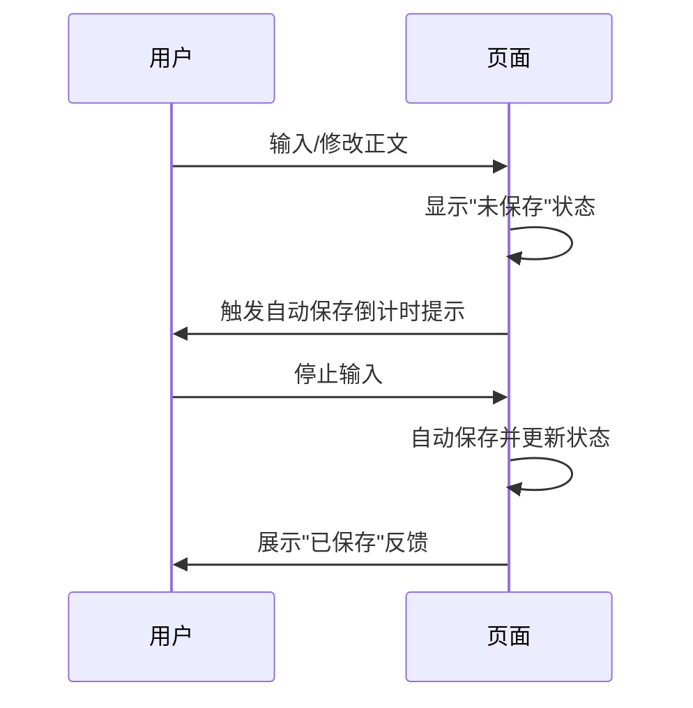
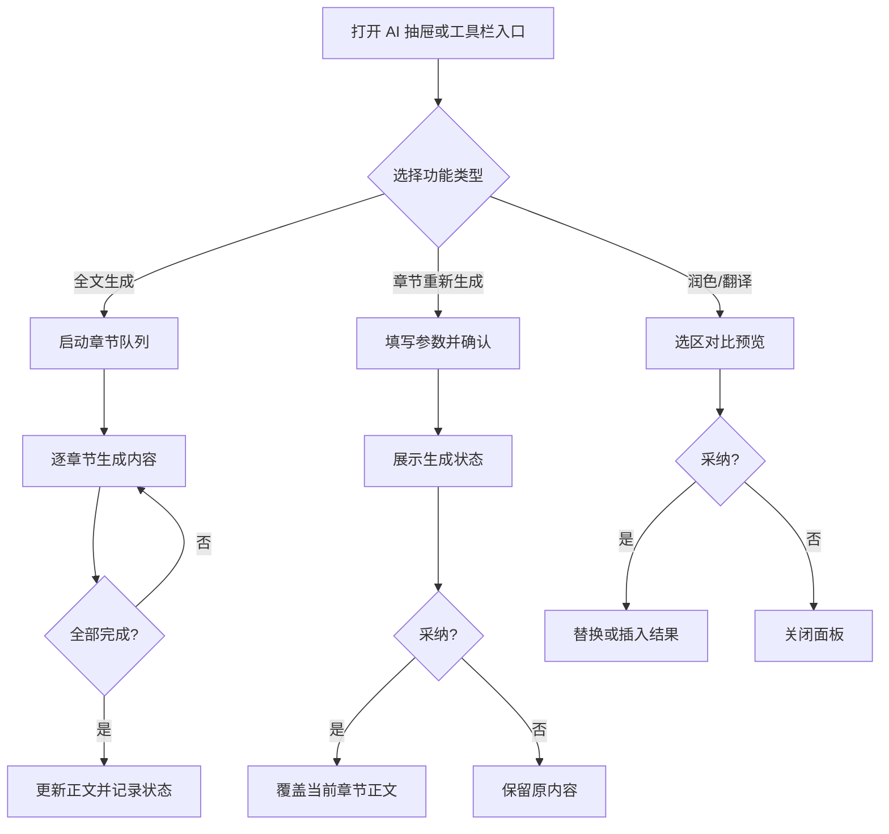
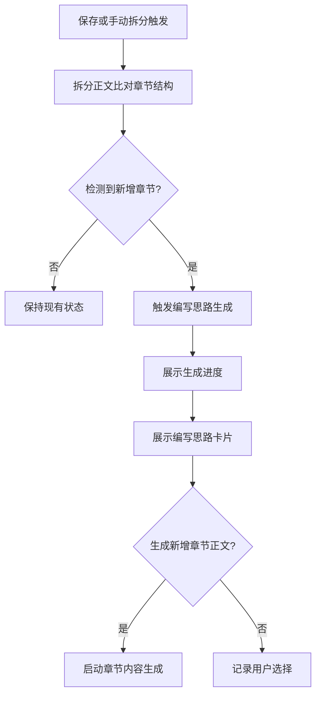

# AI 智能报告编辑器 - 前端需求文档

> **文档定位**：指导前端构建报告编辑界面，明确展示内容、用户操作与交互反馈。

## 功能说明

- 提供单份报告的章节化编辑体验，支持在统一页面内浏览大纲、编辑章节内容、调用 AI 助手及查看预览。
- 允许用户在不改变章节结构的前提下对正文与标题进行编辑、格式化、润色和审阅。
- 支持按章节触发 AI 生成与优化动作，并在页面内同步展示生成状态和结果。
- 在保存后拆分报告内容并比对章节结构，若检测到新增章节则触发编写思路生成流程。
- 通过实时状态提示、自动保存提示和异常反馈，保证编辑进度与内容安全。

## 页面布局

| 区域        | 页面位置       | 展示内容                                        | 默认状态             | 用户可执行操作                                              |
| ----------- | -------------- | ----------------------------------------------- | -------------------- | ----------------------------------------------------------- |
| 顶部工具栏  | 页面顶部横向   | 文档标题、保存状态、编辑命令、AI 入口、预览开关 | 常显                 | 点击命令按钮、触发全文生成/拆分对齐、切换模式、查看状态提示 |
| 章节大纲区  | 左侧纵向列     | 章节树、章节状态、搜索过滤                      | 展开                 | 选择章节、折叠子级、查看状态徽标、搜索章节                  |
| 正文编辑区  | 页面中央       | 当前章节标题、正文内容、光标位置                | 首次加载展示首章内容 | 输入文本、选区格式化、调用 AI 功能、撤销重做                |
| AI 助手抽屉 | 右侧可展开面板 | AI 功能列表、参数输入、生成记录、编写思路队列   | 默认收起             | 展开面板、填写参数、触发生成、查看结果与编写思路            |
| 预览抽屉    | 右侧可展开面板 | 渲染后的章节或全文预览、导出按钮                | 默认收起             | 切换章节预览、选择预览范围、执行导出                        |
| 底部状态区  | 页面底部横条   | 自动保存状态、网络状态、光标段落信息            | 常显                 | 查看保存/拆分状态提示、点击打开详细日志（如提供）           |

## 操作流程

### 1. 进入与章节定位

| 步骤 | 用户操作         | 页面反馈                       | 后续提示                   |
| ---- | ---------------- | ------------------------------ | -------------------------- |
| 1    | 打开报告详情页面 | 显示加载骨架与进度条           | 直至数据加载完成           |
| 2    | 查看左侧大纲     | 树形结构展示全部章节与状态徽标 | 无可编辑章节时整体置灰     |
| 3    | 点击某章节       | 中央编辑区切换到对应章节       | 工具栏同步高亮当前章节名称 |

### 2. 正文编辑与保存

| 场景     | 用户操作           | 界面变化                    | 限制规则                         |
| -------- | ------------------ | --------------------------- | -------------------------------- |
| 自动保存 | 停止输入 ≥ 2 秒    | 底部状态区显示保存中 → 成功 | 保存失败时显示重试按钮与错误提示 |
| 手动保存 | 点击工具栏保存按钮 | 弹出保存成功气泡提醒        | 保存按钮在进行中不可重复点击     |
| 离开提示 | 关闭标签/切换页面  | 弹窗询问是否保存未提交内容  | 仅在存在未保存更改时触发         |

### 3. AI 生成与应用

| 功能                   | 触发方式                                 | 页面展示                                            | 用户反馈                               |
| ---------------------- | ---------------------------------------- | --------------------------------------------------- | -------------------------------------- |
| 全文生成（逐章节自动） | 点击“开始生成”或确认大纲后自动执行       | AI 抽屉展示章节队列与当前进度，正文区按顺序填充内容 | 提供暂停与继续按钮，进度条显示剩余章节 |
| 单章节重新生成         | 章节标题右侧“重新生成”按钮或 AI 抽屉入口 | 抽屉顶部显示参数表单与目标章节标签                  | 生成中显示进度条，完成后正文区自动替换 |
| 新增章节正文生成       | 编写思路卡片中的“立即生成正文”按钮       | 抽屉聚焦新增章节，展示生成状态                      | 成功后提示本章节已填充，失败提供重试   |
| 文本润色               | 编辑区选中文本后点击工具栏 AI 按钮       | 在抽屉中预览原文与结果对比                          | 可选择替换原文或插入至光标后           |
| 智能翻译               | 选中文本后调用翻译功能                   | 抽屉显示源语言与目标语言下拉                        | 结果卡片提供“复制”“替换”两种操作       |

> 全文生成启动后按照章节队列逐一填充内容，可随时暂停；新增章节生成请求集中展示在编写思路队列中供逐项确认。

### 4. 预览与导出

| 步骤 | 用户操作           | 页面反馈                               | 结果                       |
| ---- | ------------------ | -------------------------------------- | -------------------------- |
| 1    | 点击工具栏预览按钮 | 右侧预览抽屉展开，默认显示当前章节     | 抽屉顶部提示当前预览范围   |
| 2    | 选择预览范围       | 下拉选项提供“当前章节/全文”            | 预览内容实时切换           |
| 3    | 点击导出按钮       | 弹出导出选项弹窗（格式列表、页边距等） | 用户确认后触发导出流程     |
| 4    | 导出完成           | 显示下载链接或自动开始下载             | 失败时在弹窗内展示错误信息 |

### 5. 章节新增检测与编写思路生成

| 步骤 | 用户操作                               | 页面反馈                                       | 交互说明                             |
| ---- | -------------------------------------- | ---------------------------------------------- | ------------------------------------ |
| 1    | 保存章节或点击“拆分并对齐”按钮         | 底部状态区显示拆分进度                         | 执行期间禁止重复触发                 |
| 2    | 系统完成章节差异比对                   | 如有新增章节，大纲中新增节点高亮               | 删除章节时需弹窗确认移除内容         |
| 3    | 自动打开 AI 抽屉并展示编写思路生成进度 | 抽屉顶部显示“正在为新增章节生成编写思路”       | 用户可手动取消生成                   |
| 4    | 思路生成完毕                           | 展示思路卡片，提供“立即生成正文”“稍后处理”按钮 | 用户选择会记录在状态数据中           |
| 5    | 用户选择生成正文                       | 触发对应章节自动生成流程并显示状态             | 若选择稍后处理，保持编写思路在列表中 |

## 数据信息

### 展示类数据

| 数据项           | 显示位置             | 来源             | 刷新规则               | 备注                              |
| ---------------- | -------------------- | ---------------- | ---------------------- | --------------------------------- |
| 报告标题         | 工具栏左侧           | 页面入参         | 页面加载后只读显示     | Hover 显示完整标题                |
| 章节名称列表     | 章节大纲区           | 接口返回         | 切换章节或刷新时更新   | 状态徽标显示待生成/生成中/完成    |
| 章节生成状态     | 工具栏、抽屉状态标签 | 后端状态         | 状态变化后界面即时刷新 | 失败状态需显示重试入口            |
| 编写思路生成状态 | AI 抽屉、章节大纲区  | 后端状态         | 状态变化后界面即时刷新 | 展示队列进度并提供失败重试入口    |
| 自动保存状态     | 底部状态区           | 界面状态指示     | 保存开始/完成时更新    | 成功显示时间戳，失败显示错误文案  |
| 章节拆分结果     | 底部状态区、通知横幅 | 前端内容拆分对比 | 每次拆分完成后展示一次 | 显示新增/删除章节数量与下一步入口 |
| AI 结果历史      | AI 抽屉              | 当前会话记录     | 每次生成追加最新卡片   | 可按时间倒序排列                  |

### 用户输入数据

| 输入区域         | 字段                          | 格式/约束                         | 校验反馈                             |
| ---------------- | ----------------------------- | --------------------------------- | ------------------------------------ |
| 正文编辑区       | 正文内容                      | 富文本，禁止粘贴脚本标签          | 不合规时弹出提示并撤回修改           |
| 正文编辑区       | 章节标题                      | 文本 ≤ 60 字符                    | 空值时显示红色警示并禁止保存         |
| AI 参数表单      | 主题、风格、字数范围等        | 主题必填，字数范围限定在 500-5000 | 缺失必填项时在表单项下方展示错误提示 |
| 编写思路确认弹窗 | 操作选择（立即生成/稍后处理） | 必须择一，默认不选                | 未选择时确认按钮置灰                 |
| 导出弹窗         | 文件格式选择                  | 单选项                            | 未选择格式时禁用“确认导出”           |

### 状态数据

| 状态类型           | 存放位置     | 显示规则                                         |
| ------------------ | ------------ | ------------------------------------------------ |
| 当前选中章节       | 页面全局状态 | 用于同步大纲高亮、编辑区内容、工具栏标题         |
| 未保存变更标记     | 页面全局状态 | 为 true 时在工具栏和浏览器标签显示红点提示       |
| 章节结构版本号     | 页面全局状态 | 每次拆分完成后更新，用于决定是否执行编写思路生成 |
| AI 任务编号        | AI 抽屉面板  | 同一任务中的结果卡片按编号归类，便于追踪         |
| 待生成新增章节列表 | AI 抽屉面板  | 列表为空时隐藏编写思路提醒与批量操作             |

## 交互反馈

### 状态与提示

| 场景             | 反馈类型          | 展示位置        | 描述                                                  |
| ---------------- | ----------------- | --------------- | ----------------------------------------------------- |
| 自动保存成功     | 状态徽标 + 时间戳 | 底部状态区      | 显示“已保存 · 10:24:32”并维持 3 秒                    |
| 自动保存失败     | 错误横幅          | 底部状态区      | 文案包含失败原因与重试按钮                            |
| 章节拆分完成     | 成功横幅          | 底部状态区      | 展示新增/删除章节数量，可展开查看明细                 |
| AI 生成中        | 进度条 + 打字动画 | AI 抽屉结果区域 | 提示剩余步骤及取消按钮                                |
| AI 生成失败      | 错误卡片          | AI 抽屉结果区域 | 显示错误码、重试与复制错误信息                        |
| 编写思路生成完成 | 信息卡片          | AI 抽屉结果区域 | 提醒确认是否生成新增章节正文，提供“立即生成/稍后处理” |
| 预览加载         | 骨架屏            | 预览抽屉        | 在渲染完成前显示骨架占位                              |

### 交互规则

| 条件            | 页面表现                                               | 目的                     |
| --------------- | ------------------------------------------------------ | ------------------------ |
| 未选择章节      | 编辑区显示空态插画与“选择章节开始编辑”提示             | 引导用户操作             |
| 章节只读        | 编辑区顶部显示只读横幅，工具栏禁用编辑按钮             | 避免越权操作             |
| 选区为空触发 AI | AI 抽屉参数区域提示“需要选中文本或选择章节”并禁用提交  | 阻止错误调用             |
| 章节生成进行中  | 该章节在大纲中显示旋转状态图标并禁止切换至其他章节生成 | 防止重复生成             |
| 检测到新增章节  | 弹出编写思路提示并高亮大纲节点                         | 引导用户完成新增章节写作 |
| 章节删除待确认  | 弹窗提示即将移除章节并要求确认                         | 防止误删内容             |
| 导出处理中      | 导出弹窗显示进度条并禁用关闭                           | 避免中断流程             |

### 空态与异常处理

| 场景             | 空态展示                                        | 操作建议                   |
| ---------------- | ----------------------------------------------- | -------------------------- |
| 无章节可编辑     | 大纲区空态插画 + “暂无可编辑章节，请联系管理员” | 提供返回列表按钮           |
| AI 无返回结果    | 抽屉内展示空状态卡片 + “尝试调整参数”           | 显示返回按钮与重试入口     |
| 暂无编写思路任务 | AI 抽屉空态提示“暂无新增章节需要处理”           | 提供返回大纲按钮与刷新入口 |
| 网络断连         | 页面顶部浮层提示“已断开，请检查网络”            | 自动重试连接，提供刷新按钮 |
| 导出失败         | 导出弹窗内显示失败原因                          | 提供重新导出与反馈按钮     |

## 检查要点

- [ ] 功能说明覆盖主要操作目的
- [ ] 页面布局明确呈现各区域与默认状态
- [ ] 操作流程图与步骤描述完整
- [ ] 数据信息表格列出展示与输入要求
- [ ] 交互反馈包含状态提示与异常处理
