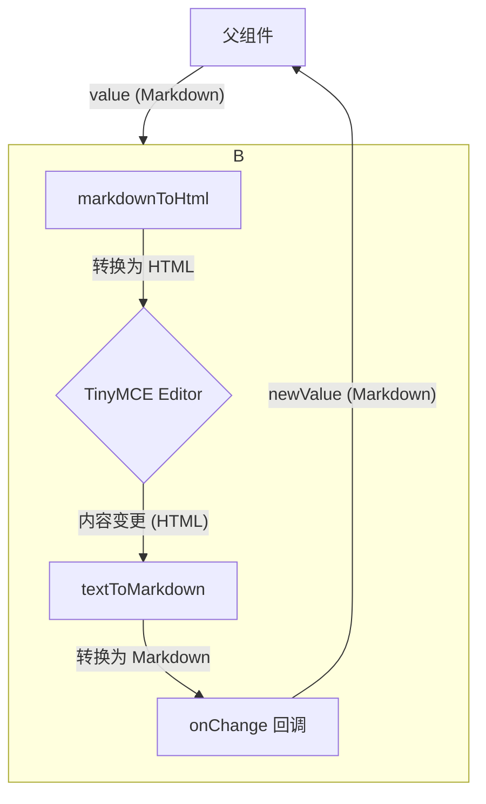

# 💻 技术设计文档：报告大纲编辑器 (FreeOutlineEditor)

## 一、组件名称

报告大纲编辑器 (FreeOutlineEditor)

> **备注**：此组件的核心目标是提供一个结构化、自动编号的大纲编辑器，同时为了减少项目依赖，将基于项目中已有的 **TinyMCE** 编辑器实现。

## 二、核心技术选型

### 1. 技术栈

- **核心库**: [**TinyMCE 6**](https://www.tinymce.com/)
- **React 封装**: [`@tinymce/tinymce-react`](https://www.tiny.cloud/docs/integrations/react/)
- **语言**: TypeScript

### 2. 选型理由

项目中已广泛使用 TinyMCE 作为富文本编辑器。为了整合技术栈、减少不必要的依赖（如 CodeMirror），并利用 TinyMCE 成熟的生态系统，我们决定采用 TinyMCE 实现大纲编辑器。

**TinyMCE 的优势**:

- **依赖复用**：无需引入新的编辑器库，减小了最终打包体积。
- **强大的插件系统**：内置的 `lists` 插件能很好地支持有序列表的层级、编号和缩进需求。
- **成熟的 API**：提供了丰富的事件钩子（如 `setup`, `paste_preprocess`）和配置项，可以轻松实现自定义需求，如初始内容转换和粘贴格式化。
- **功能稳定**：作为一款成熟的商用级编辑器，其稳定性和兼容性有保障。

## 三、架构设计

### 1. 组件 API

```typescript
interface FreeOutlineEditorProps {
  /**
   * 编辑器内容。
   * 格式为 Markdown，`#` 表示主标题 (h1)，`##` 及以上表示大纲层级。
   * @example "# 报告大纲\n## 引言\n### 项目背景"
   */
  value: string;

  /**
   * 内容变更时的回调函数。
   * 返回 Markdown 格式的大纲。
   */
  onChange: (value: string) => void;

  /**
   * 是否只读。
   */
  readOnly?: boolean;

  /**
   * 其他 props，如 style, className 等
   */
  [key: string]: any;
}
```

### 2. 数据流与格式转换

组件的外部接口使用 **Markdown** 格式，而内部 TinyMCE 编辑器则使用 **HTML**。因此，数据在组件内外流动时需要进行格式转换，这构成了核心的数据处理链路。



**数据流详解**:

1. **输入 (`value`)**: 父组件传入 Markdown 格式的字符串。
2. **`markdownToHtml`**: 组件内部的转换函数接收 Markdown，将其解析为 TinyMCE 可渲染的 HTML `<ol>` 列表。`#` 的数量决定了 `<li>` 的 `margin-left`，从而模拟层级。
3. **TinyMCE 编辑**: 用户在编辑器中操作的是 HTML 列表。`Tab` 等按键会改变列表的 DOM 结构。
4. **`textToMarkdown`**: 当内容变更时，`onEditorChange` 事件触发。我们首先从编辑器获取纯文本内容（TinyMCE 会将列表转为带缩进的文本），然后 `textToMarkdown` 函数再将其转换回 Markdown 格式。
5. **输出 (`onChange`)**: 转换后的 Markdown 字符串通过回调函数传递给父组件。

## 四、关键功能实现方案

### 1. Markdown 格式与 HTML 的相互转换 (核心逻辑)

这是实现该组件的核心。我们不依赖 `setup` 或 `initialValue`，而是通过 `useEffect` 监控 `value` prop 的变化，以确保组件完全受控。

- **`markdownToHtml(markdown)`**:

  - 将输入的 Markdown 字符串按行分割。
  - **处理标题行**: 查找所有以 `# ` (单个井号)开头的行。每个这样的行都会被转换为一个独立的 `<h1>` 标签。这可以正确处理用户在标题中换行导致的多行标题。
  - 将其余的行 (`##` 及以上) 收集起来。
  - 对这些行，用正则表达式 `^(#+)\s+` 匹配并提取 `#` 的数量。层级将根据 `##` (作为第一级) 计算，例如，`##` 的 `margin-left` 为 0, `###` 的为 `2em`。
  - 将处理后的行内容转换为 `<li>` 元素。
  - 将所有 `<li>` 包裹在 `<ol>` 中。
  - 最终拼接成 `<h1>...</h1><ol>...</ol>` 的结构。

- **`textToMarkdown(html)`**:

  - 这个转换稍微复杂，因为需要从编辑器的 DOM 结构中反向推导。
  - 首先，从 TinyMCE 获取 HTML 内容 (`getContent()`)。
  - 使用 DOM 解析器（如浏览器的 `DOMParser`）处理 HTML 字符串。
  - 提取 `<h1>` 标签的文本内容，并为其加上 `# ` 前缀。
  - 遍历 `<ol>` 中的所有 `<li>` 元素。根据其在 DOM 树中的嵌套深度（或计算其 `margin-left`），确定其层级。
  - 根据层级，在 `<li>` 文本前添加相应数量的 `#`（`##` 起始）。
  - 将 `<h1>` 和列表项的 Markdown 文本重新组合成最终的字符串。

- **`useEffect` 同步逻辑**:

  - 在 `useEffect` 中，比较外部传入的 `value` (Markdown) 和编辑器当前内容转换后的 Markdown。
  - 如果两者不一致，说明 `value` prop 已从外部更新，此时调用 `editor.setContent(markdownToHtml(value))` 来同步视图。

### 2. 自动层级编号与调整 (Tab / Shift+Tab)

此功能主要由 TinyMCE 的 **`lists`** 插件管理，应用于编辑器中的 `<ol>` 部分。

- **实现方式**: 在 `plugins` 配置中启用 `lists`。
- **效果**:
  - 编辑器会自动为 `<ol>` 内的 `<li>` 结构生成多级序号。
  - `<h1>` 标题不受影响。
  - 用户使用 `Tab` 和 `Shift+Tab` 键可以自然地增加或减少当前列表项的缩进层级，序号也会自动更新。

### 3. 粘贴内容自动格式化

为了确保粘贴进来的内容格式统一，我们需要清理其原有的格式和编号。

- **实现方式**: 使用 `paste_preprocess` 配置项。
- **实现逻辑**:
  1. 在 `paste_preprocess` 回调中，获取粘贴的原始内容 (`args.content`)。
  2. 首先，通过简单的正则替换剥离所有 HTML 标签，得到纯文本。
  3. 然后，对纯文本按行分割。
  4. 对每一行应用正则表达式 `^#+\s*`，移除行首的 Markdown 标题标记。
  5. 最后，将清理后的行重新组合成一个 HTML 有序列表 (`<ol><li>...</li></ol>`)，并将其赋值回 `args.content`。

### 4. 样式与数据输出

- **样式**: 通过 `content_style` 配置项注入自定义 CSS，确保编辑器内部的字体、边距等样式符合设计要求，并隐藏不需要的 UI 元素（如状态栏）。
- **数据输出**: 在 `onEditorChange` 回调中，调用 `textToMarkdown(editor.getContent({ format: 'text' }))` 方法，将编辑器的文本内容转换为 Markdown 格式后输出。

### 5. 自定义层级编号 (1.1, 1.1.1)

为了实现 `1.1.1` 格式的层级编号，我们不依赖 TinyMCE `lists` 插件的默认输出，而是采用纯 CSS 的 `counters` 方案进行样式覆盖。这是最佳实践，因为它将编号的展示与内容本身分离，用户无法意外删除或编辑编号。

- **实现方式**: 通过 `content_style` 注入自定义 CSS。
- **CSS 核心逻辑**:
  1. 在根 `<ol>` 上使用 `counter-reset` 初始化一个计数器。
  2. 在每个 `<li>` 元素上使用 `counter-increment` 来增加计数器。
  3. 利用 `::before` 伪元素和 `content: counters(item, '.') '. ';` 来显示嵌套的编号。`counters()` 函数会自动处理嵌套层级，并用 `.` 连接。
  4. 隐藏默认的列表标记 (`list-style-type: none`)。
- **优势**: 此方法与 `lists` 插件完美兼容。插件负责处理 `Tab` 缩进带来的 DOM 结构变化，而我们的 CSS 则仅负责根据这个结构动态渲染正确的编号。

## 五、外部依赖

- `@tinymce/tinymce-react`
- `tinymce`
- `ahooks` (用于 `debounce` 等辅助函数)

## 六、待办事项 (TODO)

- [x] 确定技术选型为 TinyMCE。
- [x] 实现基于 TinyMCE 的基础编辑器组件。
- [x] 实现 Markdown 与 HTML 列表的双向转换逻辑。
- [x] 配置 `lists` 插件实现自动编号和缩进。
- [x] 实现粘贴内容的格式化逻辑。
- [x] 细化 `h1` 与 `ol` 的混合模式转换逻辑。
- [x] 实现自定义层级编号。
- [ ] 编写 Storybook 示例进行验证。
