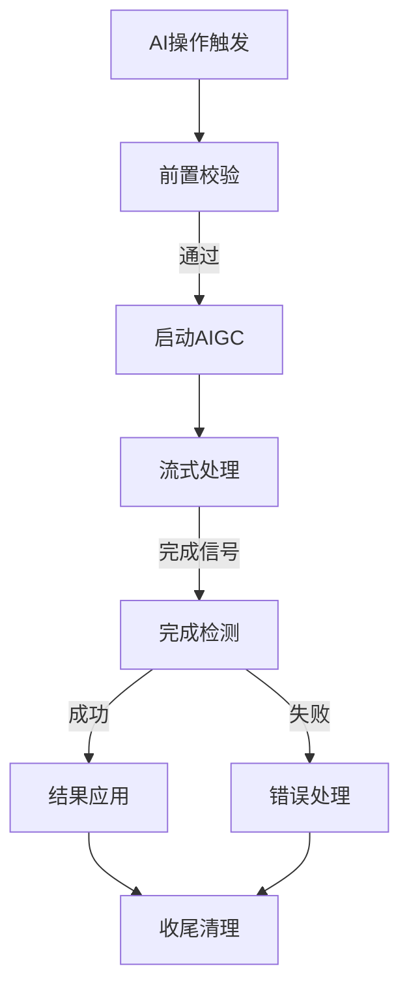

# AIGC 核心流程

> 通用 AIGC 流程，提供前置校验、流式处理、状态管理等公共机制。所有 AIGC 场景（全文/单章节/文本改写）都基于此核心构建。

## 概览

- **范围**：AIGC 操作的通用流程，包括前置校验、流式处理、完成检测、失败处理
- **目标用户**：前端开发者、AIGC 功能实现者
- **关键用例**：
  1. 统一的前置校验流程
  2. 标准的流式处理模式
  3. 一致的状态管理机制

## 信息架构

## 页面蓝图

| 区域       | 显示内容               | 可操作     | 可见条件                    |
| ---------- | ---------------------- | ---------- | --------------------------- |
| 操作状态栏 | 当前AIGC操作类型、进度 | 取消操作   | `globalOperation`不为`idle` |
| 流式预览区 | 实时生成内容预览       | 无         | 流式消息处理中              |
| 错误提示区 | 错误信息、重试建议     | 重试、取消 | 操作失败时                  |

## 任务流程

### 前置校验阶段

| 触发条件     | 关键状态               | 主要动作                 | 反馈           |
| ------------ | ---------------------- | ------------------------ | -------------- |
| 用户触发生成 | `hasDirty`, `inFlight` | 保存未完成内容、验证权限 | Loading提示    |
|              | `documentStatus`       | 锁定编辑器               | 编辑器变为只读 |

### 流式处理阶段

| 触发条件     | 关键状态                 | 主要动作                 | 反馈         |
| ------------ | ------------------------ | ------------------------ | ------------ |
| 前置校验通过 | `globalOperation={场景}` | 发送AI请求、监听流式消息 | 实时预览更新 |
| 消息到达     | `parsed*Messages`        | 更新预览内容             | 内容逐段显示 |

### 完成检测与收尾

| 触发条件     | 关键状态     | 主要动作           | 反馈          |
| ------------ | ------------ | ------------------ | ------------- |
| 收到完成信号 | 操作完成状态 | 应用结果、清理状态 | 成功/失败提示 |
| 用户取消     | 用户操作     | 中断请求、恢复状态 | 操作取消提示  |

## 状态管理

### Global Operation 状态

| 状态值               | 含义       | 编辑器状态 | 允许操作 |
| -------------------- | ---------- | ---------- | -------- |
| `idle`               | 无操作     | 可编辑     | 所有操作 |
| `full_generation`    | 全文生成   | 只读       | 仅取消   |
| `chapter_generation` | 单章节生成 | 只读       | 仅取消   |
| `text_rewrite`       | 文本改写   | 只读       | 仅取消   |
| `saving`             | 保存中     | 可编辑     | 无新保存 |

### Correlation ID 机制

所有 AIGC 操作使用唯一 ID 追踪操作生命周期，确保多次生成、并发操作的准确追踪。

**详细设计**：参见 [Correlation ID 设计文档](./correlation-id-design.md)

## 失败处理策略

| 失败场景     | 表现                   | 降级策略                      |
| ------------ | ---------------------- | ----------------------------- |
| 保存前置失败 | "保存失败，稍后重试"   | 保留 `hasDirty`，允许手动保存 |
| AI 请求失败  | 错误提示，保留原始内容 | 允许重试或放弃操作            |
| 网络中断     | "网络中断，尝试恢复"   | 本地缓存状态，恢复后重试      |
| 消息顺序错乱 | 完成检测超时           | 结合 ID 进行兜底处理          |

## 相关文档

- [Correlation ID 设计文档](./correlation-id-design.md) - 操作追踪机制详解
- [全文 AIGC 流程](./full-generation-flow.md) - 多章节队列管理
- [单章节 AIGC 流程](./single-chapter-aigc-flow.md) - 单章节优化策略
- [文本 AI 改写流程](./text-ai-rewrite-flow.md) - 选区级操作
- [数据层指南](./data-layer-guide.md) - 数据模型与状态管理

> 一句话总结：AIGC 核心流程提供标准化的操作流程，确保各场景的一致性和可维护性。
