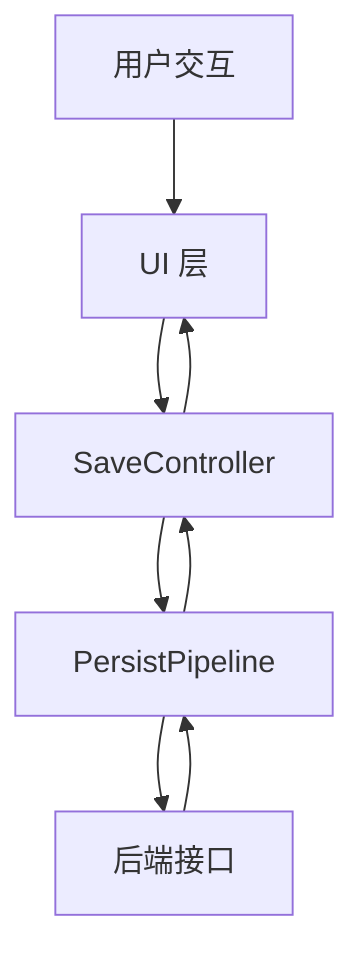
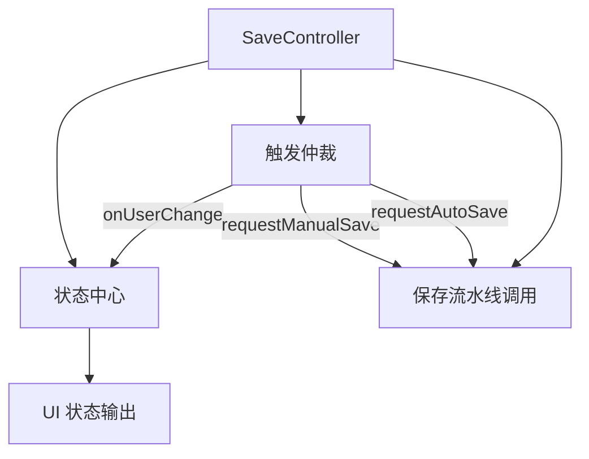
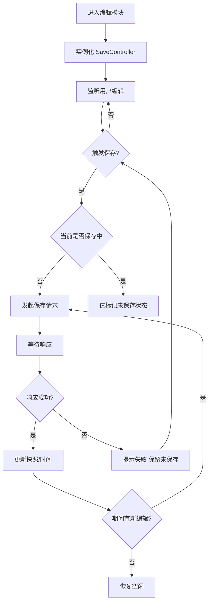
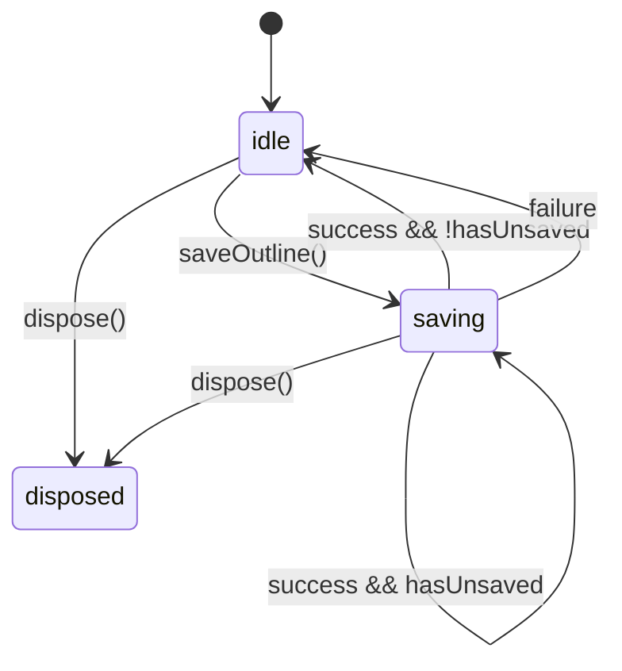
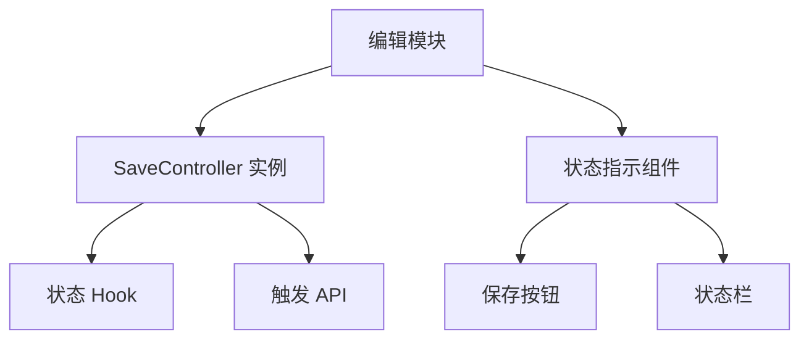

# 通用自动保存方案前端设计文档（布局与功能）

## 🧭 设计概览

- 功能范围：在编辑类场景中提供统一的全量保存能力，覆盖手动保存、自动保存与立即保存三种触发模式。
- 目标用户与场景：前端开发者在编写报告编辑、表单录入、结构化大纲等模块时复用该方案，降低保存流程实现成本。
- 关键用例：
  - 用户持续输入时，系统去抖触发自动保存并保证只存在单个在途请求。
  - 用户点击“保存”按钮或快捷键时，立即进行一次保存或在当前保存完成后尾随执行。
  - 保存过程中继续编辑，所有新变更被折叠并在请求完成后自动再次保存。
  - 保存失败后提示用户并保留未保存状态，等待后续任意触发重新尝试。

## 🗺 信息架构与导航

- 模块划分：
  - SaveController 控制器实例：负责保存仲裁、状态管理、触发入口。
  - PersistPipeline 保存流水线：负责序列化、请求发送与回写。
  - UI 适配层：呈现保存状态、按钮交互与失败提示。
- 入口与退出：
  - 页面/模块挂载时创建 SaveController；卸载或切换资源时销毁旧实例并新建。
  - 离开页面仅提示存在未保存内容，不强制拦截或自动提交。
- 导航规则：
  - 单一资源对应单个 SaveController；切换资源时必须调用 `dispose` 保证旧请求不回写。

## 🧱 模块蓝图（SaveController 实例）

- 模块目标与完成标准：在给定资源范围内对所有编辑变更进行聚合保存，确保单并发、尾随保存与失败提示逻辑一致。

| 区域           | 职责                                       | 显示/暴露数据                                          | 允许操作                    | 条件/可见性                |
| -------------- | ------------------------------------------ | ------------------------------------------------------ | --------------------------- | -------------------------- |
| 状态中心       | 维护 `saving`、`hasUnsaved`、`lastSavedAt` | 是否在保存、是否存在未保存改动、最后保存时间、错误信息 | 无                          | 常驻                       |
| 触发仲裁       | 统一处理自动/手动/立即保存请求             | 无（内部使用）                                         | 去抖、节流、单并发/尾随策略 | 常驻                       |
| 保存流水线调用 | 构建 payload 并调用后端                    | 序列化后的全量对象                                     | 发送请求、处理响应          | `saving=true` 时只允许单飞 |

- 状态与反馈：
  - 保存中：`saving=true` 时 UI 按钮显示“保存中…”，支持继续编辑。
  - 保存成功：刷新 `lastSavedAt` 并短暂展示“已保存”。若期间存在新编辑，则保持未保存提示。
  - 保存失败：展示“保存失败，请重试”轻提示，同时保留 `hasUnsaved=true`。
  - 未保存提示：`hasUnsaved=true` 时在状态栏或角标显示“有未保存变更”。

## 🔄 交互流程与状态

- 主要任务流程

- 状态机说明

- 交互规则表

| 触发条件       | 系统行为                                                     | 用户反馈                             | 可撤销 | 备注                        |
| -------------- | ------------------------------------------------------------ | ------------------------------------ | ------ | --------------------------- |
| 用户输入       | `hasUnsaved=true`，调度自动保存去抖/节流定时器               | 状态栏显示“有未保存变更”             | 否     | 不立即发请求                |
| 手动点击保存   | 若 `saving=false` 立即发起请求；否则仅记录 `hasUnsaved=true` | 按钮置忙；保存失败原位提示           | 否     | hand trigger 共享单并发策略 |
| 保存中再次输入 | 保持单并发，结束后立即尾随保存                               | 状态仍显示“有未保存变更”             | 否     | 不打断当前请求              |
| 保存成功       | 更新快照、`lastSavedAt`；若仍有未保存记录则自动尾随保存      | 状态瞬时显示“已保存”或继续显示未保存 | 否     | 成功时重置错误状态          |
| 保存失败       | `saving=false`，保留 `hasUnsaved`，记录 `lastError`          | Toast 或原位提示“保存失败，请重试”   | 否     | 不自动重试                  |

## 🧮 数据与本地状态（技术无关）

- 状态字段
  - `saving: boolean` — 是否存在在途请求。
  - `hasUnsaved: boolean` — 是否存在未保存改动。
  - `unsavedNodes?: string[]` — （可选）用于需要高亮具体字段/节点的模块；全量保存且无差异提示需求时可省略。
  - 实践示例：`apps/report-ai/docs/RPOutline/OutlineEditor/outline-edit.md` 中的大纲编辑器仅维护布尔未保存标记。
  - `lastSavedAt?: string` — 最近一次保存成功的时间戳。
  - `lastError?: string` — 最近一次保存失败的简短说明。
- 数据来源与依赖
  - 资源初始数据由上层模块传入 `switchResource(resourceId, initialData)`。
  - 序列化函数 `serialize(data)` 负责生成可提交的全量对象。
  - 后端接口：`PUT /resources/{id}`（或等价路径），请求体为全量对象，可附加 `mode: 'auto' | 'manual' | 'immediate'`；响应需返回规范化后的 `data` 与 `serverTimestamp`。
- 查询与触发策略
  - 自动保存：支持 `debounceMs` 去抖与 `minIntervalMs` 最小间隔组合触发。
  - 手动保存：调用 `requestManualSave(reason?)`。
  - 立即保存：调用 `requestImmediateSave(payloadOverride?)`，绕过节流但仍服从单并发。
- 刷新与缓存策略
- 成功后可根据后端回传对象刷新本地快照，保持前后端一致。
- 若接口仅返回成功/失败（如 OutlineTreeEditor 当前实现），需在前端维护乐观快照，并评估忽略服务端归一化/派生字段可能导致的偏差。
- 失败不清除未保存列表，等待下一次触发。
- UI 可根据 SaveController 的 `saving/hasUnsaved/lastSavedAt/lastError` 输出展示状态条，OutlineTreeEditor 即采用该方案。
- 并发与重复提交
  - 单并发：始终只有一个请求在途。
  - 尾随保存：`saving=true` 期间新变更只记录为未保存，待当前请求完成后再次触发。

## 🧩 组件分解与复用

- SaveController：提供配置、触发入口、状态读取（如 `saving`, `hasUnsaved`）。
- UI 指示组件：订阅状态 Hook，渲染保存按钮、状态栏、错误提示。
- 序列化钩子：模块自行实现，注入到控制器配置中。
- Pipeline：前端网络层封装，统一调用 `PUT /resources/{id}` 接口。

## 🧭 可访问性与国际化（可选）

- 保存按钮在键盘焦点序列中应紧邻主要编辑区域，支持快捷键触发（如 `Cmd+S`）。
- 状态栏提示文案需可国际化，长度变化不影响布局（可使用弹性容器）。

## 🚫 非目标与不包含

- 不实现请求重试、指数退避、并行冲突解决。
- 不覆盖多客户端协作或乐观锁版本控制。
- 不定义服务端数据校验细则，仅约定最小接口形态。

## ✅ 检查清单（布局与功能）

- [ ] SaveController 提供配置、触发、状态读取接口。
- [ ] 单并发 + 尾随保存仲裁逻辑实现并通过基础测试。
- [ ] 自动保存去抖/节流策略可配置并默认开启。
- [ ] UI 能够展示保存中、已保存、保存失败三种状态。
- [ ] 保存失败时提示节流，避免重复弹窗。
- [ ] 离开页面时若存在未保存状态给出轻提示。
- [ ] 序列化钩子支持日期、数字、空值的统一规范。
- [ ] 接口调用包含 resourceId 与可选 mode 字段。
- [ ] `dispose` 后的在途响应不会回写 UI。

## 参考配置（附录）

- `autoSave.enabled = true`
- `autoSave.debounceMs = 1200`
- `autoSave.minIntervalMs = 5000`
- `serialize(data)` 返回全量对象；确保无 `NaN`、无未清洗富文本。
- `onSuccess(data, serverTimestamp)` 用于刷新快照与 `lastSavedAt`。
- `onError(message)` 用于自定义提示通道。
