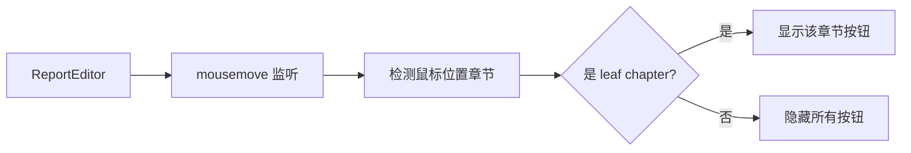

# 方案设计 - 章节标题悬停 AIGC 按钮

> 📖 [返回任务概览](./README.md) | 📝 [需求文档](./spec-require-v1.md)

## 设计原则

- **简化交互**：仅监听鼠标移动，基于 leaf chapter 判断显示/隐藏
- **外部组件架构**：基于现有外部组件渲染系统扩展
- **性能优先**：RAF 节流 + 状态去重

## 核心方案

### 交互逻辑

监听鼠标移动事件，根据鼠标位置判断：

- 如果鼠标悬停在 **leaf chapter**（叶子章节）标题上 → 显示对应按钮
- 如果鼠标悬停在 **非 leaf chapter** 标题上 → 隐藏所有按钮
- 如果鼠标不在任何标题上 → 隐藏所有按钮

**关键判断**：leaf chapter = 没有子章节的章节

### 架构设计



### 核心模块

| 模块                         | 职责                   | 输入/输出                        |
| ---------------------------- | ---------------------- | -------------------------------- |
| useMouseChapterDetector      | 监听鼠标移动，检测章节 | 输出: hoveredChapterId           |
| useChapterTree               | 提供章节树结构         | 输出: isLeafChapter(id)          |
| useAIGCButtonManager         | 管理按钮显示/隐藏      | 输入: chapterId, isLeaf          |
| useExternalComponentRenderer | 协调外部组件渲染       | 输入: buttonInstances            |
| ChapterAIGCButton            | 渲染按钮 UI            | 输入: visible, onClick, position |

## 关键实现

### 1. 鼠标位置检测

```typescript
// 伪代码
const handleMouseMove = throttle((e: MouseEvent) => {
  const element = document.elementFromPoint(e.clientX, e.clientY);
  const heading = findHeadingElement(element); // 向上查找 h1-h6
  const chapterId = heading?.dataset.chapterId;

  if (chapterId && isLeafChapter(chapterId)) {
    showButton(chapterId);
  } else {
    hideAllButtons();
  }
}, 16); // RAF 节流
```

### 2. Leaf Chapter 判断

```typescript
// 伪代码
const isLeafChapter = (chapterId: string): boolean => {
  const chapter = chapterMap.get(chapterId);
  return !chapter?.children || chapter.children.length === 0;
};
```

### 3. 按钮定位

| 维度     | 计算方式                                   | 说明             |
| -------- | ------------------------------------------ | ---------------- |
| 垂直位置 | `iframeTop + headingTop + headingHeight/2` | iframe + 中心点  |
| 水平位置 | `iframeLeft + headingLeft - 12px`          | 标题左侧 12px    |
| 对齐方式 | `transform: translate(-100%, -50%)`        | 右对齐，垂直居中 |

### 4. 性能优化

- RAF 节流：16ms 一次检测
- 状态去重：相同 chapterId 不重复触发
- 懒创建：按钮实例按需创建，显示/隐藏切换

## UI 规范

| 属性 | 值             |
| ---- | -------------- |
| 尺寸 | 32px × 32px    |
| 位置 | 标题左侧 12px  |
| 样式 | 圆角，渐变蓝色 |
| 对齐 | 垂直居中       |

@see [样式规范](../../../../../docs/rule/code-style-less-bem-rule.md)

## 更新记录

| 日期       | 修改人 | 更新内容                                       |
| ---------- | ------ | ---------------------------------------------- |
| 2025-11-05 | Kiro   | 简化方案：仅监听鼠标移动 + leaf chapter 判断   |
| 2025-11-XX | Codex  | 调整检测策略，采用 elementFromPoint + 按钮守卫 |
| 2025-10-30 | Kiro   | 移除大段代码，布局约束移至需求                 |
| 2025-10-29 | Kiro   | 从主文档拆分方案设计                           |

