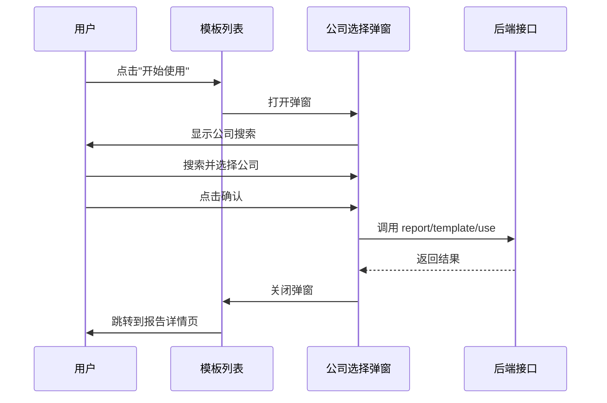

# 模板使用公司选择 - 需求与方案设计

> 📖 返回 [任务概览](./README.md)

## 需求背景

用户在模板列表中点击"开始使用"时，需要选择一个公司来关联使用该模板。当前实现直接跳转，缺少公司选择环节，需要补充此交互流程。

## 功能需求

### 用户场景

1. 用户浏览模板列表，找到合适的模板
2. 点击"开始使用"按钮
3. 弹出公司选择弹窗
4. 在弹窗中搜索并选择目标公司
5. 点击确认，系统调用接口创建关联
6. 成功后跳转到报告详情页

### 功能要点

- 弹窗标题：使用模板
- 表单字段：公司名称（必填）
- 搜索组件：复用 `CorpPresearch` 组件
- 确认按钮：选择公司后可点击
- 取消按钮：关闭弹窗

## 方案设计

### 交互流程

### 组件结构

| 组件层级      | 说明                        |
| ------------- | --------------------------- |
| Modal         | 弹窗容器，控制显示/隐藏     |
| Form          | 表单布局                    |
| CorpPresearch | 公司搜索组件，auto 模式单选 |

### 状态管理

| 状态             | 类型               | 说明             |
| ---------------- | ------------------ | ---------------- |
| useModalVisible  | boolean            | 弹窗显示状态     |
| selectedTemplate | ReportTemplateItem | 当前选中的模板   |
| selectedCorpId   | string             | 选中的公司 ID    |
| selectedCorpName | string             | 选中的公司名称   |
| confirmLoading   | boolean            | 确认按钮加载状态 |

### API 接口

**接口路径**：`report/template/use`  
**定义位置**：`@see packages/gel-api/src/chat/report/template.ts:24-29`

| 参数       | 类型   | 说明               |
| ---------- | ------ | ------------------ |
| templateId | number | 模板 ID            |
| entityCode | string | 公司代码（corpId） |
| entityType | 1      | 实体类型，固定为 1 |

### 关键实现点

1. **状态管理**：新增弹窗相关状态，管理模板和公司选择
2. **CorpPresearch 集成**：监听 onChange 回调获取公司信息
3. **按钮逻辑调整**：将"开始使用"从直接跳转改为打开弹窗
4. **API 调用**：确认时调用 `report/template/use` 接口
5. **错误处理**：API 失败时友好提示，成功后清空状态并跳转

## 技术约束

- 使用 `@wind/wind-ui` 的 Modal 和 Form 组件
- 复用 `packages/gel-ui/src/biz/common/CorpPresearch` 组件
- API 调用使用 `createChatRequest` 方法
- 遵循 [React 规范](../../../../../docs/rule/code-react-component-rule.md) 和 [TypeScript 规范](../../../../../docs/rule/code-typescript-style-rule.md)

## 更新记录

| 日期       | 修改人 | 更新内容           |
| ---------- | ------ | ------------------ |
| 2025-10-30 | Kiro   | 完成需求与方案设计 |

