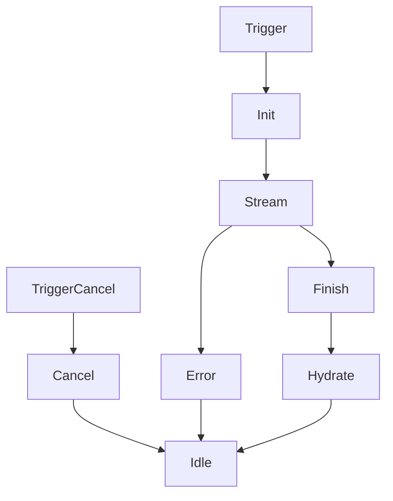

# 单章节 AIGC 方案设计

> 📖 回链：[任务概览](./README.md) | 阶段：方案设计

## 设计目标

- 保持与全文生成相同的校验与错误处理，但流程只聚焦单章节。
- 触发后 3 步直达：初始化 → 流式 → 完成收尾，缩短等待链路。
- 设计可复用的 Hook 与 UI，让后续章节能力复用成本低。

## 范围与依赖

| 项目 | 说明 |
| ---- | ---- |
| 涉及页面 | `ReportDetail/RightPanel/ContentManagement` |
| 共享逻辑 | 复用 [AIGC 核心流程](../../RPDetail/ContentManagement/aigc-core-flow.md) 的前置校验、流式解析、错误态 |
| 数据输入 | `chapterId`, `operationType=single_chapter`, 章节原内容 |
| 数据输出 | 流式内容、完成后的章节正文、操作日志 |

## 模块划分

| 模块 | 职责 | 关键实现 |
| ---- | ---- | -------- |
| Hook `useSingleChapterGenerator` | 暴露触发、取消、重试与状态 | 封装 `chapterGenerationState`，订阅事件总线 |
| 请求适配器 | 统一构建单章节请求 | 直接调用核心流程的 `createAIGCSession` |
| 流式处理器 | 收集消息并推送预览、计算进度 | 简化为消息计数，估算线性百分比 |
| 注水器 | 将结果写入编辑器 | 复用现有 `hydrateChapter`，完成后清理 |
| UI 组件 | 展示进度与操作按钮 | 组合进度条、错误提示、重试与取消 |

## 状态模型

```typescript
type ChapterStatus = 'idle' | 'generating' | 'failed' | 'completed';

interface ChapterGenerationState {
  chapterId: string | null;
  status: ChapterStatus;
  progress: number;           // 百分比
  buffer: string[];           // 流式缓存
  error?: { code: string; message: string };
  correlationId?: string;
  startedAt?: number;
}
```

状态保存在轻量 store（如 zustand/ahooks），只追踪一个章节，清理时重置为初始值。

## 核心流程



1. **Init**：校验章节、锁定、记录 `correlationId`，状态置为 `generating`，可选清空内容。
2. **Stream**：核心流程推送消息 → 更新 `buffer`、递增进度；首条消息即刻写入预览。
3. **Finish**：收到完成标记后触发注水，写入最终内容并释放锁。
4. **Cancel / Error**：通知核心流程中断，回滚到触发前内容，状态回到 `idle`。

## 进度规则

- 消息数 × 固定步长（默认 10%）平滑递增，完成时直接置 100%。
- 若连续 2s 未收到消息，显示“处理中”占位，不退回低进度。
- 取消或失败时将进度归零，并记录最近错误信息供 UI 使用。

## 与全文生成协同

| 项目 | 策略 |
| ---- | ---- |
| 互斥 | 读取全局 `globalOperation`，全文进行时拒绝单章节触发，反之亦然 |
| 共享功能 | 校验、流式解析、错误消息模板完全复用 |
| 解锁策略 | 单章节完成后立即解锁；全文生成依旧由队列收尾 |

## 风险与缓解

| 风险 | 影响 | 缓解 |
| ---- | ---- | ---- |
| 核心流程接口差异 | 请求失败 | 与后端确认 `operationType` 约定，预先加默认值 |
| 取消不生效 | 残留锁定 | 调用核心流程的中断接口，取消后统一清理 store |
| 进度估算不稳定 | 体验割裂 | 采用消息计数 + 超时占位，避免回退或跳动 |

## 更新记录

| 日期       | 修改人 | 更新内容                   |
| ---------- | ------ | -------------------------- |
| 2025-10-30 | Kiro   | 精简方案结构，突出关键信息 |
