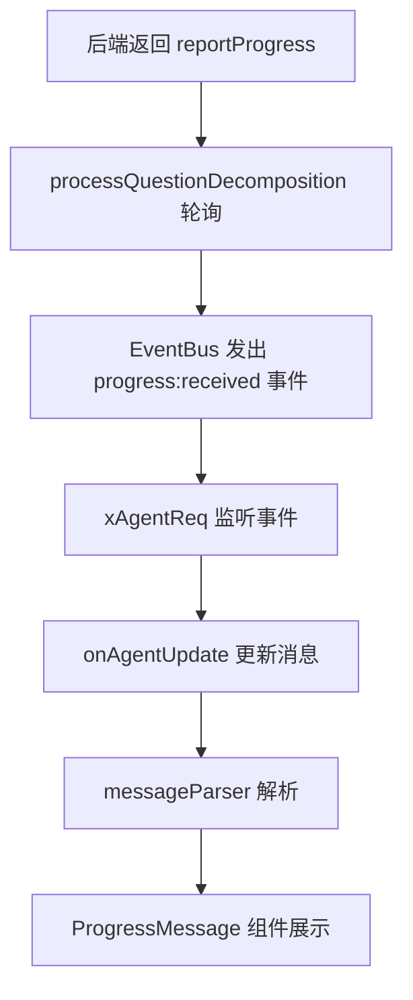
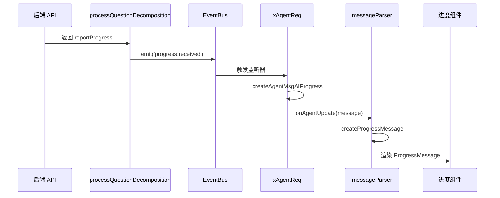

# AIGC 消息进度接入 - 需求与设计

> 📖 回链：[任务概览](./README.md) | 遵循 [Spec 文档编写规范](../../../../../docs/rule/doc-spec-rule.md)

## 背景与上下文

### 业务背景

当前 RPOutline 聊天功能在 AIGC 生成报告大纲时，用户只能看到"正在生成"的状态，无法了解具体进度。后端已支持返回进度信息（`reportProgress`），但前端尚未接入展示。

@see `packages/gel-api/src/chat/types/base.ts:28-32` - 后端已定义 `reportProgress` 字段

### 现有能力

1. **子问题展示机制**：已有 `subQuestion` role 用于展示问题拆解过程

   - @see `packages/gel-ui/src/utils/ai-chat/messageParser/index.tsx:48-60`
   - @see `apps/report-ai/src/components/ChatRPOutline/parsers/messageParser.tsx:54-57`

2. **轮询机制**：`processQuestionDecomposition` 已实现轮询获取用户问题

   - @see `packages/gel-ui/src/service/agentRequest/processes/processQuestionDecomposition.ts:25-80`

3. **事件总线**：已有 EventBus 机制用于流程间通信
   - @see `apps/report-ai/src/hooks/RPOutline/xAgentReq.ts:42-47`

### 遗留问题

- 进度信息未被前端消费和展示
- 用户在等待时缺乏反馈，体验不佳
- 没有统一的进度消息类型定义

## 需求提炼

### 功能需求

| 需求 ID | 描述                               | 优先级 | 来源         |
| ------- | ---------------------------------- | ------ | ------------ |
| FR-01   | 展示 AIGC 生成进度百分比           | P0     | 用户体验优化 |
| FR-02   | 展示当前步骤名称（如"模板已确认"） | P0     | 后端已支持   |
| FR-03   | 进度信息实时更新（跟随轮询）       | P0     | 技术可行性   |
| FR-04   | 进度展示样式与子问题保持一致       | P1     | UI 一致性    |

### 非功能需求

| 需求 ID | 描述                                   | 约束条件   |
| ------- | -------------------------------------- | ---------- |
| NFR-01  | 复用现有轮询机制，不增加额外请求       | 性能要求   |
| NFR-02  | 类型定义完整，支持 TypeScript 类型检查 | 代码质量   |
| NFR-03  | 与现有消息解析流程保持一致             | 架构一致性 |

## 方案设计

### 整体架构



### 核心设计

#### 1. 类型定义

**新增 RPOutlineProgressMessage 类型**

@see `apps/report-ai/src/types/chat/RPOutline.ts` - RPOutline 模块特有类型

```typescript
// apps/report-ai/src/types/chat/RPOutline.ts
export type RPOutlineProgressMessage = BaseMessageFields & {
  role: 'progress';
  content: {
    currentStepCode: string; // 当前步骤代码
    currentStepName: string; // 当前步骤名称
    progressPercentage: number; // 进度百分比 (0-100)
  };
  status: OtherMessageStatus;
};

// 添加到 RPOutlineMsgParsed 联合类型中
export type RPOutlineMsgParsed =
  | RPOutlineUserMsgParse
  | AIMessageGEL
  | AIHeaderMsg
  | SuggestionMessage
  | SubQuestionMessage
  | RPOutlineProgressMessage // 新增
  | OutlineEditorMessage
  | OutlinePreviewMessage;
```

> 💡 **设计决策**：将 `ProgressMessage` 定义在 RPOutline 模块而非通用类型系统中，因为：
>
> - 进度功能是 RPOutline 特有的业务逻辑
> - 避免污染通用类型系统（`MsgParsedDepre`）
> - 保持模块独立性和可维护性

**扩展 AgentMsgAI 类型**

```typescript
// 在 AgentMsgAI 中添加 progress 字段
export interface AgentMsgAI {
  // ... 现有字段
  progress?: {
    currentStepCode: string;
    currentStepName: string;
    progressPercentage: number;
  };
}
```

#### 2. 事件定义

**新增 EventBus 事件**

@see `packages/gel-ui/src/service/agentRequest/processes/processQuestionDecomposition.ts:70-76`

```typescript
// 在 processQuestionDecomposition 中发出事件
context.eventBus?.emit('progress:received', {
  progress: response.reportProgress,
  input: context.input,
  runtime: context.runtime,
});
```

#### 3. 消息解析器

**通用解析器**

@see `packages/gel-ui/src/utils/ai-chat/messageParser/index.tsx`

```typescript
export const createProgressMessage = <T extends AgentMsgAIDepre>(agentMessage: T): ProgressMessage | null => {
  if (!agentMessage.progress) {
    return null;
  }

  return {
    role: 'progress',
    content: agentMessage.progress,
    status: 'pending',
  };
};
```

**RPOutline 解析器集成**

@see `apps/report-ai/src/components/ChatRPOutline/parsers/messageParser.tsx:48-62`

```typescript
// 在 createRPOutlineMessageParser 中添加
const progressMessage = createProgressMessage(agentMessage);
if (progressMessage) {
  messageList.push(progressMessage);
}
```

#### 4. 流程处理

**processQuestionDecomposition 改造**

@see `packages/gel-ui/src/service/agentRequest/processes/processQuestionDecomposition.ts:70-76`

在 `processResponse` 函数中添加进度处理：

```typescript
function processResponse<TInput extends ChatSendInput = ChatSendInput>(
  context: ChatRunContext<TInput>,
  response: ApiResponseForGetUserQuestion<string>
): void {
  const { content, result, suggest, gelData, splTable, reportData, modelType, reportProgress } = response;

  // 新增：处理进度信息
  if (reportProgress) {
    context.eventBus?.emit('progress:received', {
      progress: reportProgress,
      input: context.input,
      runtime: context.runtime,
    });
  }

  // ... 现有逻辑
}
```

#### 5. Hook 集成

**xAgentReq 事件监听**

@see `apps/report-ai/src/hooks/RPOutline/xAgentReq.ts:42-47`

在 EventBus 监听器中添加：

```typescript
context.eventBus.on('progress:received', ({ progress, input }) => {
  onAgentUpdate({
    ...createAgentMsgAIProgress(input, progress),
    status: 'pending',
  });
});
```

**创建进度消息辅助函数**

```typescript
export const createAgentMsgAIProgress = (
  input: RPOutlineSendInput,
  progress: {
    currentStepCode: string;
    currentStepName: string;
    progressPercentage: number;
  }
): RPOutlineAgentMsgAI => ({
  role: 'ai',
  content: '',
  status: 'pending',
  progress,
  // ... 其他必要字段
});
```

### 数据流转



### 关键决策

| 决策点           | 选项                           | 选择          | 理由                          |
| ---------------- | ------------------------------ | ------------- | ----------------------------- |
| 进度信息获取方式 | 新增接口 / 复用轮询            | 复用轮询      | 后端已返回，无需额外请求      |
| 消息类型设计     | 独立 role / 合并到 subQuestion | 独立 progress | 语义清晰，便于扩展            |
| 事件触发时机     | 每次轮询 / 仅进度变化时        | 每次轮询      | 简化逻辑，UI 层可自行优化渲染 |
| 进度展示位置     | 独立消息 / 合并到 AI 消息      | 独立消息      | 参考 subQuestion，保持一致性  |

## 技术约束

1. **兼容性**：需兼容现有的消息解析流程，不影响其他消息类型
2. **性能**：复用现有轮询，不增加额外网络请求
3. **类型安全**：所有新增类型需完整定义，支持 TypeScript 检查
4. **可扩展性**：设计需考虑未来可能的进度类型扩展

## 风险评估

| 风险                   | 影响 | 概率 | 缓解措施                   |
| ---------------------- | ---- | ---- | -------------------------- |
| 后端进度信息不稳定     | 中   | 低   | 添加容错处理，缺失时不展示 |
| 轮询频率导致进度闪烁   | 低   | 中   | UI 层添加防抖或过渡动画    |
| 类型定义与现有结构冲突 | 高   | 低   | 充分测试，确保向后兼容     |

## 更新记录

| 日期       | 修改人 | 更新内容                           |
| ---------- | ------ | ---------------------------------- |
| 2025-11-12 | -      | 初始创建，完成背景、需求、方案设计 |

## 相关文档

- [任务概览](./README.md)
- [实施计划](./spec-implementation.md)
- [TypeScript 编码规范](../../../../../docs/rule/code-typescript-style-rule.md)
- [React 组件规范](../../../../../docs/rule/code-react-component-rule.md)

