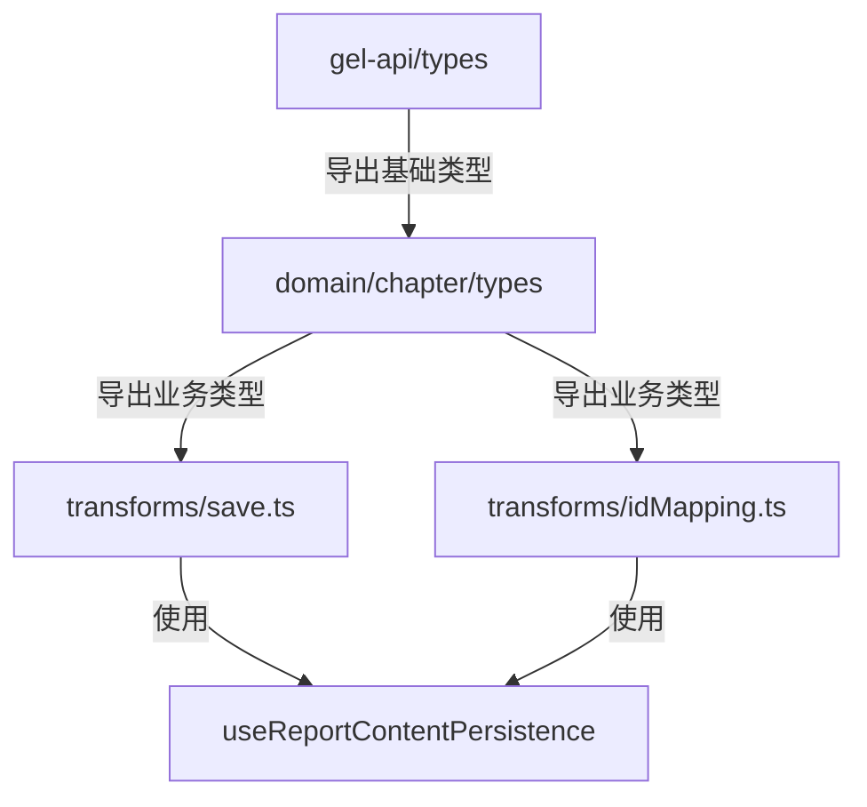

# 章节保存流程类型安全改造 - 设计方案

> 回链：[任务概览](./README.md) | 状态：📝 设计中 | 版本：v1.0

## 1. 背景与问题

### 1.1 当前问题

保存流程核心转换函数存在类型安全缺陷：

```typescript
// ❌ 问题代码示例
// @see apps/report-ai/src/domain/chapter/transforms/save.ts:95
return saveChapter as any; // 绕过类型检查

// @see apps/report-ai/src/domain/chapter/transforms/save.ts:58
savedChapters as RPDetailChapter[]; // 强制类型转换
```

**根本原因**：`RPChapterSavePayload` 类型定义过于宽松，所有字段都是可选的，无法区分：

- 临时章节：`{ tempId: string, isTemporary: true }`
- 持久章节：`{ chapterId: number }`

### 1.2 影响范围

| 模块        | 文件                                                            | 问题             |
| ----------- | --------------------------------------------------------------- | ---------------- |
| 保存转换    | `domain/chapter/transforms/save.ts`                             | 2 处 `as any`    |
| ID 映射     | `domain/chapter/transforms/idMapping.ts`                        | 类型转换不安全   |
| 持久化 Hook | `store/reportContentStore/hooks/useReportContentPersistence.ts` | 依赖不安全的类型 |

### 1.3 设计目标

- **类型安全**：编译时捕获类型错误，消除 `any`
- **运行时保护**：添加验证，提供清晰错误信息
- **向后兼容**：不改变现有功能和 API 契约
- **可维护性**：统一 ID 处理，减少重复逻辑

## 2. 核心方案

### 2.1 类型系统重构

#### 方案：判别联合类型（Discriminated Union）

使用 TypeScript 判别联合类型在编译时区分章节状态：

```typescript
// 临时章节（新增，未保存）
interface TempChapterPayload {
  tempId: string;
  isTemporary: true; // 判别字段
  title: string;
  content?: string;
  contentType?: 'html' | 'markdown';
  writingThought?: string;
  children?: ChapterSavePayload[];
}

// 持久章节（已保存）
interface PersistedChapterPayload {
  chapterId: number;
  isTemporary?: false; // 判别字段
  title: string;
  content?: string;
  contentType?: 'html' | 'markdown';
  writingThought?: string;
  children?: ChapterSavePayload[];
}

// 联合类型
type ChapterSavePayload = TempChapterPayload | PersistedChapterPayload;
```

**优势**：

- TypeScript 自动类型收窄（Type Narrowing）
- 编译时检查字段访问
- IDE 智能提示完整

#### 类型守卫函数

```typescript
function isTempChapter(chapter: ChapterSavePayload): chapter is TempChapterPayload {
  return chapter.isTemporary === true;
}

function isPersistedChapter(chapter: ChapterSavePayload): chapter is PersistedChapterPayload {
  return !chapter.isTemporary && 'chapterId' in chapter;
}
```

### 2.2 类型定义位置



**文件组织**：

| 文件                                                | 职责     | 导出类型                                                              |
| --------------------------------------------------- | -------- | --------------------------------------------------------------------- |
| `packages/gel-api/src/chat/types/report/detail.ts`  | API 契约 | `RPChapterSavePayload`（保持兼容）                                    |
| `apps/report-ai/src/domain/chapter/types/save.ts`   | 业务类型 | `TempChapterPayload`, `PersistedChapterPayload`, `ChapterSavePayload` |
| `apps/report-ai/src/domain/chapter/types/guards.ts` | 类型守卫 | `isTempChapter`, `isPersistedChapter`                                 |

### 2.3 ID 处理统一

#### 问题：ID 类型混乱

| 来源                 | 类型      | 说明                           |
| -------------------- | --------- | ------------------------------ |
| DOM 属性             | `string`  | `data-chapter-id="123"`        |
| DocumentChapterNode  | `number?` | 解析后                         |
| RPChapterSavePayload | `number?` | 保存请求                       |
| RPDetailChapter      | `number`  | 服务器响应                     |
| Map 键               | `string`  | `canonicalMap.get(String(id))` |

#### 方案：统一工具函数

```typescript
// @see apps/report-ai/src/domain/chapter/utils/idUtils.ts

export type ChapterId = number;
export type ChapterIdString = string;
export type TempChapterId = string;

/** 将章节 ID 转换为字符串（用于 Map 键） */
export function chapterIdToString(id: ChapterId | undefined): ChapterIdString | undefined {
  return id !== undefined ? String(id) : undefined;
}

/** 将字符串转换为章节 ID（用于 DOM 解析） */
export function stringToChapterId(str: string | undefined): ChapterId | undefined {
  if (!str) return undefined;
  const num = Number(str);
  return Number.isNaN(num) ? undefined : num;
}

/** 检查是否为有效的章节 ID */
export function isValidChapterId(id: unknown): id is ChapterId {
  return typeof id === 'number' && id > 0 && Number.isInteger(id);
}

/** 检查是否为临时 ID */
export function isTempId(id: string): boolean {
  return id.startsWith('temp-') || id.startsWith('new-');
}
```

### 2.4 运行时验证（可选）

使用 Zod 在开发环境验证数据结构：

```typescript
// @see apps/report-ai/src/domain/chapter/utils/validation.ts

import { z } from 'zod';

const TempChapterSchema = z.object({
  tempId: z.string(),
  isTemporary: z.literal(true),
  title: z.string(),
  content: z.string().optional(),
  // ...
});

const PersistedChapterSchema = z.object({
  chapterId: z.number().int().positive(),
  isTemporary: z.literal(false).optional(),
  title: z.string(),
  // ...
});

export const ChapterSavePayloadSchema = z.union([TempChapterSchema, PersistedChapterSchema]);

export function validateChapterSavePayload(data: unknown): ChapterSavePayload {
  return ChapterSavePayloadSchema.parse(data);
}
```

**使用场景**：

- 开发环境：自动验证
- 生产环境：仅在关键路径验证
- 测试环境：全量验证

## 3. 关键模块重构

### 3.1 `convertDocumentChaptersToSaveFormat` 重构

**当前问题**：

```typescript
// ❌ 使用 as any 绕过类型检查
// @see apps/report-ai/src/domain/chapter/transforms/save.ts:95
return saveChapter as any;
```

**重构方案**：

```typescript
export const convertDocumentChaptersToSaveFormat = (
  documentChapters: DocumentChapterNode[],
  canonicalMap: ChapterNodeMap<RPDetailChapter>
): ChapterSavePayload[] => {
  return mapTree(
    documentChapters,
    (docChapter): ChapterSavePayload => {
      const canonical = docChapter.chapterId ? canonicalMap.get(chapterIdToString(docChapter.chapterId)) : undefined;

      const basePayload = {
        title: docChapter.title,
        content: docChapter.content,
        contentType: 'html' as const,
        writingThought: canonical?.writingThought || '',
      };

      // 使用判别联合类型
      if (docChapter.isTemporary) {
        if (!docChapter.tempId) {
          throw new ChapterValidationError(`Temporary chapter missing tempId: ${docChapter.title}`);
        }
        return {
          ...basePayload,
          tempId: docChapter.tempId,
          isTemporary: true,
        };
      } else {
        if (!docChapter.chapterId) {
          throw new ChapterValidationError(`Persisted chapter missing chapterId: ${docChapter.title}`);
        }
        return {
          ...basePayload,
          chapterId: docChapter.chapterId,
        };
      }
    },
    'children'
  );
};
```

**改进点**：

- ✅ 移除 `as any`
- ✅ 使用判别联合类型
- ✅ 添加运行时检查
- ✅ 使用统一的 ID 工具函数
- ✅ 提供清晰的错误信息

### 3.2 `mergeSavedChaptersWithCanonical` 重构

**当前问题**：

```typescript
// ❌ 强制类型转换
// @see apps/report-ai/src/domain/chapter/transforms/save.ts:58
savedChapters as RPDetailChapter[];
chapterId: savedChapter.chapterId as number;
```

**重构方案**：

```typescript
export const mergeSavedChaptersWithCanonical = (
  savedChapters: ChapterSavePayload[],
  canonicalMap: ChapterNodeMap<RPDetailChapter>
): RPDetailChapter[] => {
  return mapTree(
    savedChapters,
    (savedChapter): RPDetailChapter => {
      // 保存后的章节应该都有 chapterId（临时 ID 已被替换）
      if (isTempChapter(savedChapter)) {
        throw new ChapterValidationError(`Saved chapter should not have temporary ID: ${savedChapter.tempId}`);
      }

      const { chapterId } = savedChapter;
      if (!isValidChapterId(chapterId)) {
        throw new ChapterValidationError(`Invalid chapterId: ${chapterId}`);
      }

      const canonicalChapter = canonicalMap.get(chapterIdToString(chapterId));

      // 合并：Canonical 元数据 + 保存后的内容
      return {
        // 1. Canonical 的元数据（DPU、RAG、实体等）
        ...(canonicalChapter || {}),
        // 2. 保存后的内容（标题、内容、结构）
        ...savedChapter,
        // 3. 确保 chapterId 是 number
        chapterId,
      } as RPDetailChapter;
    },
    'children'
  );
};
```

**改进点**：

- ✅ 移除不安全的类型断言
- ✅ 使用类型守卫
- ✅ 添加运行时验证
- ✅ 清晰的错误信息

### 3.3 `applyIdMapToChapters` 重构

**当前问题**：ID 映射逻辑分散，缺乏类型保护

**重构方案**：

```typescript
export const applyIdMapToChapters = (
  chapters: ChapterSavePayload[],
  idMap: Record<string, number>
): ChapterSavePayload[] => {
  return mapTree(
    chapters,
    (chapter): ChapterSavePayload => {
      if (isTempChapter(chapter)) {
        const newId = idMap[chapter.tempId];
        if (!newId) {
          // 临时 ID 未映射，保持原样
          return chapter;
        }
        if (!isValidChapterId(newId)) {
          throw new ChapterValidationError(`Invalid mapped chapterId: ${newId} for tempId: ${chapter.tempId}`);
        }
        // 转换为持久章节
        const { tempId, isTemporary, ...rest } = chapter;
        return {
          ...rest,
          chapterId: newId,
        };
      }
      return chapter;
    },
    'children'
  );
};
```

## 4. 错误处理

### 4.1 自定义错误类

```typescript
// @see apps/report-ai/src/domain/chapter/errors/ChapterValidationError.ts

export class ChapterValidationError extends Error {
  constructor(
    message: string,
    public readonly context?: Record<string, unknown>
  ) {
    super(message);
    this.name = 'ChapterValidationError';
  }
}
```

### 4.2 错误处理策略

| 场景     | 策略            | 说明         |
| -------- | --------------- | ------------ |
| 开发环境 | 抛出异常        | 立即暴露问题 |
| 生产环境 | 记录日志 + 降级 | 保证用户体验 |
| 测试环境 | 抛出异常        | 确保测试覆盖 |

## 5. 向后兼容性

### 5.1 API 契约保持不变

`gel-api` 包中的 `RPChapterSavePayload` 保持原有定义，确保：

- 后端 API 不需要修改
- 其他模块不受影响
- 渐进式迁移

### 5.2 类型适配层

```typescript
// 业务类型 → API 类型
export function toApiPayload(chapter: ChapterSavePayload): RPChapterSavePayload {
  return chapter; // 结构兼容，直接返回
}

// API 类型 → 业务类型（需要验证）
export function fromApiPayload(chapter: RPChapterSavePayload): ChapterSavePayload {
  if (chapter.isTemporary && chapter.tempId) {
    return chapter as TempChapterPayload;
  }
  if (chapter.chapterId) {
    return chapter as PersistedChapterPayload;
  }
  throw new ChapterValidationError('Invalid chapter payload', { chapter });
}
```

## 6. 测试策略

### 6.1 单元测试

| 测试对象 | 覆盖场景                              |
| -------- | ------------------------------------- |
| 类型守卫 | `isTempChapter`, `isPersistedChapter` |
| ID 工具  | 转换、验证、边界情况                  |
| 转换函数 | 临时章节、持久章节、嵌套结构          |
| ID 映射  | 单个映射、批量映射、部分映射          |
| 错误处理 | 缺失字段、无效 ID、类型不匹配         |

### 6.2 集成测试

| 场景         | 验证点                   |
| ------------ | ------------------------ |
| 新增章节保存 | 临时 ID → 持久 ID 转换   |
| 编辑章节保存 | 持久章节数据完整性       |
| 混合保存     | 新增 + 编辑同时保存      |
| 保存失败     | 错误信息清晰，状态可恢复 |

### 6.3 类型测试

```typescript
// 编译时类型检查
import { expectType } from 'tsd';

const tempChapter: TempChapterPayload = {
  tempId: 'temp-123',
  isTemporary: true,
  title: 'Test',
};

const persistedChapter: PersistedChapterPayload = {
  chapterId: 123,
  title: 'Test',
};

// 类型收窄测试
function testTypeNarrowing(chapter: ChapterSavePayload) {
  if (isTempChapter(chapter)) {
    expectType<string>(chapter.tempId); // ✅ 类型收窄成功
    // @ts-expect-error
    chapter.chapterId; // ❌ 编译错误
  } else {
    expectType<number>(chapter.chapterId); // ✅ 类型收窄成功
    // @ts-expect-error
    chapter.tempId; // ❌ 编译错误
  }
}
```

## 7. 性能影响

### 7.1 编译时

- **类型检查**：增加 <5% 编译时间（判别联合类型）
- **类型推断**：IDE 智能提示更快（类型更精确）

### 7.2 运行时

| 操作     | 影响    | 说明                 |
| -------- | ------- | -------------------- |
| 类型守卫 | 可忽略  | 简单布尔判断         |
| ID 转换  | 可忽略  | 基础类型转换         |
| Zod 验证 | +5-10ms | 仅开发环境或关键路径 |

### 7.3 优化建议

- 生产环境禁用 Zod 验证（通过环境变量控制）
- 缓存类型守卫结果（如需要）
- 使用 Tree-shaking 移除未使用的验证代码

## 8. 迁移路径

### 8.1 阶段 1：类型定义（1 天）

1. 创建新类型定义文件
2. 添加类型守卫和工具函数
3. 编写单元测试

### 8.2 阶段 2：核心模块重构（2 天）

1. 重构 `convertDocumentChaptersToSaveFormat`
2. 重构 `mergeSavedChaptersWithCanonical`
3. 重构 `applyIdMapToChapters`
4. 更新相关测试

### 8.3 阶段 3：集成与验证（1 天）

1. 更新 `useReportContentPersistence`
2. 集成测试
3. 手动测试关键路径

### 8.4 阶段 4：文档与清理（0.5 天）

1. 更新代码注释
2. 更新设计文档
3. 清理废弃代码

## 9. 风险与缓解

| 风险           | 影响 | 缓解措施                      |
| -------------- | ---- | ----------------------------- |
| 类型定义不兼容 | 高   | 保持 API 契约不变，添加适配层 |
| 运行时错误增加 | 中   | 充分测试，提供降级方案        |
| 性能下降       | 低   | 性能测试，优化关键路径        |
| 迁移成本高     | 中   | 渐进式迁移，保持向后兼容      |

## 10. 相关文档

- [任务概览](./README.md)
- [实施计划](./spec-implementation-plan-v1.md)
- [分析报告](../../RPDetail/ContentManagement/save-flow-analysis.md)
- [TypeScript 规范](../../../docs/rule/code-typescript-style-rule.md)
- [测试规范](../../../docs/rule/code-testing-vitest-storybook-rule.md)

## 更新记录

| 日期       | 修改人 | 更新内容                   |
| ---------- | ------ | -------------------------- |
| 2024-11-14 | Kiro   | 初始版本，完成核心方案设计 |

