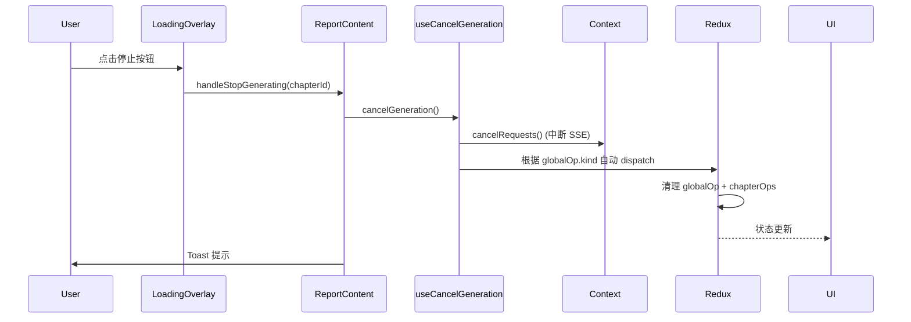

# AIGC 功能取消能力 - 核心设计

[← 返回任务概览](./README.md)

## 1. 背景与需求

当前全文生成、多章节生成、单章节生成、文本改写无法中途停止，用户体验差且浪费资源。需要提供统一的取消能力。

**现有基础**：

- Redux 已有部分取消 reducer（单章节、多章节、文本改写）
- Context 已有 `cancelRequests` 方法（中断 SSE 流式请求）
- `useChapterLoadingOverlay` 已有 `onStop` 回调机制

**实现目标**：

- 新增全文生成取消 reducer
- 创建统一的 `useCancelGeneration` Hook 整合所有取消逻辑
- 通过 Loading Overlay 的停止按钮作为唯一取消入口

@see apps/report-ai/src/store/reportContentStore/reducers/aigc/generation.ts
@see apps/report-ai/src/store/reportContentStore/hooks/useCancelGeneration.ts
@see apps/report-ai/src/components/ReportEditor/hooks/useChapterLoadingOverlay.tsx

## 2. 方案设计

### 2.1 架构分层

| 层级    | 职责                 | 关键模块                                   |
| ------- | -------------------- | ------------------------------------------ |
| UI      | 停止按钮、确认对话框 | `useChapterLoadingOverlay` (唯一入口)      |
| Hook    | 统一取消逻辑         | `useCancelGeneration` (整合所有取消)       |
| Redux   | 状态清理             | `cancelFullDocumentGeneration` 等 reducers |
| Context | 中断 SSE 流式请求    | `useRPContentChat.cancelRequests`          |

### 2.2 取消流程

### 2.3 统一取消入口

**唯一入口**：`useChapterLoadingOverlay` 的停止按钮

| 操作类型   | 触发方式               | 停止按钮位置              | 取消逻辑                       |
| ---------- | ---------------------- | ------------------------- | ------------------------------ |
| 全文生成   | Header "生成全文"按钮  | 章节 Loading Overlay 停止 | `useCancelGeneration` 自动识别 |
| 多章节生成 | 大纲右键菜单（待实现） | 章节 Loading Overlay 停止 | `useCancelGeneration` 自动识别 |
| 单章节生成 | 章节 AIGC 按钮         | 章节 Loading Overlay 停止 | `useCancelGeneration` 自动识别 |
| 文本改写   | 改写预览浮层           | "取消"按钮（已有）        | `rejectRewrite()` + Toast      |

## 3. 实施拆解

| 任务 | 模块                             | 工作内容                                                      | 工期   | 状态 |
| ---- | -------------------------------- | ------------------------------------------------------------- | ------ | ---- |
| T1   | Redux - 全文生成取消             | 新增 `cancelFullDocumentGeneration` reducer                   | 0.5 天 | ✅   |
| T2   | Hook - useFullDocGeneration      | 新增 `cancelGeneration`（调用 cancelRequests + dispatch）     | 0.5 天 | ✅   |
| T3   | Hook - useMultiChapterGeneration | 新增 `cancelGeneration`（调用 cancelRequests + dispatch）     | 0.5 天 | ✅   |
| T4   | Hook - useChapterRegeneration    | 新增 `cancelRegeneration`（调用 cancelRequests + dispatch）   | 0.5 天 | ✅   |
| T5   | Hook - useCancelGeneration       | 创建统一取消 Hook，整合 T2/T3/T4 的取消逻辑                   | 0.5 天 | ✅   |
| T6   | UI - Loading Overlay 停止逻辑    | 通过 `handleStopGenerating` 调用统一取消 + 确认对话框 + Toast | 1 天   | ✅   |
| T7   | UI - 文本改写 Toast              | 取消后添加 Toast 提示                                         | 0.5 天 | ✅   |

**依赖关系**：T1/T2/T3/T4 → T5 → T6，T7 独立

## 4. 关键实现

### 4.1 Redux Reducer（新增）

新增 `cancelFullDocumentGeneration` reducer，保留已完成章节，只清理未完成的章节。

@see apps/report-ai/src/store/reportContentStore/reducers/aigc/generation.ts

### 4.2 统一取消 Hook（核心）

创建 `useCancelGeneration` Hook，整合所有取消逻辑：

1. 中断 SSE 流式请求（`cancelRequests()`）
2. 清空 Context 消息（`setMsgs([])`），避免残留消息干扰
3. 根据 `globalOp.kind` 自动调用对应的 cancel action

@see apps/report-ai/src/store/reportContentStore/hooks/useCancelGeneration.ts

### 4.3 UI 实现要点

- 使用 `useCancelGeneration()` 获取统一取消方法
- 根据 `currentOperationKind` 显示不同的确认提示
- 通过 `handleStopGenerating` 传递给 `useChapterLoadingOverlay`
- 取消成功后显示 Toast 提示

@see apps/report-ai/src/pages/ReportDetail/ReportContent/index.tsx

## 5. 验收标准

| 验收项       | 标准                                   |
| ------------ | -------------------------------------- |
| 功能完整性   | 四类操作均可取消，取消后可重新生成     |
| 响应速度     | 点击停止到生成停止 < 500ms             |
| SSE 请求中断 | cancelRequests 成功中断流式请求        |
| 状态一致性   | globalOp、chapterOps、章节锁定正确清理 |
| 流式消息中断 | 取消后立即停止注水，编辑器不再更新     |
| 兼容性       | 不影响保存、撤销、编辑等现有功能       |
| 用户体验     | 确认对话框清晰，Toast 提示及时         |

## 6. 边界处理

| 场景                 | 处理方式                 |
| -------------------- | ------------------------ |
| 取消时章节已完成     | 正常取消，已完成内容保留 |
| 取消时正在流式生成   | 立即停止，部分内容保留   |
| 取消后立即重新生成   | 允许，确保状态已清理     |
| 多次点击停止按钮     | 防抖处理，避免重复触发   |
| 非生成状态下点击停止 | 操作被忽略，无副作用     |

## 更新记录

| 日期       | 修改人 | 更新内容                               |
| ---------- | ------ | -------------------------------------- |
| 2025-11-18 | Kiro   | 初始化，补充多章节生成                 |
| 2025-11-18 | Kiro   | 根据实现更新：统一取消入口 + 统一 Hook |

## 相关

- [React 规范](../../../docs/rule/react-rule.md)
- [TypeScript 规范](../../../docs/rule/typescript-rule.md)
