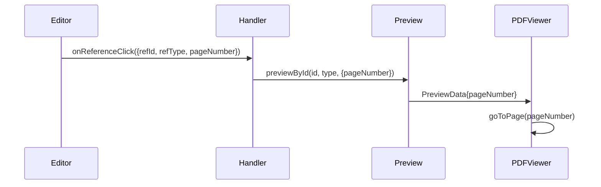

# 引用资料 PDF 页面跳转 - 需求与设计

> 📖 回链：[任务概览](./README.md) | 遵循 [Spec 文档编写规范](../../../../../docs/rule/doc-spec-rule.md)

## 背景与上下文

### 业务背景

用户点击编辑器中的引用标记时，PDF 预览无法跳转到引用来源的具体页码，需手动翻页查找，体验不佳。后端已在 `RPFileTraced.position` 提供页码信息，但前端未消费。

**关键场景**：同一个文件可能在报告的不同位置被多次引用，每次引用可能指向该文件的不同页码。例如：

- 文件 A 在第一处引用第 5 页的内容
- 文件 A 在第二处引用第 10 页的内容
- 因此，页码信息必须与每个具体的引用标记绑定，而不能仅通过 `refId` 查找

@see `apps/report-ai/src/types/file/index.ts:20-26` - `position` 字段定义

### 现有能力

1. **引用点击链路**：编辑器 → `onReferenceClick` → `previewById` → PDF 预览

   - @see `apps/report-ai/src/components/ReportEditor/types/index.ts:47`
   - @see `apps/report-ai/src/components/Reference/useReferencePreview.ts:48-70`

2. **预览选项**：`PreviewOptions` 支持扩展元数据
   - @see `apps/report-ai/src/components/Reference/type.ts:56-64`

### 遗留问题

- 引用标记 DOM 未存储页码
- 回调链路未传递页码参数
- PDF 预览组件未实现页码跳转

## 需求提炼

| 需求 ID | 描述                               | 优先级 | 约束         |
| ------- | ---------------------------------- | ------ | ------------ |
| FR-01   | 点击引用标记时，PDF 跳转到对应页码 | P0     | 用户体验优化 |
| FR-02   | 页码缺失时，正常打开 PDF 但不跳转  | P0     | 容错处理     |
| FR-03   | 支持多页码引用（取首页）           | P1     | 业务场景     |
| NFR-01  | 向后兼容，不影响现有引用流程       | P0     | 架构约束     |
| NFR-02  | 页码跳转响应 < 500ms               | P1     | 性能要求     |

## 方案设计

### 整体架构


### 核心设计

#### 1. 类型扩展

**扩展回调参数**

@see `apps/report-ai/src/components/ReportEditor/types/index.ts:47`

在 `onReferenceClick` 回调参数中添加 `pageNumber?: number` 字段。

**扩展预览选项**

@see `apps/report-ai/src/components/Reference/type.ts:56-64`

在 `PreviewOptions` 和 `PreviewData` 接口中添加 `pageNumber?: number` 字段（初始页码，从 1 开始）。

#### 2. 引用标记 DOM

在引用标记中添加 `data-page-number` 属性：

```html
<span class="reference-mark" data-ref-id="file-123" data-ref-type="file" data-page-number="5">[1]</span>
```

@see `apps/report-ai/src/components/ReportEditor/config/editorConfig.ts:213-227` - 引用标记生成逻辑

#### 3. 数据流转



**涉及模块**：

| 模块           | 改动                                 | 文件路径                                                  |
| -------------- | ------------------------------------ | --------------------------------------------------------- |
| 编辑器点击处理 | 提取 `data-page-number` 并传递       | `ReportEditor/config/editorConfig.ts:215-227`             |
| 页面引用处理   | 传递 `pageNumber` 到 `previewById`   | `pages/ReportDetail/ReportContent/index.tsx:138-143`      |
| 预览逻辑       | 将 `pageNumber` 添加到 `PreviewData` | `Reference/useReferencePreview.ts:48-70`                  |
| 预览数据工具   | 支持 `options.pageNumber`            | `Reference/utils/previewDataUtils.ts`                     |
| PDF 预览组件   | 实现 `initialPage` 跳转              | `common/PreviewArea/PDFPreview.tsx`（需确认实际组件路径） |

### 关键决策

| 决策点       | 选择               | 理由                     |
| ------------ | ------------------ | ------------------------ |
| 页码存储     | DOM 属性           | 简单直接，无需状态管理   |
| 页码传递     | 扩展回调参数       | 保持数据流清晰           |
| 多页码处理   | 仅支持单页（首页） | 简化实现，满足主要场景   |
| 页码缺失处理 | 静默忽略           | 向后兼容，不影响现有功能 |

## 边界情况

| 场景              | 处理方式         |
| ----------------- | ---------------- |
| 页码 ≤ 0          | 视为无效，不跳转 |
| 页码超出总页数    | 跳转到最后一页   |
| 非 PDF 文件       | 忽略 pageNumber  |
| position 数组为空 | 不跳转           |
| 多个 position 值  | 使用第一个       |

## 风险评估

| 风险                  | 影响 | 概率 | 缓解措施         |
| --------------------- | ---- | ---- | ---------------- |
| PDF 组件不支持跳转    | 高   | 低   | 提前验证组件能力 |
| 页码信息不准确        | 中   | 低   | 后端数据质量保证 |
| 引用标记 DOM 结构变化 | 中   | 低   | 添加单元测试     |

## 更新记录

| 日期       | 修改人 | 更新内容                           |
| ---------- | ------ | ---------------------------------- |
| 2025-11-12 | Kiro   | 初始创建，完成背景、需求、方案设计 |

## 相关文档

- [任务概览](./README.md)
- [实施计划](./spec-implementation.md)
- [TypeScript 编码规范](../../../../../docs/rule/code-typescript-style-rule.md)
- [React 组件规范](../../../../../docs/rule/code-react-component-rule.md)

