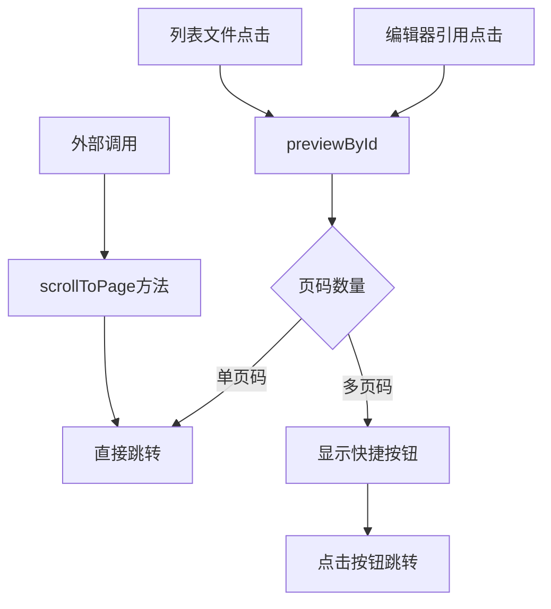
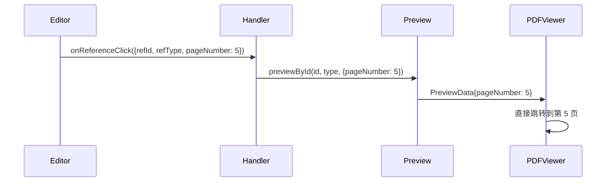
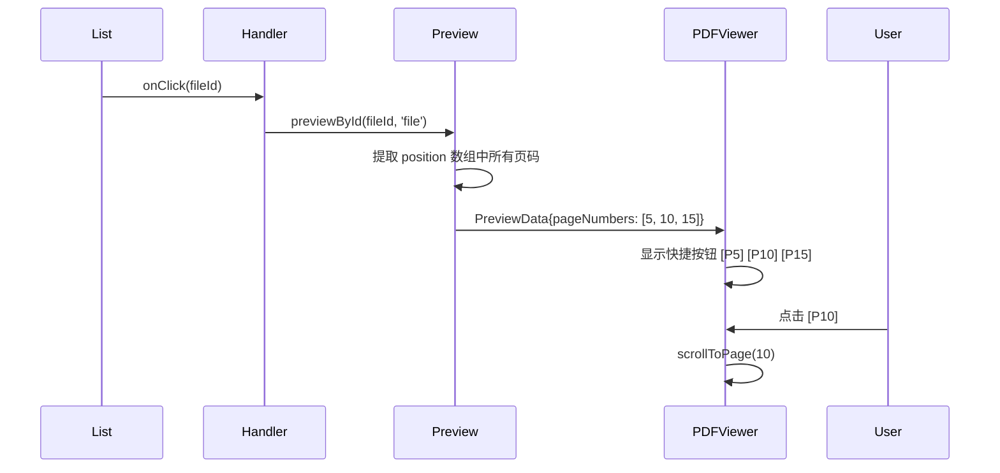

# 引用资料 PDF 多页码跳转 - 需求与设计

> 📖 回链：[任务概览](./README.md) | 遵循 [Spec 文档编写规范](../../../../../docs/rule/doc-spec-rule.md)

## 背景与上下文

### 业务背景

PDF 预览有两个入口场景，需要不同的页码跳转体验：

1. **编辑器引用标记点击**：用户点击报告中的引用标记【1】，需要跳转到该引用对应的具体页码
2. **引用列表文件点击**：用户在引用列表中点击文件，该文件可能在报告多处被引用，需要显示所有引用页码的快捷按钮

**关键场景示例**：

- 文件 A 在报告中被引用 3 次：第 5 页、第 10 页、第 15 页
- 从编辑器点击引用标记 → 直接跳转到对应页码（如第 5 页）
- 从列表点击文件 A → 显示 3 个快捷按钮 [P5] [P10] [P15]，点击任意按钮跳转

@see `apps/report-ai/src/types/file/index.ts:20-40` - `RPFileUnified.position` 数组定义
@see `apps/report-ai/src/components/Reference/type.ts:20-45` - `PreviewData` 接口定义

### 现有能力

1. **单页码跳转**（v1 已实现）：

   - 编辑器引用标记包含 `data-page-number` 属性
   - `onReferenceClick` 回调传递单个页码
   - PDF 组件支持 `initialPage` 跳转
   - @see `apps/report-ai/src/components/ReportEditor/config/editorConfig.ts:213-227`
   - @see `apps/report-ai/src/components/Reference/FilePreviewRenderer/PDFPreviewWrapper.tsx:15-35`

2. **文件位置信息**：
   - `RPFileUnified.position` 数组存储文件在各章节的位置
   - 每个 position 包含 `startPoint.page` 页码信息
   - @see `apps/report-ai/src/types/file/index.ts:20-40`

### 遗留问题

- PDF 预览组件不支持多页码快捷按钮 UI
- 缺少外部滚动控制方法（需要通过 ref 暴露）
- 引用列表点击文件时，未传递完整的页码数组
- `PreviewData` 仅支持单个 `pageNumber`，无法表达多页码场景

## 需求提炼

| 需求 ID | 描述                                      | 优先级 | 约束         |
| ------- | ----------------------------------------- | ------ | ------------ |
| FR-01   | 编辑器引用点击时，PDF 跳转到对应页码      | P0     | 已实现（v1） |
| FR-02   | 列表文件点击时，显示多页码快捷按钮        | P0     | 新增需求     |
| FR-03   | 点击快捷按钮，PDF 滚动到对应页码          | P0     | 新增需求     |
| FR-04   | 外部可调用方法直接滚动到指定页码          | P1     | API 扩展     |
| FR-05   | 页码按钮显示格式为 [P5] [P10]，去重排序   | P1     | UI 体验      |
| FR-06   | 页码缺失时，正常打开 PDF 但不显示快捷按钮 | P0     | 容错处理     |
| NFR-01  | 向后兼容，不影响现有单页码跳转流程        | P0     | 架构约束     |
| NFR-02  | 页码跳转响应 < 500ms                      | P1     | 性能要求     |

## 方案设计

### 整体架构



### 核心设计

#### 1. 类型扩展

**扩展 PreviewData 接口**

@see `apps/report-ai/src/components/Reference/type.ts:20-45`

```typescript
export interface PreviewData<TData = unknown> {
  type: PreviewContentType;
  id: string;
  chapterId?: number[];
  title: string;
  data: TData;
  /** PDF 初始页码（从 1 开始，仅用于 PDF 文件预览） */
  pageNumber?: number;
  /** PDF 多页码数组（用于显示快捷按钮，已去重排序） */
  pageNumbers?: number[];
}
```

**扩展 PDFPreviewWrapperProps 接口**

@see `apps/report-ai/src/components/Reference/FilePreviewRenderer/types.ts`

```typescript
export interface PDFPreviewWrapperProps {
  url: string;
  fileName: string;
  initialPage?: number;
  /** 多页码快捷按钮（已去重排序） */
  pageNumbers?: number[];
  onLoad?: () => void;
  style?: React.CSSProperties;
  className?: string;
}

/** PDF 预览组件暴露的方法 */
export interface PDFPreviewHandle {
  /** 滚动到指定页码 */
  scrollToPage: (page: number) => void;
}
```

#### 2. 数据流转

**场景 1：编辑器引用点击（单页码）**



**场景 2：列表文件点击（多页码）**



#### 3. 页码提取逻辑

**从 RPFileUnified 提取所有页码**

@see `apps/report-ai/src/components/Reference/utils/previewDataUtils.ts`

```typescript
/**
 * 从文件的 position 数组中提取所有页码
 * @param file - 文件对象
 * @returns 去重排序后的页码数组
 */
const extractPageNumbers = (file: RPFileTraced): number[] => {
  if (!file.position || !Array.isArray(file.position)) {
    return [];
  }

  const pages = file.position
    .map((pos) => pos?.startPoint?.page)
    .filter((page): page is number => typeof page === 'number' && page > 0);

  // 去重并排序
  return Array.from(new Set(pages)).sort((a, b) => a - b);
};
```

#### 4. PDF 预览组件改造

**快捷按钮 UI**

```tsx
// PDFPreviewWrapper.tsx
const PDFPreviewWrapper = forwardRef<PDFPreviewHandle, PDFPreviewWrapperProps>(
  ({ url, fileName, initialPage, pageNumbers, onLoad, style, className }, ref) => {
    const pdfViewerRef = useRef<PDFViewerHandle>(null);

    // 暴露滚动方法
    useImperativeHandle(ref, () => ({
      scrollToPage: (page: number) => {
        pdfViewerRef.current?.goToPage(page);
      },
    }));

    const handlePageButtonClick = (page: number) => {
      pdfViewerRef.current?.goToPage(page);
    };

    return (
      <div className={styles['pdf-preview-wrapper']}>
        {/* 多页码快捷按钮 */}
        {pageNumbers && pageNumbers.length > 1 && (
          <div className={styles['page-shortcuts']}>
            {pageNumbers.map((page) => (
              <button key={page} onClick={() => handlePageButtonClick(page)} className={styles['page-button']}>
                P{page}
              </button>
            ))}
          </div>
        )}

        <PDFViewer
          ref={pdfViewerRef}
          source={{ url }}
          fileName={fileName}
          initialPage={initialPage}
          onTotalChange={handleDocumentLoad}
        />
      </div>
    );
  }
);
```

### 关键决策

| 决策点           | 选择                         | 理由                             |
| ---------------- | ---------------------------- | -------------------------------- |
| 页码存储方式     | `pageNumber` + `pageNumbers` | 兼容单页码场景，扩展多页码场景   |
| 页码提取时机     | `previewById` 调用时         | 避免数据冗余，保持单一数据源     |
| 快捷按钮显示条件 | `pageNumbers.length > 1`     | 单页码直接跳转，多页码显示按钮   |
| 外部控制方式     | `ref.scrollToPage()`         | 符合 React 命令式 API 设计模式   |
| 页码去重排序     | 提取时处理                   | 确保 UI 显示清晰，避免重复和乱序 |

### 涉及模块改动

| 模块         | 改动内容                                | 文件路径                                              |
| ------------ | --------------------------------------- | ----------------------------------------------------- |
| 类型定义     | 扩展 `PreviewData` 添加 `pageNumbers`   | `Reference/type.ts`                                   |
| 类型定义     | 扩展 `PDFPreviewWrapperProps` 和 Handle | `Reference/FilePreviewRenderer/types.ts`              |
| 预览数据工具 | 添加 `extractPageNumbers` 函数          | `Reference/utils/previewDataUtils.ts`                 |
| 预览数据工具 | 更新 `createPreviewDataFromReference`   | `Reference/utils/previewDataUtils.ts`                 |
| PDF 预览组件 | 添加快捷按钮 UI 和 `scrollToPage` 方法  | `Reference/FilePreviewRenderer/PDFPreviewWrapper.tsx` |
| 引用列表组件 | 点击文件时不传递 `pageNumber` 选项      | `Reference/ReferenceItemTable/index.tsx`              |
| 页面引用处理 | 保持现有逻辑，传递单个 `pageNumber`     | `pages/ReportDetail/ReportContent/index.tsx`          |

## 边界情况

| 场景                  | 处理方式                              |
| --------------------- | ------------------------------------- |
| position 数组为空     | 不显示快捷按钮，正常打开 PDF          |
| position 包含无效页码 | 过滤掉 ≤ 0 的页码                     |
| 所有页码相同          | 视为单页码，直接跳转不显示按钮        |
| 页码超出总页数        | 跳转到最后一页                        |
| 非 PDF 文件           | 忽略 pageNumber 和 pageNumbers        |
| 编辑器引用点击        | 优先使用 pageNumber，忽略 pageNumbers |
| 列表文件点击          | 使用 pageNumbers，忽略 pageNumber     |

## 向后兼容性

- ✅ `pageNumber` 字段保持不变，现有单页码跳转逻辑不受影响
- ✅ `pageNumbers` 为可选字段，不传递时不显示快捷按钮
- ✅ 编辑器引用点击流程无需修改，继续传递 `pageNumber`
- ✅ PDF 组件的 `initialPage` 属性保持不变

## 风险评估

| 风险                      | 影响 | 概率 | 缓解措施                   |
| ------------------------- | ---- | ---- | -------------------------- |
| PDFViewer 不支持 goToPage | 高   | 低   | 提前验证组件 API           |
| position 数据不准确       | 中   | 低   | 后端数据质量保证           |
| 快捷按钮过多影响 UI       | 低   | 中   | 限制显示数量或使用下拉菜单 |
| ref 暴露方法调用失败      | 中   | 低   | 添加空值检查和错误处理     |

## 更新记录

| 日期       | 修改人 | 更新内容                                 |
| ---------- | ------ | ---------------------------------------- |
| 2025-11-12 | Kiro   | 初始创建，完成背景、需求、方案设计（v2） |

## 相关文档

- [任务概览](./README.md)
- [实施计划](./spec-implementation.md)
- [TypeScript 编码规范](../../../../../docs/rule/code-typescript-style-rule.md)
- [React 组件规范](../../../../../docs/rule/code-react-component-rule.md)

