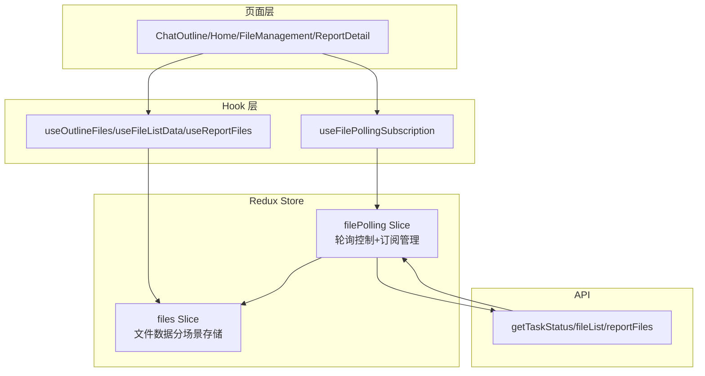
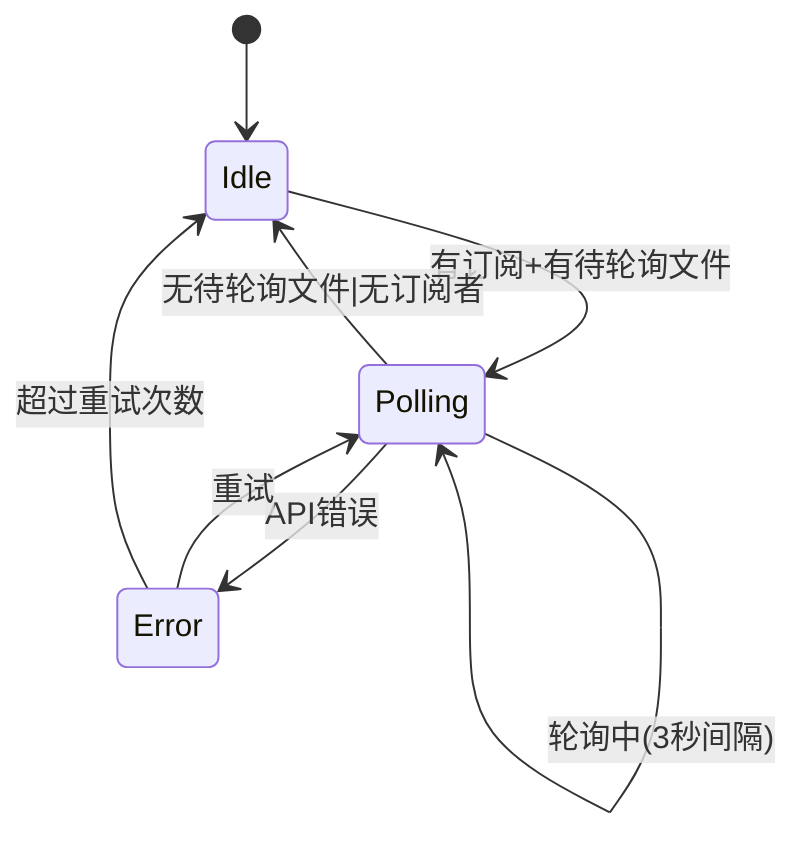
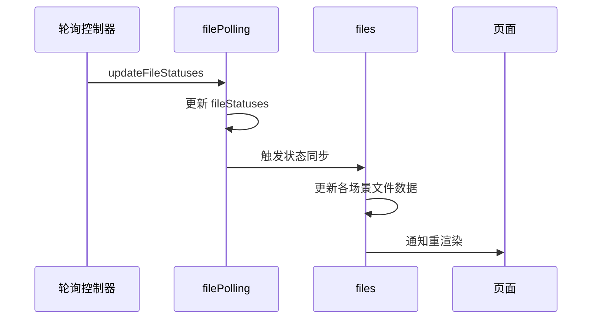

# 文件状态轮询与数据统一管理 - 设计方案 v1

> 回链：[README.md](/apps/report-ai/docs/specs/file-status-polling-redux/README.md)  
> 状态：🚧 设计中

## 设计目标

将分散在各页面的文件状态轮询逻辑和文件数据管理统一到 Redux Store，实现轮询机制统一、文件数据统一、自动清理和状态同步。

## 架构设计

### 整体架构

### 核心概念

#### 1. 双 Slice 架构

- **filePolling Slice**：管理订阅关系、控制轮询启停、维护文件状态映射
- **files Slice**：按场景存储文件数据（大纲/报告/列表），接收状态同步

#### 2. 场景分类

| 场景     | 数据源         | 特点     | 存储位置             |
| -------- | -------------- | -------- | -------------------- |
| 大纲文件 | 消息中的文件   | 临时性   | `files.outlineFiles` |
| 报告文件 | 报告参考资料   | 持久性   | `files.reportFiles`  |
| 文件列表 | 用户上传的文件 | 分页加载 | `files.fileList`     |

#### 3. 订阅机制

页面通过 Hook 订阅文件 ID 列表，组件卸载时自动取消订阅。Redux Store 自动合并所有订阅者的文件列表并去重。

#### 4. 状态同步

轮询获取的状态更新自动同步到 `filePolling.fileStatuses` 和 `files` 的所有场景数据。

## Redux Store 设计

### filePolling Slice

**State 结构**：

- `subscriptions`: 订阅管理 `{ subscriberId: fileIds[] }`
- `fileStatuses`: 文件状态映射 `{ fileId: status }`
- `polling`: 轮询控制状态（isActive/lastUpdateTime/error）

**核心 Actions**：

- `subscribe/unsubscribe`: 订阅管理
- `updateFileStatuses`: 批量更新文件状态
- `setPollingActive/setPollingError`: 轮询状态控制

**核心 Selectors**：

- `selectPendingFileIds`: 待轮询文件 ID（自动去重）
- `selectFileStatus`: 获取指定文件状态
- `selectIsPolling/selectPollingError`: 轮询状态查询

@see `/apps/report-ai/src/hooks/useFileStatusPolling.ts` - 底层轮询实现

### files Slice

**State 结构**：

- `outlineFiles`: 按 sessionId 分组的大纲文件
- `reportFiles`: 按 reportId 分组的报告文件
- `fileList`: 全局文件列表（含分页和搜索参数）

**核心 Actions**：

- `setOutlineFiles/setReportFiles/setFileList`: 设置文件数据
- `updateOutlineFileStatus/updateReportFileStatus/updateFileListStatus`: 更新文件状态
- `clearOutlineFiles/clearReportFiles`: 清理文件数据

**核心 Selectors**：

- `selectOutlineFiles/selectReportFiles/selectFileList`: 获取文件数据
- `selectOutlineFileById/selectReportFileById`: 获取单个文件

## 轮询机制设计

### 轮询触发条件

1. 有订阅者（subscriptions 不为空）
2. 有待轮询文件（从订阅者的 fileIds 中提取可变状态的文件）

### 轮询生命周期

### 状态同步流程

### 优化策略

- **智能去重**：合并所有订阅者的文件 ID
- **自动停止**：所有文件完成后停止轮询
- **错误重试**：失败后自动重试（最多 3 次）
- **防抖处理**：订阅变化时防抖 300ms

## Hook 设计

### useFilePollingSubscription

订阅文件状态轮询，自动管理订阅生命周期。

**参数**：`subscriberId`、`fileIds`、`enabled`  
**返回**：`fileStatuses`、`isPolling`、`error`、`refresh`

@see `/apps/report-ai/src/hooks/useFileStatusPolling.ts` - 参考现有实现

### useOutlineFiles

管理大纲文件数据，自动订阅轮询。

**参数**：`sessionId`、`initialFiles`、`autoSubscribe`  
**返回**：`files`、`setFiles`、`updateFileStatus`、`clearFiles`

### useFileListData

管理文件列表数据，支持搜索和分页。

**参数**：`autoFetch`、`autoSubscribe`  
**返回**：`fileList`、`total`、`loading`、`searchParams`、`setSearchParams`、`refresh`

@see `/apps/report-ai/src/hooks/useFileList.ts` - 参考现有实现

### useReportFiles

管理报告文件数据（已存在，需适配）。

@see `/apps/report-ai/src/store/reportContentStore/hooks/useReportFiles.ts`

## 页面迁移方案

### 迁移对比表

| 页面           | 当前实现                                  | 迁移后                                 |
| -------------- | ----------------------------------------- | -------------------------------------- |
| ChatOutline    | Context + useOutlineFilePolling           | useOutlineFiles (autoSubscribe: true)  |
| FileManagement | useFileList (内部轮询)                    | useFileListData (autoSubscribe: true)  |
| ReportDetail   | reportContentStore + useFileStatusPolling | useReportFiles (autoSubscribe: true)   |
| Home           | ChatSenderReport 组件内部状态             | 保持不变（文件仅用于传递，不需要轮询） |

### 迁移步骤

1. **ChatOutline**：使用 `useOutlineFiles` 替代 Context 文件管理，移除 `useOutlineFilePolling`
2. **FileManagement**：使用 `useFileListData` 替代 `useFileList`，移除内部轮询逻辑
3. **ReportDetail**：适配 `useReportFiles` 使用新的 files Slice，移除手动轮询订阅

@see `/apps/report-ai/docs/specs/file-status-polling-redux/spec-implementation-v1.md` - 详细实施计划

## 页面切换与清理

### 自动清理机制

Hook 内部通过 `useEffect` 在组件卸载时自动取消订阅。

### 数据清理策略

| 场景     | 清理时机         | 清理方式                  |
| -------- | ---------------- | ------------------------- |
| 大纲文件 | 离开大纲页面     | 清空对应 sessionId 的数据 |
| 报告文件 | 离开报告详情页面 | 保留数据（可能再次进入）  |
| 文件列表 | 离开文件管理页面 | 保留数据（全局列表）      |

### 清理流程

组件卸载 → Hook 取消订阅 → Redux 移除订阅者 → 重新计算待轮询文件 → 无订阅者时停止轮询 → 可选清理文件数据

## 数据一致性保证

### 状态更新优先级

轮询更新 > 手动更新 > 初始数据

### 冲突处理

同一文件在多个场景中存在时，状态更新会同步到所有场景。

## 性能优化

- **请求优化**：批量查询、智能去重、自动停止
- **渲染优化**：精确订阅、Selector 缓存、状态分片
- **内存优化**：按需加载、自动清理、数据限制

## 错误处理

- **错误类型**：API 错误、超时错误、数据错误
- **处理策略**：最多重试 3 次、指数退避、错误降级、保留最后已知状态

## 测试策略

- **单元测试**：Redux reducers、Selectors、Hook 逻辑
- **集成测试**：订阅流程、轮询机制、状态同步、跨 Slice 同步
- **E2E 测试**：页面切换清理、多页面订阅、错误处理、数据一致性

## 兼容性考虑

### 渐进式迁移

阶段 1-2：创建 Redux Slices → 阶段 3：实现轮询中间件 → 阶段 4：实现 Hooks → 阶段 5：迁移页面 → 阶段 6：清理旧代码

### 向后兼容

保留 `useFileStatusPolling` 作为底层实现，现有页面可逐步迁移，新旧机制可短期共存。

## 相关文档

- [实施拆解](/apps/report-ai/docs/specs/file-status-polling-redux/spec-implementation-v1.md)
- [useFileStatusPolling](/apps/report-ai/src/hooks/useFileStatusPolling.ts)
- [useOutlineFilePolling](/apps/report-ai/src/hooks/RPOutline/useOutlineFilePolling.ts)
- [useFileList](/apps/report-ai/src/hooks/useFileList.ts)
- [reportContentStore](/apps/report-ai/src/store/reportContentStore/README.md)

## 更新记录

| 日期       | 修改人 | 更新内容                     |
| ---------- | ------ | ---------------------------- |
| 2024-11-19 | AI     | 精简版设计方案，减少代码示例 |
