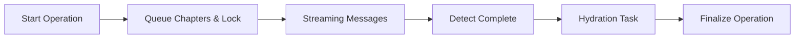

# Spec v1 · 生命周期统一设计

> 回链：[任务总览](./README.md)  
> 阶段：设计草案

## 1. 背景与目标

| 项目             | 内容 |
| ---------------- | ---- |
| 现状             | `useChapterRegeneration`、`useFullDocGeneration`、`useCompletionHandler` 各自处理启动/完成逻辑，导致流程重复与状态机边界不清晰（详见 [Issue](./report-content-store-issues.md)）。 |
| 核心目标         | 建立统一的生命周期协议（Start → Streaming → Complete → Hydration → Finalize），同时明确“全文队列推进”和“单章收尾”各自的责任。 |
| 约束与依赖       | 保持现有 Redux 状态结构；遵循 `Hydration` 机制；与 `ChatSync`、`useRehydrationOrchestrator` 无缝对接；允许全文与单章在完成检测阶段采用不同监听器。 |

## 2. 需求提炼

| 编号 | 需求描述 | 来源 |
| ---- | -------- | ---- |
| R1 | 启动章节/全文 AIGC 时，统一执行消息清理、章节锁定、correlationId 建立 | [Issue](./report-content-store-issues.md) |
| R2 | 全文生成需在章节完成后推进队列并触发下一章节；单章生成仅需完成当前章节收尾 | 同上 |
| R3 | 单章完成监听可集中在专用 Hook（如保留或重构 `useCompletionHandler`），但不得影响全文队列推进 | 同上 |
| R4 | 全局操作状态机须在注水完成后再收尾，保证 UI 与锁定状态一致 | 同上 |
| R5 | 发送请求需具备幂等标记并可观测 | 同上 |

## 3. 现状问题要点

| 维度     | 问题描述 | 来源 |
| -------- | -------- | ---- |
| 启动流程 | Hook 与 reducer 分别清理上下文消息/锁定章节，调用顺序难以追踪 | `hooks/useChapterRegeneration.ts:55`、`reducers/generationReducers.ts:40` |
| 完成检测 | 全文与章节各自监听消息尾部，重复触发 `processSingleChapterCompletion`；章节监听集中在 `useCompletionHandler`，职责边界模糊 | `hooks/useFullDocGeneration.ts:189`、`hooks/rehydration/useCompletionHandler.ts:40` |
| 状态收尾 | `finishGlobalOperation` 在多处调用导致时机不一致 | `hooks/rehydration/useCompletionHandler.ts:78`、`reducers/generationReducers.ts:165` |
| 幂等控制 | “只发送一次”逻辑散落在多个 `ref` 中，缺乏 Redux 可观测性 | `hooks/useChapterRegeneration.ts:104`、`hooks/useFullDocGeneration.ts:159` |

## 4. 统一方案设计

### 4.1 生命周期协议

- **单一入口**：新增 `startChapterOperation` action，负责清理消息、生成 correlationId、锁定章节，可接受 `mode: 'single' | 'batch'`。
- **完成监听策略**：
  - 全文生成：由 `useFullDocGeneration` 基于 `generationQueue` 监听消息并在章节完成后推进队列，同时调用共享完成处理。
  - 章节生成：保留/重构 `useCompletionHandler`（或新 `useChapterCompletionWatcher`）专门监听 `regeneration` 操作，聚焦当前章节收尾。
- **集中收尾**：章节路径监听注水状态后触发 `finishGlobalOperation`；全文路径在 `completeFullDocumentGeneration` 统一收尾。
- **幂等标记**：在 Redux 新增 `latestRequestedOperations: Record<chapterId, { correlationId: string; requested: boolean }>`，Hook 仅读取该状态决定是否发送消息并在发送后置 `requested=true`。

### 4.2 状态与 Action 调整

| 模块      | 变更                     | 目的 |
| --------- | ------------------------ | ---- |
| `reducers/generationReducers.ts` | 使用统一 `startChapterOperation` 初始化，移除本地消息清理逻辑 | 降低重复 |
| `reducers/chapterRegenerationReducers.ts` | 改写为调用共享启动逻辑，并存储 `operationId` | 同步协议 |
| `reducers/chapterOperationReducers.ts` | 初始化章节操作、登记 `latestRequestedOperations`、锁定章节 | 控制幂等 |
| `utils/chapterProcessing.ts` | 完成后清理 `latestRequestedOperations` | 收尾 |
| `hooks/useFullDocGeneration.ts` | 保留章节完成判断，但改为：检测完成 → 调用共享处理 → 推进队列/判断结束 | 明确职责 |
| `hooks/useChapterRegeneration.ts` | 移除本地 ref，改为观察 Redux 并触发消息 | 单一职责 |
| `hooks/rehydration/useCompletionHandler.ts` | 精简为只处理 `regeneration` 收尾（或替换为新 Hook），不再影响全文流程 | 职责聚焦 |

### 4.3 回兼容策略

- 保留原有 `processSingleChapterCompletion`，仅调整调用入口。
- 新增 action/type 命名保持向后兼容，旧组件不直接调用。
- `progressToNextChapter` 仍用于推进索引，但章节完成处理改由 `useFullDocGeneration` 控制，避免与章节监听重复。

## 5. 实施任务拆解

| 顺序 | 子任务 | 状态 | 负责人 | 关联目录 | 预计完成 | 备注 |
| ---- | ------ | ---- | ------ | -------- | -------- | ---- |
| T1 | 定义 `startChapterOperation` 及共享启动 reducers，迁移单章/全文入口 | ✅ 完成 | Codex | `apps/report-ai/src/store/reportContentStore/reducers` | 2025-10-29 | 引入 `mode` 区分 |
| T2 | 实现 `latestRequestedOperations` 状态，改造两类 Hook 发送逻辑 | ✅ 完成 | Codex | `apps/report-ai/src/store/reportContentStore/hooks` | 2025-10-29 | 需更新 selector |
| T3 | 重构章节完成监听（保留 `useCompletionHandler` 或新 Hook），确保仅处理 `regeneration` 收尾 | ✅ 完成 | Codex | `apps/report-ai/src/store/reportContentStore/hooks/rehydration` | 2025-10-29 | 不影响全文队列 |
| T4 | 调整 `progressToNextChapter`：仅推进索引，移除重复完成处理 | ✅ 完成 | Codex | `apps/report-ai/src/store/reportContentStore/reducers/generationReducers.ts` | 2025-10-29 | 保持进度统计 |
| T5 | 补充单元测试 & Storybook 场景：单章、全文、异常回滚 | ⏳ 待开始 | 待指派 | `apps/report-ai/src/store/reportContentStore/__tests__` | 待定 | 参照测试规范 |

## 6. 验证策略与风险

| 项目 | 内容 |
| ---- | ---- |
| 验证 | Vitest 覆盖章节/全文生成流程；Storybook 回归 AIGC 面板；手动验证 Hydration 日志按顺序输出。 |
| 风险 | 启动 action 合并可能影响现有并发流程；章节监听改造需验证 `useCompletionHandler` 替换方案；Redux 状态新增字段需确保持久化/序列化兼容；若遗漏 correlationId 关联会导致注水漏写。 |
| 降级 | 保留旧 action 的导出入口，必要时通过 feature flag 回退；监控 `activeOperations` 状态异常数。 |

## 7. 更新记录

| 日期       | 修改人 | 更新内容 |
| ---------- | ------ | -------- |
| 2025-10-29 | Codex  | 补充需求提炼、方案与任务拆解；调整完成监听策略说明 |
| 2025-10-29 | Codex  | 实施批量/单章统一启动与请求幂等方案，更新任务进度 |
