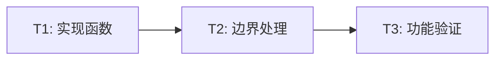

# 实施计划 v1

[← 返回任务概览](/docs/specs/rp-outline-regenerate/README.md)

## 实施范围

实现 `handleRegenerate` 函数，使其能够重新生成报告大纲。

## 任务拆解

| 任务 | 描述                         | 负责人 | 预计时间 | 状态 |
| ---- | ---------------------------- | ------ | -------- | ---- |
| T1   | 实现 `handleRegenerate` 函数 | -      | 30min    | ✅   |
| T2   | 添加边界情况处理             | -      | 15min    | ✅   |
| T3   | 验证功能正确性               | -      | 15min    | ⏳   |

## 实施细节

### T1：实现 handleRegenerate 函数

**修改文件**：

- `apps/report-ai/src/context/RPOutline.tsx` - 暴露 `getLastSendInput` 方法
- `apps/report-ai/src/hooks/RPOutline/useRPOutlineChat.ts` - 暴露 `inputRef`
- `apps/report-ai/src/hooks/RPOutline/useRPOutlineXAgent.ts` - 暴露 `inputRef`
- `apps/report-ai/src/components/ChatRPOutline/OperationArea/hooks/useOperationActions.ts` - 实现重新生成逻辑

**修改内容**：

1. 暴露现有的 `inputRef`（由 `useRPOutlineXAgent` 管理）
2. Context 层：提供 `getLastSendInput()` 方法
3. Hook 层：调用 `getLastSendInput()` 和 `sendMessage()`

**核心实现**（仅 5 行）：

```typescript
const lastInput = getLastSendInput()
if (!lastInput) return
sendMessage(lastInput) // sendMessage 内部自动处理 chatId
```

@see apps/report-ai/src/context/RPOutline.tsx
@see apps/report-ai/src/components/ChatRPOutline/OperationArea/hooks/useOperationActions.ts

### T2：添加边界情况处理

**处理场景**：

1. inputRef 为 null：早期返回，输出警告

### T3：验证功能正确性

**验证项**：

- [ ] 点击按钮后能重新生成大纲
- [ ] 保留完整对话历史
- [ ] 按钮状态正确
- [ ] 使用最新的 chatId
- [ ] 无控制台错误

## 依赖关系



## 交付物

- [x] 更新后的 `useOperationActions.ts` 文件
- [x] Spec 文档（需求、设计、实施）
- [ ] 功能验证报告（待测试）

## 风险与缓解

| 风险             | 缓解措施                             |
| ---------------- | ------------------------------------ |
| inputRef 为 null | 添加边界检查，早期返回               |
| 并发操作冲突     | 依赖现有的 `isChating` 状态          |
| chatId 过期      | 由 `sendMessage` 自动处理最新 chatId |

## 验收标准

- [x] 代码实现完成
- [x] 符合 TypeScript 规范
- [x] 符合 React Hooks 规范
- [ ] 功能测试通过
- [ ] 无 TypeScript 错误
- [ ] 无 ESLint 警告

## 相关文档

- [需求分析 v1](/docs/specs/rp-outline-regenerate/spec-requirements-v1.md)
- [方案设计 v1](/docs/specs/rp-outline-regenerate/spec-design-v1.md)
- [TypeScript 规范](/docs/rule/code-typescript-style-rule.md)
- [React 规范](/docs/rule/code-react-component-rule.md)
