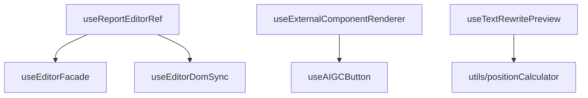

# ReportEditor Hooks 模块

> 报告编辑器的自定义 Hooks 集合，提供组件状态管理、DOM 操作、AI 功能集成

## 📁 目录结构

```
hooks/
├── index.ts                          # 统一导出
├── __tests__/                        # 单元测试
├── utils/                            # DOM 工具集
│   ├── README.md                     # 工具文档
│   ├── editorDomUtils.ts             # 基础 DOM 操作
│   ├── positionCalculator.ts         # 位置计算
│   └── ...
├── useTextRewritePreview/            # 文本改写预览
│   ├── README.md                     # 模块文档
│   ├── hook.tsx                      # 主实现
│   └── utils/                        # 子工具
├── useReportEditorRef.ts             # 编辑器引用管理
├── useExternalComponentRenderer.tsx  # 外部组件渲染
├── useEditorDomSync.ts               # DOM 同步管理
├── useEditorFacade.ts                # 编辑器外观封装
├── useAIGCButton.tsx                 # AIGC 按钮逻辑
└── ...
```

## 🔧 核心 Hooks

### useReportEditorRef
- **职责**: 编辑器命令式控制入口
- **功能**: TinyMCE 访问管理、章节 ID/编号同步

### useExternalComponentRenderer  
- **职责**: 统一调度外部组件渲染
- **功能**: AIGC 按钮、加载占位符等组件渲染管理

### useTextRewritePreview
- **职责**: 文本改写预览功能
- **文档**: [独立 README](useTextRewritePreview/README.md)

## 🎯 设计原则

1. **单一职责**: 每个 Hook 只负责一个具体功能
2. **类型安全**: 完整的 TypeScript 类型定义  
3. **性能优化**: 使用 useCallback、useMemo 优化重渲染

## 🔗 依赖关系



## 🚀 使用示例

```typescript
import { 
  useReportEditorRef, 
  useExternalComponentRenderer 
} from '@/components/ReportEditor/hooks';

// 编辑器引用
const { editorFacadeRef } = useReportEditorRef(props, ref);

// 外部组件渲染  
const { renderComponents } = useExternalComponentRenderer(editorRef, {
  onAIGCButtonClick: handleAIGCClick
});
```

## 📚 相关文档

- [ReportEditor 组件文档](../README.md)
- [DOM 工具集](utils/README.md)  
- [文本改写预览](useTextRewritePreview/README.md)