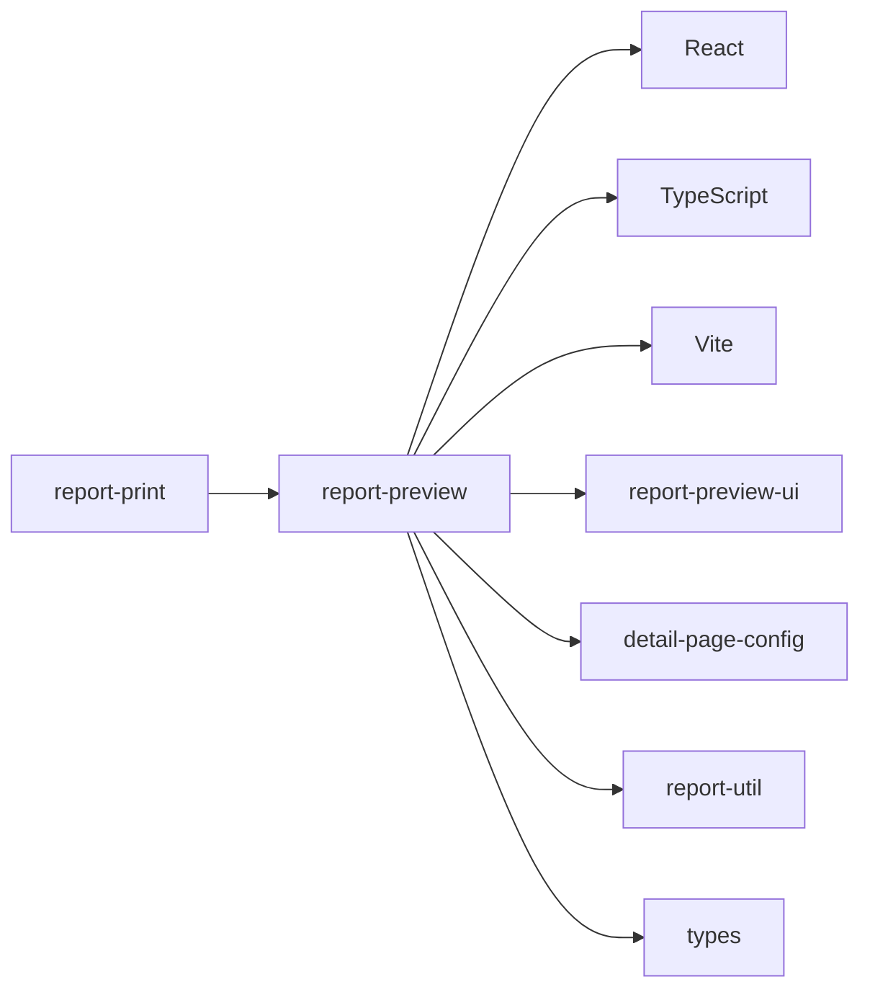

# `report-preview` - 报告浏览器预览应用

基于 React 的单页应用，专门用于报告的浏览器端高保真预览。提供交互式目录、内容联动、动态标题等功能，支持所见即所得的实时预览体验。

## 目录结构

```
apps/report-preview/
├── docs/                      # 文档目录
│   ├── overview.md            # 项目概述
│   ├── architecture.md        # 架构设计
│   └── development.md         # 开发指南
├── public/                    # 静态资源
├── script/                    # 脚本工具
├── src/                       # 源代码
│   ├── components/            # 组件
│   ├── hooks/                 # 自定义Hooks
│   ├── pages/                 # 页面
│   ├── services/              # 服务层
│   ├── styles/                # 样式
│   ├── utils/                 # 工具函数
│   ├── App.tsx                # 根组件
│   └── main.tsx               # 入口文件
├── package.json               # 项目配置
└── vite.config.ts             # Vite配置
```

## 关键文件说明

| 文件 | 作用 |
|------|------|
| `src/App.tsx` | 应用根组件 |
| `src/main.tsx` | 应用入口文件 |
| `vite.config.ts` | Vite构建配置 |
| `package.json` | 项目依赖和脚本配置 |

## 依赖关系



## 🚀 快速开始

```bash
# 安装依赖
pnpm install

# 启动开发服务
pnpm run dev:serve
```

访问 `http://localhost:3000?corpCode=xxx` 开始预览。

## 📚 文档

| 文档 | 描述 |
|------|------|
| [概述](./docs/overview.md) | 项目定位、核心功能介绍 |
| [架构设计](./docs/architecture.md) | 技术架构、分层设计、数据流 |
| [开发指南](./docs/development.md) | 本地开发、调试指南 |

## 📍 定位

专门用于**浏览器预览**，与 PDF 生成分离，可充分利用现代 Web 技术。
