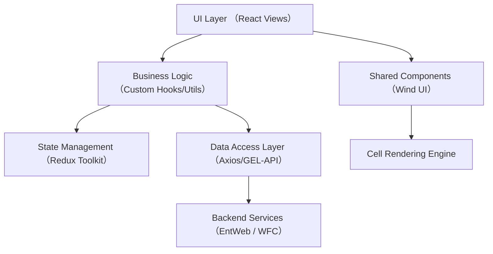
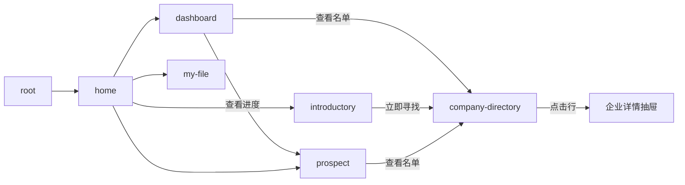
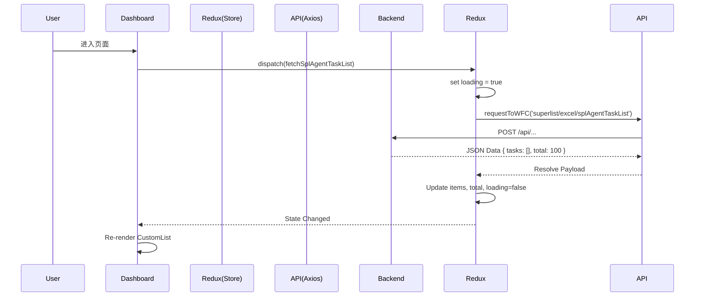
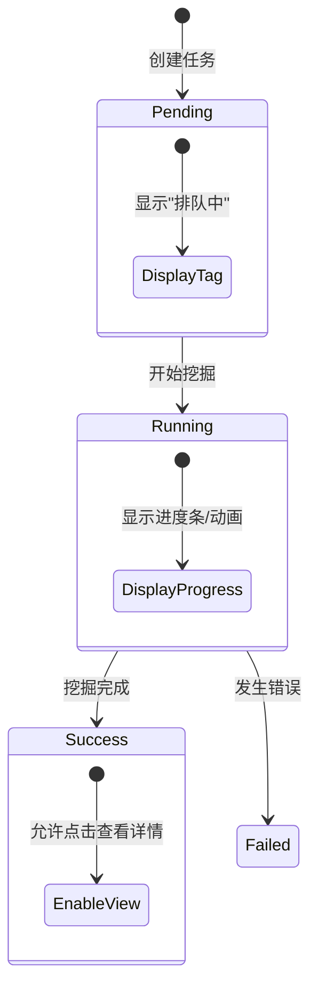

# Super Agent 项目详细设计文档

## 1. 引言 (Introduction)

### 1.1 编写目的

本文档旨在为 Super Agent 项目提供详细的前端设计说明，明确系统架构、模块划分、界面交互及接口规范，指导开发人员进行编码实现，并作为后续测试和维护的依据。

### 1.2 项目背景

Super Agent 是一个基于 AI 的企业线索挖掘与管理系统，旨在帮助销售人员通过智能匹配高效获取潜在客户，减少无效时间投入。

#### 1.2.1 模块简述

本模块为 Super Agent 单页面应用（SPA），提供潜在客户挖掘任务管理、客户名单展示、企业名录查询及文件管理功能的图形化界面，集成 Wind UI 与内部 GEL 生态组件。

### 1.3 定义

- **SPA (Single Page Application)**: 单页面应用，利用 React 路由实现页面无刷新跳转。
- **Micro-frontend**: 虽然本项目目前独立运行，但架构设计上通过 `gel-*` 系列包保留了微前端集成的可能性。
- **CellRegistry**: 项目核心组件之一，用于低代码化的单元格渲染，支持通过 JSON 配置动态渲染表格列内容（如 Markdown、数值、自定义组件）。
- **Addon**: CellRegistry 的增强插件机制，用于为单元格添加抽屉、Tooltip 等交互功能。
- **Wind UI**: 企业级 UI 组件库，基于 Ant Design 定制。
- **Hydration**: 虽然本项目主要为 CSR (Client-Side Rendering)，但保留了 SSR 兼容的结构。

### 1.4 参考资料

- **UI 设计稿**: [Figma 设计稿链接](https://www.figma.com/file/placeholder) (待补充)
- **前端技术栈**:
  - [React 18 官方文档](https://react.dev/)
  - [WIND UI 文档](http://10.106.42.38/wind-design/index-cn)
  - [Redux Toolkit 文档](https://redux-toolkit.js.org/)
  - [Vite 配置指南](https://vitejs.dev/)
- **后端接口文档**: [YApi 接口文档地址](http://yapi.internal/project/super-agent) (待补充)

---

## 2. 系统结构设计 (System Architecture)

### 2.1 顶层系统结构 (Top-Level Architecture)

前端架构采用典型的分层设计，确保关注点分离与可维护性。



- **UI 库层**: `@wind/wind-ui`, `gel-ui` 提供基础原子组件。
- **业务组件层**: `src/components` 提供 `CustomList`, `GeminiButton`, `CellRegistry` 等复用组件。
- **逻辑 Hooks 层**: `src/hooks` 及页面内的 `hooks` 目录，封装 `useCompanyDirectoryData` 等业务逻辑。
- **状态管理层**: `src/store` (Redux Toolkit) 管理全局状态（如 `superAgent` 任务列表）。
- **数据请求层**: `src/api` 封装 Axios 实例与拦截器，统一处理请求与错误。

### 2.2 子系统结构 (Directory Structure)

```text
src/
├── api/                # API 定义与拦截器
│   ├── entWeb/         # 企业 Web 服务接口
│   └── interceptors/   # 请求/响应拦截
├── components/         # 公共组件
│   ├── CellRegistry/   # [核心] 单元格渲染引擎
│   ├── CustomList/     # 客户列表组件
│   ├── GeminiButton/   # AI 风格按钮
│   └── layout/         # 布局组件 (PageContainer, AppSideMenu)
├── pages/              # 页面视图
│   ├── Dashboard/      # 仪表盘（任务管理）
│   ├── CompanyDirectory/# 企业名录（复杂表格页）
│   ├── MyFile/         # 我的文件
│   └── Home/           # 首页
├── router/             # 路由配置 (routes.tsx)
├── store/              # Redux 状态管理
│   └── superAgent/     # 核心业务 Slice
└── utils/              # 工具函数 (area, bury, env)
```

---

## 3. 用户界面 (User Interface)

### 3.1 界面流程图 (Screen Flow)



### 3.2 关键页面布局与交互

#### 3.2.1 仪表盘 (Dashboard)

- **布局**:
  - **Banner 区**: 包含动态背景与 Slogan ("找到对的客户...")，支持 "立即找寻" (GeminiButton) 操作。
  - **Intro 动画**: 首次进入时的全屏引导动画，随后收缩至 Banner。
  - **任务列表区**: 包含状态筛选 Tab (全部/挖掘完成/排队中/挖掘中/失败)，展示 `CustomList` 卡片/列表。
- **交互**:
  - 点击状态 Tab 过滤任务列表。
  - 点击 "立即找寻" 触发 `onCTA` 回调（通常打开新建任务 Modal）。
  - 列表项支持点击跳转至详情。

#### 3.2.2 企业名录 (Company Directory)

- **布局**: 全屏布局 (`PageContainer full`)。
  - **右侧面板 (RightPanel)**: 包含搜索栏 (`SearchToolbar`)、快捷筛选 (`QuickTabs`) 和核心数据表格 (`DataTable`)。
- **交互**:
  - **表格渲染**: 使用 `CellRegistry` 动态渲染列，支持 Markdown、数值格式化。
  - **详情查看**: 点击企业名称（Markdown 链接）触发 `DrawerAddon`，从右侧滑出企业详情。
  - **筛选**: 顶部 Toolbar 支持关键字搜索，QuickTabs 支持快速切换数据视图。

---

## 4. 接口设计 (Interface Design)

### 4.1 对外依赖接口 (External Dependencies)

后端 API 主要通过 `gel-api` 提供的路径常量进行调用，基础 URL 配置在 `src/api/baseUrl.ts`。

| 接口名称     | HTTP 方法 | URL 路径 (示例)                     | 前端调用场景                  | 参数示例                              |
| :----------- | :-------- | :---------------------------------- | :---------------------------- | :------------------------------------ |
| 获取任务列表 | POST      | `/superlist/excel/splAgentTaskList` | Dashboard 初始化加载任务列表  | `{ pageNum: 1, pageSize: 20 }`        |
| 获取企业列表 | POST      | `/ent/search/list` (假设)           | CompanyDirectory 表格数据加载 | `{ keyword: "科技", filters: {...} }` |
| 埋点上报     | POST      | `/user-log/add?api=buryCode`        | 用户点击核心按钮时            | `{ userLogItems: [...] }`             |

### 4.2 内部接口 (Internal Interfaces)

#### 4.2.1 组件通信 (Props & Events)

- **Dashboard**:
  - `Props`: `{ name?: string, onCTA?: () => void }`
  - `Event`: `window.postMessage` 监听 `banner/cta` 消息触发 `onCTA`。
- **DataTable** (CompanyDirectory):
  - `Props`: `{ columns: BasicColumn[], dataSource: BasicRecord[], loading: boolean }`
  - `Context`: `TableContext` 传递 columns 和 dataSource 给子组件。

#### 4.2.2 URL Query 参数

- `/company-directory`:
  - `selected`: (Number) 选中企业的 ID，用于初始化打开详情抽屉。
- `/dashboard`: 无特定 Query 参数，主要靠内部 State。

#### 4.2.3 Storage

- **Redux Store**: `superAgent` slice 存储任务列表数据，不持久化到 LocalStorage（页面刷新重置，依赖 API 重新获取）。

---

## 5. 类模型 (Class Model / Component Model)

### 5.1 系统组件结构树

```text
App
└── CellRegistryProvider (Global Context)
    └── PageContainer
        ├── AppSideMenu (Navigation)
        └── Routes
            ├── Dashboard
            │   ├── GeminiButton
            │   └── CustomList
            └── CompanyDirectory
                └── RightPanel
                    ├── SearchToolbar
                    ├── QuickTabs
                    └── DataTable
                        └── CellRegistryProvider (Local Context)
                            └── Table (AntD)
                                └── CellView (Render Cell)
                                    ├── CompanyCell (Custom Renderer)
                                    └── DrawerAddon (Interaction)
```

### 5.2 核心组件/Store 描述

#### 5.2.1 CellRegistry (核心渲染引擎)

- **功能**: 解耦表格数据与渲染逻辑，通过配置驱动渲染。
- **API**:
  - `registerRenderer(type, component)`: 注册新的数据类型渲染器。
  - `registerAddon(name, addon)`: 注册增强功能（如点击弹窗）。
  - `<CellView />`: 具体的渲染组件，接收 `value`, `record`, `column`。

#### 5.2.2 SuperAgent Store (`src/store/superAgent`)

- **State 定义**:

```typescript
interface SplAgentTaskState {
  items: TaskListItemWithAreaName[] // 任务列表（带地区名）
  total: number // 总数
  pageNum: number // 当前页
  pageSize: number // 页大小
  loading: boolean // 加载状态
  error: string | null
}
```

- **Actions**:
  - `fetchSplAgentTaskList`: AsyncThunk，调用 API 获取任务列表，并处理地区代码转换 (`getAreaNameByCode`)。

---

## 6. 动态模型 (Dynamic Model)

### 6.1 场景：加载并展示任务列表 (Scenario)



### 6.2 状态图：任务状态流转 (State Diagram)

虽然前端主要是展示状态，但 UI 根据状态有不同表现：



---

## 7. 非功能性需求 (Non-functional Requirements)

### 7.1 性能要求

- **构建优化**: 使用 Vite 进行构建，配置 `manualChunks` 将 React、AntD 等依赖拆分到 `vendor` chunk，利用浏览器缓存。
- **按需加载**: 路由级别使用 `React.lazy` (在 `routes.tsx` 中配置 `NotFound` 等，核心页面建议按需调整) 实现代码分割。
- **渲染性能**: `CellRegistry` 内部对大量单元格渲染应使用 `React.memo` 优化，避免无效重渲染。

### 7.2 兼容性

- **目标浏览器**: Chrome 80+, Safari 13+, Edge (Chromium内核)。
- **构建目标**: `es2015`，通过 `@vitejs/plugin-react` 处理 Polyfill。

### 7.3 安全性

- **API 代理**: 开发环境使用 Vite Proxy 转发请求，避免 CORS 问题。
- **XSS 防护**: `CellRegistry` 若涉及 Markdown 渲染，必须使用安全的解析库（如 `markdown-it`）并配置 HTML 过滤。
- **Token 管理**: Axios 拦截器 (`src/api/interceptors`) 统一注入 Authorization Header。

### 7.4 埋点需求

- 核心按钮（如 "立即找寻"、"查看结果"）需调用 `bury.ts` 中的埋点方法上报用户行为。

---

## 8. 单元测试/代码审查清单 (Unit Test / Code Review)

### 8.1 建议测试范围

目前项目尚未配置自动化测试框架，建议引入 Vitest + React Testing Library。

- **Utils 工具函数**:
  - `src/utils/area.ts`: 测试 `getAreaNameByCode` 对各种 Code 的返回值。
  - `src/components/CompanyDirectory/parts/DataTable/buildColumns.tsx`: 测试列构建逻辑是否正确处理 `expandAll` 等参数。
- **Redux Reducers**:
  - 测试 `superAgent` slice 对 `fulfilled`, `rejected` 状态的处理。
- **公共组件**:
  - `CellRegistry`: 核心组件，需测试不同 `type` 是否渲染正确的组件。

### 8.2 代码审查清单

- [ ] **TypeScript 类型**: 是否定义了明确的 Interface，避免使用 `any`。
- [ ] **Hooks 依赖**: `useEffect` 和 `useMemo` 的依赖数组是否完整。
- [ ] **样式隔离**: 是否使用了 CSS Modules (`.module.less`) 避免样式污染。
- [ ] **国际化**: 硬编码的中文是否包裹了 `t()` 函数。
- [ ] **错误处理**: API 调用是否包含 try-catch 或全局错误处理。
