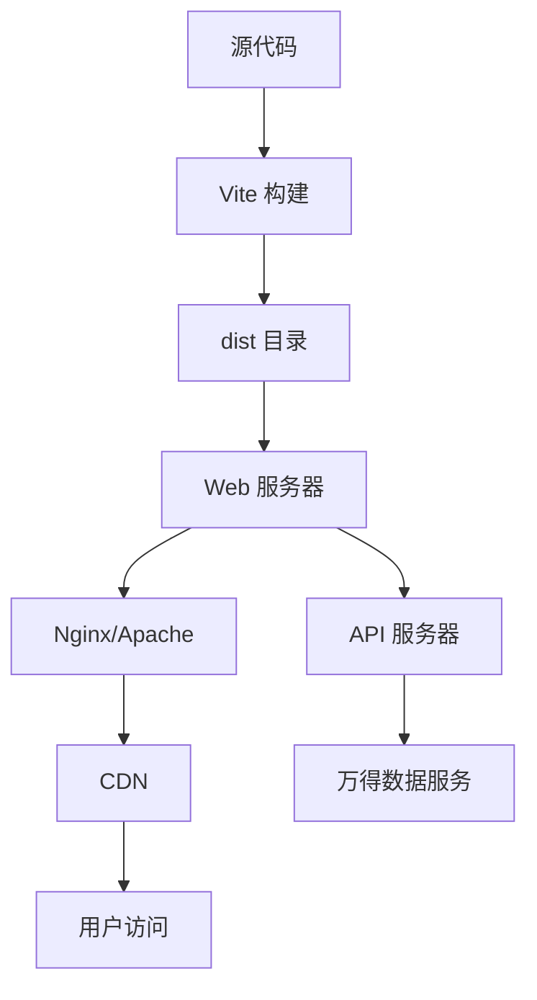

# 部署指南

## 概述

万得征信项目使用 Vite 构建工具，支持开发环境和生产环境的部署。本文档介绍项目的部署流程和配置。

## 构建流程

### 1. 开发环境

```bash
# 安装依赖
pnpm install

# 启动开发服务器
pnpm dev
```

开发服务器将在 `http://localhost:8081` 启动，支持：
- 热模块替换 (HMR)
- API 代理配置
- 源码映射
- 实时错误提示

### 2. 生产环境构建

```bash
# 构建生产版本
pnpm build

# 预览构建结果
pnpm preview
```

构建产物将输出到 `dist` 目录，包含：
- 压缩的 HTML 文件
- 带 hash 的 CSS 和 JS 文件
- 优化的静态资源
- 自动生成的资源映射

## 部署架构



## 服务器配置

### Nginx 配置示例

```nginx
server {
    listen 80;
    server_name your-domain.com;
    root /path/to/wind-zx/dist;
    index index.html;

    # 静态资源缓存
    location ~* \.(js|css|png|jpg|jpeg|gif|ico|svg)$ {
        expires 1y;
        add_header Cache-Control "public, immutable";
    }

    # HTML 文件不缓存
    location ~* \.html$ {
        expires -1;
        add_header Cache-Control "no-cache, no-store, must-revalidate";
    }

    # API 代理
    location /prod-api/ {
        proxy_pass https://gel.wind.com.cn/;
        proxy_set_header Host $host;
        proxy_set_header X-Real-IP $remote_addr;
        proxy_set_header X-Forwarded-For $proxy_add_x_forwarded_for;
        proxy_set_header X-Forwarded-Proto $scheme;
    }

    location /test-api/ {
        proxy_pass https://test.wind.com.cn/;
        proxy_set_header Host $host;
        proxy_set_header X-Real-IP $remote_addr;
        proxy_set_header X-Forwarded-For $proxy_add_x_forwarded_for;
        proxy_set_header X-Forwarded-Proto $scheme;
    }

    # SPA 路由支持
    location / {
        try_files $uri $uri/ /index.html;
    }
}
```

### Apache 配置示例

```apache
<VirtualHost *:80>
    ServerName your-domain.com
    DocumentRoot /path/to/wind-zx/dist

    # 静态资源缓存
    <FilesMatch "\.(js|css|png|jpg|jpeg|gif|ico|svg)$">
        ExpiresActive On
        ExpiresDefault "access plus 1 year"
        Header set Cache-Control "public, immutable"
    </FilesMatch>

    # HTML 文件不缓存
    <FilesMatch "\.html$">
        ExpiresActive On
        ExpiresDefault "access minus 1 second"
        Header set Cache-Control "no-cache, no-store, must-revalidate"
    </FilesMatch>

    # API 代理
    ProxyPreserveHost On
    ProxyPass /prod-api/ https://gel.wind.com.cn/
    ProxyPassReverse /prod-api/ https://gel.wind.com.cn/
    
    ProxyPass /test-api/ https://test.wind.com.cn/
    ProxyPassReverse /test-api/ https://test.wind.com.cn/

    # SPA 路由支持
    RewriteEngine On
    RewriteCond %{REQUEST_FILENAME} !-f
    RewriteCond %{REQUEST_FILENAME} !-d
    RewriteRule ^(.*)$ /index.html [QSA,L]
</VirtualHost>
```

## 环境变量配置

### 开发环境

创建 `.env.development` 文件：

```env
VITE_API_BASE_URL=/prod-api
VITE_APP_TITLE=万得征信
VITE_APP_ENV=development
```

### 生产环境

创建 `.env.production` 文件：

```env
VITE_API_BASE_URL=https://gel.wind.com.cn
VITE_APP_TITLE=万得征信
VITE_APP_ENV=production
```

## 构建优化

### 1. 代码分割

Vite 自动进行代码分割，将不同页面的代码分离：

```javascript
// 动态导入页面模块
if (currentPage.includes('index.html')) {
  import('./pages/homepage.js')
} else if (currentPage.includes('contact.html')) {
  import('./pages/contact.js')
}
```

### 2. 资源优化

- **图片压缩**：自动压缩图片资源
- **CSS 压缩**：移除注释和空白
- **JS 压缩**：使用 Terser 压缩
- **Tree Shaking**：移除未使用的代码

### 3. 缓存策略

```javascript
// vite.config.js
export default defineConfig({
  build: {
    rollupOptions: {
      output: {
        // 生成带 hash 的文件名
        entryFileNames: 'assets/js/[name]-[hash].js',
        chunkFileNames: 'assets/js/[name]-[hash].js',
        assetFileNames: 'assets/[name]-[hash].[ext]'
      }
    }
  }
})
```

## 监控和日志

### 1. 性能监控

```javascript
// 页面加载性能监控
window.addEventListener('load', () => {
  const timing = performance.getEntriesByType('navigation')[0]
  console.log('页面加载时间:', timing.loadEventEnd - timing.loadEventStart)
})
```

### 2. 错误监控

```javascript
// 全局错误捕获
window.addEventListener('error', (event) => {
  console.error('页面错误:', event.error)
  // 发送错误信息到监控服务
})
```

### 3. API 监控

```javascript
// API 请求监控
const originalFetch = window.fetch
window.fetch = function(...args) {
  const startTime = performance.now()
  return originalFetch.apply(this, args).then(response => {
    const endTime = performance.now()
    console.log('API 响应时间:', endTime - startTime)
    return response
  })
}
```

## 安全配置

### 1. HTTPS 配置

```nginx
server {
    listen 443 ssl http2;
    ssl_certificate /path/to/certificate.crt;
    ssl_certificate_key /path/to/private.key;
    
    # 安全头部
    add_header Strict-Transport-Security "max-age=31536000; includeSubDomains" always;
    add_header X-Content-Type-Options nosniff always;
    add_header X-Frame-Options DENY always;
    add_header X-XSS-Protection "1; mode=block" always;
}
```

### 2. CSP 配置

```html
<meta http-equiv="Content-Security-Policy" 
      content="default-src 'self'; 
               script-src 'self' 'unsafe-inline'; 
               style-src 'self' 'unsafe-inline'; 
               img-src 'self' data: https:;">
```

## 部署检查清单

### 构建前检查
- [ ] 所有依赖已安装
- [ ] 环境变量配置正确
- [ ] API 地址配置正确
- [ ] 静态资源路径正确

### 构建后检查
- [ ] 构建产物完整
- [ ] 资源文件带 hash
- [ ] 页面功能正常
- [ ] API 代理正常

### 部署后检查
- [ ] 网站可正常访问
- [ ] 静态资源加载正常
- [ ] API 请求正常
- [ ] 缓存策略生效
- [ ] 安全配置生效

## 故障排除

### 1. 构建失败

```bash
# 清理缓存
rm -rf node_modules/.vite
rm -rf dist

# 重新安装依赖
pnpm install

# 重新构建
pnpm build
```

### 2. 资源加载失败

检查构建后的 HTML 文件中的资源路径是否正确：

```html
<!-- 正确的资源路径 -->
<script type="module" src="/assets/js/main-a1b2c3d4.js"></script>
<link rel="stylesheet" href="/assets/css/index-e5f6g7h8.css">
```

### 3. API 代理失败

检查服务器配置中的代理设置：

```nginx
# 确保代理路径正确
location /prod-api/ {
    proxy_pass https://gel.wind.com.cn/;
}
```

## 性能优化建议

### 1. 资源预加载

```html
<!-- 预加载关键资源 -->
<link rel="preload" href="/assets/js/main.js" as="script">
<link rel="preload" href="/assets/css/index.css" as="style">
```

### 2. 图片优化

```javascript
// 使用 WebP 格式
const webpSupported = document.createElement('canvas').toDataURL('image/webp').indexOf('data:image/webp') === 0
if (webpSupported) {
  // 使用 WebP 图片
}
```

### 3. 缓存策略

```javascript
// Service Worker 缓存
if ('serviceWorker' in navigator) {
  navigator.serviceWorker.register('/sw.js')
}
```

## 联系支持

如有部署问题，请联系：
- **技术支持**：[联系方式]
- **运维团队**：[联系方式]
- **文档更新**：[文档链接] 