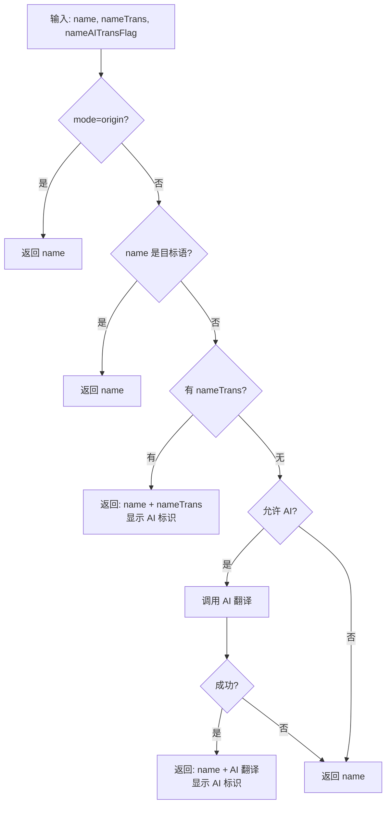

# 企业名称前端展示逻辑

## 概述

定义企业名称在前端的展示规则、优先级选择与 UI 呈现方式。

## 重要变更（2025-12）

- 中文环境（`zh-CN`）前端不再调用 AI 翻译作为回退，完全依赖后端提供的翻译字段。
- 若后端无翻译，展示仅保留原始名称，不显示 AI 标识。
- 相关实现：`apps/company/src/views/GlobalSearch/components/result/MultiResultList/handleName.ts`

## 字段映射

| API 字段              | 前端字段          | 说明     |
| --------------------- | ----------------- | -------- |
| `corpName`            | `name`            | 原始名称 |
| `corpNameTrans`       | `nameTrans`       | 翻译名称 |
| `corpNameAITransFlag` | `nameAITransFlag` | AI 标识  |

## 展示模式

| 模式   | 标识        | 主要位置  | 其余位置 |
| ------ | ----------- | --------- | -------- |
| 模式一 | `origin`    | 仅原始    | 仅原始   |
| 模式二 | `only-data` | 原始+翻译 | 仅原始   |

**位置定义**：

- **主要位置**：搜索结果卡片、企业详情页顶部卡片、图谱中心节点
- **其余位置**：表格列表、关联列表、图谱非中心节点、面包屑等

详见：[全局显示模式](../i18n-display-modes.md)

## 取值优先级

### 主要位置逻辑



### 其余位置逻辑

始终返回 `name`（原始名称）

## 展示规则

### 双行展示（主要位置，原始非目标语）

```
┌─────────────────────────┐
│ Apple Inc.               │  ← primaryText (name)
│ 苹果公司                  │  ← secondaryText (nameTrans)
│ Provided by AI           │  ← showAiBadge=true 时
└─────────────────────────┘
```

### 单行展示

```
┌─────────────────────────┐
│ Apple Inc.               │  ← primaryText (name)
└─────────────────────────┘
```

## 使用示例

### 基本用法

```typescript
import { formatEnterpriseNameMainWithAI } from 'gel-util/misc'

// API 数据映射
const input = {
  name: apiData.corpName,
  nameTrans: apiData.corpNameTrans,
  nameAITransFlag: apiData.corpNameAITransFlag,
}

// 格式化
const result = await formatEnterpriseNameMainWithAI(input, { locale: 'zh-CN', mode: 'only-data' }, aiTranslateFunc)
```

### 返回结果

```typescript
interface NameDisplayResult {
  primaryText: string // 主要显示名称
  secondaryText?: string // 次要显示名称（双行时）
  showAiBadge: boolean // 是否显示 AI 标识
  usedTranslation: boolean // 是否使用了翻译
}
```

## 场景矩阵

### 中文环境

| 场景     | 原始为中文                | 原始非中文                         | 展示说明                                    |
| -------- | ------------------------- | ---------------------------------- | ------------------------------------------- |
| 搜索结果 | 中文 + 英文（若有）       | 原始 + 中文译名（若后端提供）      | 不触发前端 AI；AI 标识仅依据后端字段        |
| 详情顶部 | 仅中文                    | 原始 + 中文译名（若后端提供）      | 无后端译名则仅原始；不显示前端生成的 AI 标识 |
| 图谱中心 | 仅中文                    | 原始 + 中文译名（若后端提供）      | 与搜索结果一致                              |
| 表格列表 | 仅中文                    | 仅原始                             | 单行展示                                    |

### 英文环境

| 场景     | 原始为英文 | 原始非英文      | 展示           |
| -------- | ---------- | --------------- | -------------- |
| 搜索结果 | 仅英文     | 原始 + 英文译名 | 单/双行 + 标识 |
| 详情顶部 | 仅英文     | 原始 + 英文译名 | 单/双行 + 标识 |
| 图谱中心 | 仅英文     | 原始 + 英文译名 | 单/双行 + 标识 |
| 表格列表 | 仅英文     | 仅原始          | 单行           |

## 降级策略

1. 同步格式化失败 → 返回原始名称
2. 中文环境：不触发前端 AI，后端无译名则保留原始名称
3. 英文环境：若允许 AI，AI 失败则保留已有译名或原始名称

## 相关文档

- [企业名称 API 定义](./api.md)
- [全局显示模式](../i18n-display-modes.md)

## 相关代码

- `packages/gel-util/src/misc/translate/companyName.ts` - 核心格式化逻辑
  - `formatEnterpriseNameMainWithAI()` - 主要位置格式化
  - `formatEnterpriseNameOther()` - 其余位置格式化
  - `deriveCorpNameInputFromRecord()` - 从对象提取字段
- `packages/gel-util/src/misc/translate/languageDetector.ts` - 语言检测
  - `detectChinese()` - 检测中文
  - `detectEnglish()` - 检测英文
  - `getDetectorByLocale()` - 获取检测器
- `packages/gel-util/src/misc/translate/displayModes.ts` - 显示模式
  - `shouldAllowAIForMain()` - 主要位置是否允许 AI
- `apps/company/src/handle/corp/base/translate.ts` - 企业详情翻译处理
 - `apps/company/src/views/GlobalSearch/components/result/MultiResultList/handleName.ts` - 搜索结果名称处理
   - `handleItemEn()` - 英文环境处理函数
   - `handleItemZh()` - 中文环境处理函数
   - `handleItem()` - 分派函数

## 字段兼容性

`deriveCorpNameInputFromRecord()` 函数支持驼峰和下划线两种命名风格：

| 命名风格 | 传入参数  | 读取字段                                        |
| -------- | --------- | ----------------------------------------------- |
| 驼峰命名 | corpName  | corpName, corpNameTrans, corpNameAITransFlag    |
| 下划线   | corp_name | corp_name, corp_nameTrans, corp_nameAITransFlag |

**推荐**：新代码统一使用驼峰命名风格
