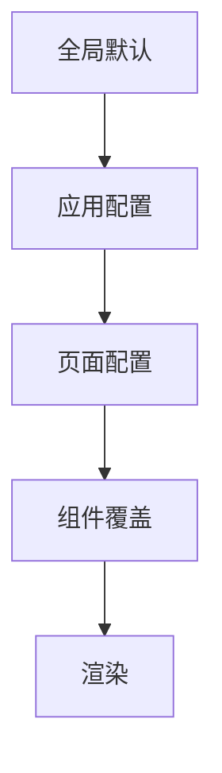

# 全局显示模式（i18n Display Modes）

## 概述

显示模式是全局页面设置，统一控制"原始名称/翻译名称"的展示策略与来源限制。适用于企业名称及其他可翻译字段。

## 适用范围

- 企业名称（搜索结果、详情页、图谱、列表等）
- 其他实体名称或可翻译字段

## 模式定义

| 模式   | 标识常量    | 主要位置                   | 其余位置 |
| ------ | ----------- | -------------------------- | -------- |
| 模式一 | `origin`    | 仅原始                     | 仅原始   |
| 模式二 | `only-data` | 原始+翻译（官方/TRANS/AI） | 仅原始   |

**代码定义**：`packages/gel-util/src/misc/translate/displayModes.ts`

```typescript
export type DisplayMode = 'origin' | 'only-data'
export const DEFAULT_DISPLAY_MODE: DisplayMode = 'only-data'
```

### 位置定义

- **主要位置**：搜索结果卡片、企业详情页顶部卡片、图谱中心节点
- **其余位置**：表格列表、关联列表、图谱非中心节点、面包屑等

### AI 标识规则

"Provided by AI"标识显示条件：

- 模式一：不显示
- 模式二：主要位置且 `AITransFlag=true` 时显示

## 配置与优先级



优先级：组件覆盖 > 页面配置 > 应用配置 > 全局默认

## 与后端契约

- 前端传入 `locale`/`lang` 参数
- 后端返回三字段：`{field}`、`{field}Trans`、`{field}AITransFlag`
- 模式不下发后端，属前端展示策略

## 行为矩阵

| 场景     | origin | only-data                          |
| -------- | ------ | ---------------------------------- |
| 主要位置 | 仅原始 | 原始+翻译（官方/TRANS/AI）         |
| 其余位置 | 仅原始 | 仅原始                             |
| AI 标识  | 不展示 | 主要位置且 AITransFlag=true 时展示 |

**判断逻辑**：

```typescript
// 主要位置是否允许 AI
shouldAllowAIForMain(mode: DisplayMode): boolean
// mode === 'only-data' 时返回 true

```

## 异常与降级

- 缺少译文：回退到原始
- 译文语种不匹配：视为缺失，回退原始
- 网络/服务失败：不影响原始展示

## 实施建议

- 应用启动时确定全局默认模式
- 关键页面在路由配置中显式声明模式
- 组件支持 `mode` 参数覆盖
- 使用统一 UI 组件处理"原始+翻译+AI 标识"

## 相关文档

- [企业名称规则](./company-name/) - 企业名称具体应用
- [API 文档](./api.md) - 国际化 API 函数
- [README](./README.md) - 模块总览

## 相关代码

- `packages/gel-util/src/misc/translate/displayModes.ts` - 模式定义与判断逻辑
