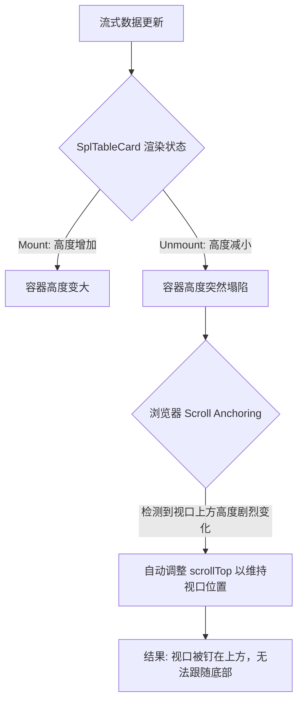

# 聊天滚动异常深度分析 (Simplified)

## 1. 核心问题

在 AI 流式回答过程中，页面出现**自动上滑**（视口停留在内容上方）或**底部抖动**现象。经排查，该问题由两个核心因素共同导致：

1.  **高度震荡源 (Source of Jitter)**：`SplTableCard` 组件的不稳定渲染（Mount/Unmount）导致容器高度剧烈变化，触发了浏览器的 **Scroll Anchoring（滚动锚定）** 机制。
2.  **滚动冲突 (Scroll Conflict)**：旧的滚动逻辑（基于 React State）响应过于频繁且滞后，与浏览器原生的锚定修正行为发生“拉锯战”，加剧了视觉上的抖动。

## 2. 根因图解

## 3. 关键疑问深度解析

### Q1: 为什么只有在“元素高度刚刚超过视口”时最容易复现？

**答案：这是浏览器“锚点选择”的模糊区（Ambiguous Zone）。**

1.  **锚点机制**：Scroll Anchoring 需要选择一个“锚点元素”来锁定视口。
2.  **深度溢出时 (Deep Overflow)**：当内容远超视口时，视口上方有大量稳定的 DOM 元素，浏览器很容易选中一个稳定的锚点，滚动相对可控。
3.  **临界溢出时 (Critical Overflow)**：
    - 当内容高度 = 视口高度 + 20px 时，整个容器都在可视范围内或边缘。
    - **不稳定锚点**：此时 DOM 结构稍有变化（如 `SplTableCard` 消失），浏览器会困惑：_“用户到底是在看头部还是尾部？”_
    - **默认行为**：浏览器通常倾向于**“保护顶部阅读体验”**。它会假设用户正在阅读开头，因此当底部发生剧烈震荡时，它会强制锁定顶部位置（`scrollTop: 0` 或当前位置），从而导致“无法滚到底部”的现象。

### Q2: 为什么有的电脑有，有的电脑没有？（时序与竞态）

**答案：这是渲染线程 (UI) 与 逻辑线程 (JS) 的赛跑。**

此问题本质上是一个 **Race Condition (竞态条件)**，取决于硬件性能：

- **Case A：高性能机器 / 特定帧率 (问题复现)**

  - 组件 Unmount (高度塌陷) -> **浏览器 Layout 完成** -> **触发 Scroll Anchoring (修正位置)** -> JS `scrollToBottom` 执行。
  - _结果_：浏览器先锁定了位置，JS 后执行滚动，但如果后续还有连续的 Layout 抖动，JS 的滚动会被覆盖或视觉上看起来像“跳回去了”。

- **Case B：由于时序差异巧合避开 (问题不复现)**
  - 组件 Unmount -> JS `scrollToBottom` **立即执行** -> 浏览器 Layout/Paint。
  - _结果_：JS 抢在浏览器“修正”之前强行设置了新的 `scrollTop`，掩盖了锚定行为。

**结论**：由于 `SplTableCard` 的闪烁是毫秒级的，不同电脑的 CPU/GPU 调度差异决定了“谁先赢”。

### Q3: 为什么最终呈现的是“剧烈抖动”？

**答案：这是“浏览器锚定修正”与“代码强制滚动”的高频冲突。**

1.  **冲突循环**：
    - **浏览器行为**：检测到高度塌陷，Scroll Anchoring 机制介入，瞬间将 `scrollTop` 向上修正，试图“锚定”视口内容。
    - **代码行为**：流式更新触发组件重渲染，旧的滚动逻辑（基于 State 或高频事件）检测到需要跟随，立即执行 `scrollToBottom` 强制向下滚动。
2.  **高频对抗**：在 AI 流式输出期间，这种“塌陷 -> 修正 -> 强制滚动”的过程以极高的频率（毫秒级）反复发生。
3.  **视觉残留**：屏幕在“被拉回上方”和“被推到底部”两个位置之间快速切换，人眼捕捉到的就是视口在剧烈上下跳动（Jittering）。

## 4. 解决方案

1.  **修复组件渲染稳定性**：优化 `SplTableCard` 的渲染逻辑，防止组件在流式数据更新过程中发生意外的 Mount/Unmount，从而消除高度震荡源。（已实施）
2.  **防御性 CSS**：在滚动容器上强制设置 `overflow-anchor: none`，告诉浏览器：“不要帮我自动调整位置，我自己控制”。
3.  **优化滚动驱动逻辑 (ResizeObserver)**：弃用基于 React State 的滚动触发方式，改为使用 `ResizeObserver` 监听内容容器的高度变化。
    - **按需滚动**：仅当内容高度实际发生变化且用户处于“吸附态”时才触发滚动，避免了单纯 State 更新但 DOM 未变导致的无效滚动。
    - **物理感知**：直接响应 DOM 几何尺寸变化，解决图片懒加载、公式渲染滞后导致的滚动失效问题。
    - **低频高效**：利用浏览器原生 Observer 机制，相比高频 JS 轮询或全量 Effect 触发，性能更好且不会高频抢占主线程。
