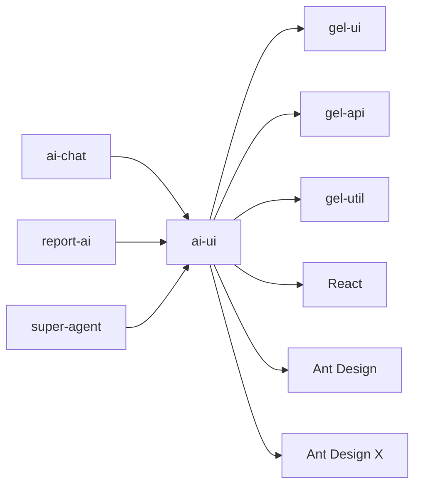

# ai-ui - AI对话组件库

AI对话组件库，提供完整的AI对话系统，支持会话管理、消息收发、流式响应和历史消息等核心功能。

## 目录结构

```
packages/ai-ui/
├── src/
│   ├── ChatBase/             # 聊天基础组件
│   │   ├── AddConversationBtn/ # 添加会话按钮
│   │   ├── HistoryBtn/         # 历史记录按钮
│   │   └── MyCollectBtn/       # 我的收藏按钮
│   ├── ChatMessage/           # 聊天消息组件
│   │   ├── Actions/            # 消息操作组件
│   │   ├── BubbleList/         # 消息气泡列表
│   │   ├── PlaceholderPrompts/ # 占位符提示
│   │   ├── ScrollToBottomButton/ # 滚动到底部按钮
│   │   └── WelcomeMiniProgram/ # 欢迎小程序
│   ├── ChatRoles/             # 聊天角色组件
│   │   ├── AIMsg/             # AI消息组件
│   │   ├── RolesBase/         # 角色基础组件
│   │   ├── SubQuestion/       # 子问题组件
│   │   └── suggestion/        # 建议组件
│   ├── WindChart/             # 风格图表组件
│   │   ├── BarChart/          # 柱状图组件
│   │   ├── ComposeChart/      # 组合图组件
│   │   └── PieChart/          # 饼图组件
│   ├── AliceIcon/             # Alice图标组件
│   ├── AliceLogo/             # Alice标志组件
│   ├── GradientText/         # 渐变文本组件
│   ├── WuiAliceBtn/           # WUI Alice按钮组件
│   ├── assets/                # 静态资源
│   ├── chart/                 # 图表相关
│   ├── constants/             # 常量定义
│   ├── context/               # 上下文管理
│   ├── hooks/                 # 自定义Hooks
│   ├── md/                    # Markdown相关
│   ├── misc/                  # 杂项组件
│   ├── styles/                # 样式
│   ├── types/                 # 类型定义
│   └── util/                  # 工具函数
├── docs/                      # 文档目录
├── package.json
└── tsconfig.json
```

## 关键文件说明

| 文件 | 作用 |
|------|------|
| `src/hooks/useChatBase.tsx` | 聊天基础Hook，处理核心聊天功能和状态管理 |
| `src/hooks/useConversationSetupBase.ts` | 会话设置基础Hook，处理会话初始化和非流式消息 |
| `src/hooks/useXChatParserBase.tsx` | 聊天解析基础Hook，处理消息解析和转换 |
| `src/context/ChatRoom/index.ts` | 聊天室上下文，管理聊天状态 |
| `src/ChatMessage/index.ts` | 聊天消息组件，统一导出消息相关组件 |

## 依赖关系



## 相关文档

- [架构设计](./architecture.md) - 系统架构和设计决策
- [组件文档](./docs/) - 组件详细文档和使用说明
- [设计文档](./ai-ui.md) - 组件设计文档
- [开发规范](../../docs/rule/) - TypeScript、React、样式等开发规范