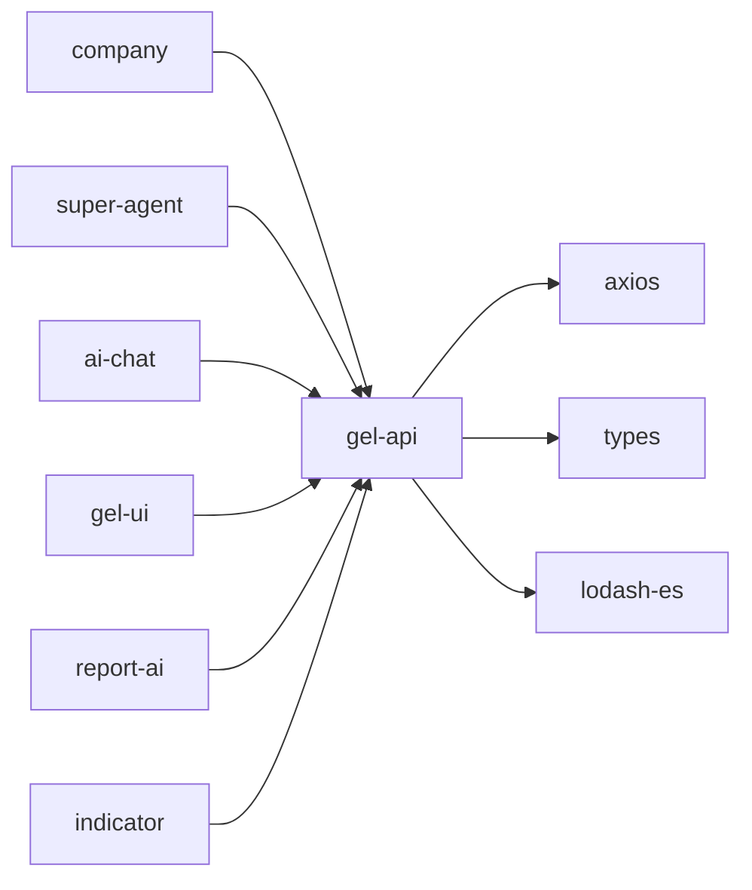

# gel-api - API请求层

统一的API请求层，封装axios提供标准化的请求函数、拦截器和环境判断，为全应用提供一致的API调用体验。

## 目录结构

```
packages/gel-api/
├── src/
│   ├── apiConfig.ts           # API配置文件
│   ├── config.ts              # 通用配置
│   ├── pathType.ts            # 路径类型定义
│   ├── bury/                  # 埋点相关API
│   ├── chat/                  # 聊天相关API
│   ├── entWeb/                # 企业Web相关API
│   ├── indicator/             # 指标相关API
│   ├── out/                   # 外部API
│   ├── requestFunc/           # 请求函数
│   ├── superlist/             # 超级列表相关API
│   ├── types/                 # 类型定义
│   ├── wfc/                   # WFC相关API
│   └── windSecure/            # 安全相关API
├── doc/                       # 文档目录
├── package.json
└── tsconfig.json
```

## 关键文件说明

| 文件 | 作用 |
|------|------|
| `src/apiConfig.ts` | API配置文件，定义基础URL和请求配置 |
| `src/requestFunc/base.ts` | 基础请求函数，封装axios核心功能 |
| `src/types/common.ts` | 通用类型定义，包括请求和响应结构 |
| `src/entWeb/axios.ts` | 企业Web模块的axios实例配置 |
| `src/chat/index.ts` | 聊天相关API统一导出 |

## 依赖关系



## 相关文档

- [架构设计](./architecture.md) - 系统架构和设计决策
- [API文档](./doc/) - 各模块API详细文档
- [开发规范](../../docs/rule/) - TypeScript、API请求等开发规范