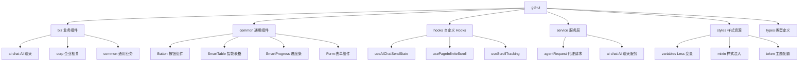

# gel-ui

项目通用 React 组件库，提供跨应用共享的 UI 组件、Hooks、服务和样式资源。

## 功能特性

| 特性 | 说明 |
|-----|-----|
| **业务组件** | AI 聊天、企业标签、调试面板等业务场景组件 |
| **通用组件** | 按钮、表格、表单、进度条等基础 UI 组件 |
| **自定义 Hooks** | AI 聊天状态、无限滚动、滚动跟踪等实用 Hooks |
| **服务层** | AI 请求处理、流式响应、代理请求等服务封装 |
| **样式系统** | Less 变量、Mixin、主题配置等样式资源 |
| **类型定义** | 完整的 TypeScript 类型定义与导出 |

## 包结构



## 安装使用

```bash
pnpm add gel-ui
```

### 导入方式

| 导入内容 | 导入路径 | 说明 |
|---------|---------|-----|
| 组件/Hooks/工具 | `gel-ui` | 从主入口导入 |
| Less 变量 | `gel-ui/variables.less` | 样式变量定义 |
| Less Mixin | `gel-ui/mixin/index.less` | 样式混入工具 |
| 组件样式 | `gel-ui/dist/index.css` | 打包后的样式文件 |

### 使用示例

参考各组件的 Storybook 文档和类型定义获取详细使用方法。

## 开发指南

| 命令 | 说明 |
|-----|-----|
| `pnpm install` | 安装依赖 |
| `pnpm dev` | 开发模式（带 watch） |
| `pnpm build` | 构建生产包 |
| `pnpm story` | 启动 Storybook 文档 |
| `pnpm build-story` | 构建 Storybook 静态站点 |
| `pnpm lint` | 代码检查 |
| `pnpm tsc` | 类型检查 |

## 相关文档

- [架构说明](./architecture.md) - 目录结构与模块职责
- [AI 聊天流程设计](./docs/biz/ai-chat/) - AI 聊天相关组件与服务的详细设计
- Storybook 文档 - 运行 `pnpm story` 查看组件交互文档

## 技术栈

基于以下核心技术构建：

- **React 18** - UI 框架
- **TypeScript** - 类型安全
- **Vite** - 构建工具
- **Less** - 样式预处理
- **Ant Design / Wind UI** - 基础组件库
- **ahooks** - React Hooks 工具集
- **lodash** - 工具函数库

## License

MIT 