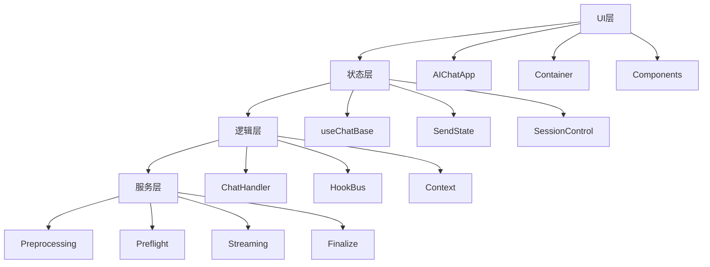

# AI Chat 系统架构设计

## 设计概览

实现高内聚低耦合的组件体系，支持灵活扩展和业务定制，覆盖UI组件层到服务层的完整架构。

## 核心目标

- 业务定制化：灵活定制UI组件和交互流程
- 流程扩展：请求处理各阶段插入业务逻辑
- 组件复用：跨项目复用核心对话能力
- 性能优化：大规模并发和长会话管理

## 整体架构

## 层次职责

| 层级 | 核心组件 | 主要职责 | 扩展机制 |
|------|----------|----------|----------|
| UI层 | 组件容器 | 渲染展示、用户交互 | 插槽系统、主题定制 |
| 状态层 | Hooks | 状态管理、数据流 | 自定义Hook、状态持久化 |
| 逻辑层 | 处理器 | 流程编排、事件处理 | 中间件、插件化 |
| 服务层 | 处理器 | 业务逻辑、数据处理 | 扩展点、配置化 |

## 关键特性

### 1. 插件化扩展
- 流程扩展：各阶段插入业务逻辑
- UI扩展：组件插槽化配置
- 数据扩展：自定义解析器

### 2. 状态管理
- 分层状态：全局→会话→消息→UI
- Hook封装：复用状态逻辑
- 持久化：本地缓存策略

### 3. 性能优化
- 虚拟滚动：长列表性能优化
- 懒加载：按需加载组件
- 缓存机制：智能缓存策略

### 4. 错误处理
- 分层边界：组件→功能→页面→应用
- 降级策略：错误时的备选方案
- 监控告警：错误上报和分析

---

*相关实现: `src/biz/ai-chat/`, `src/hooks/aiChat/`*
*参见文档: [组件架构](./component-architecture.md), [流程设计](./process-flow.md)*