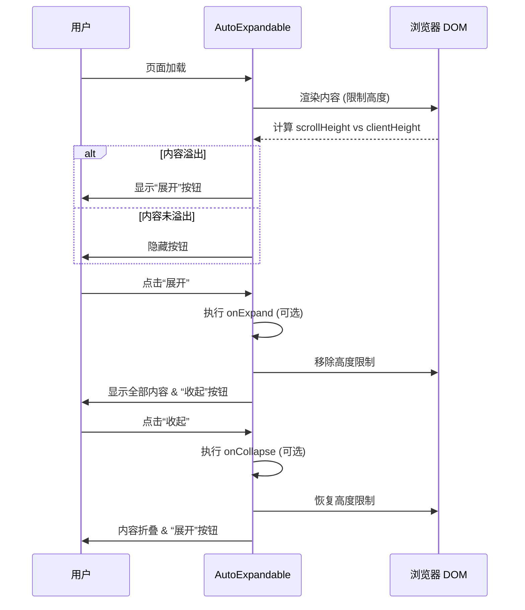

# AutoExpandable 组件设计文档

## 1. Overview (概览)

`AutoExpandable` 是一个通用的自动展开/收起组件。它允许开发者限制任何内容（文本、HTML 元素、React 组件等）的最大显示行数。当内容高度超过指定行数时，组件会自动截断内容并显示“展开”按钮。

### 关键场景
- **长文本展示**: 在列表或卡片中展示简介，默认只显示 2 行，点击展开查看全部。
- **复杂内容折叠**: 折叠包含标签、图标或富文本的复杂组件区域。
- **异步展开**: 点击展开时触发数据加载（如加载完整评论）。

## 2. Architecture (信息架构)

该组件作为一个通用 UI 原子组件，嵌入在业务页面或更高层级的业务组件中使用。

```mermaid
graph TD
    Page[业务页面] --> Container[内容容器]
    Container --> AutoExpandable[AutoExpandable 组件]
    AutoExpandable --> Content[原始内容 (Children)]
    AutoExpandable --> Trigger[展开/收起触发器]
```

## 3. Blueprint (页面蓝图)

| 区域 | 数据来源 | 交互动作 | 可见条件 | 备注 |
| :--- | :--- | :--- | :--- | :--- |
| **内容区域** | `props.children` | 无 | 常驻 | 默认设置 `line-clamp` 样式 |
| **展开按钮** | 内部状态 | 点击切换为展开状态 | `isOverflowing` 为真 且 `expanded` 为假 | 支持异步回调 `onExpand` |
| **收起按钮** | 内部状态 | 点击切换为收起状态 | `expanded` 为真 | |

## 4. Task Flow (任务流程)

### 基础交互流程



## 5. States (状态)

| 状态 | 描述 | 视觉表现 |
| :--- | :--- | :--- |
| **Initial (检测中)** | 组件挂载初期的状态 | 内容渲染，按钮状态待定（通常使用 useLayoutEffect 避免闪烁） |
| **Collapsed (已收起)** | 内容超过最大行数 | 内容被截断，底部显示“展开”按钮 |
| **Expanded (已展开)** | 用户点击展开后 | 内容完整显示，底部显示“收起”按钮 |
| **No Overflow (无溢出)** | 内容未超过最大行数 | 内容完整显示，**不显示**任何按钮 |

## 6. Components (组件复用与对比)

### 组件对比：AutoExpandable vs TextExpandable

| 特性 | AutoExpandable (推荐) | TextExpandable (旧版) |
| :--- | :--- | :--- |
| **适用内容** | **任意 ReactNode** (文本、标签、图片等) | **仅纯文本 (String)** |
| **溢出检测** | `scrollHeight > clientHeight` (通用 DOM 检测) | 依赖纯文本的高度估算或类似 DOM 检测 |
| **样式实现** | `line-clamp` + CSS Modules | `line-clamp` + CSS Modules (曾有 Safari 兼容 hack) |
| **异步支持** | 支持 `onExpand` 异步回调 | 不支持 |
| **架构定位** | 通用 UI 组件 | 遗留文本组件 |

### 迁移建议
建议新业务全量使用 `AutoExpandable`。对于仅展示简单文本的旧业务，可视情况逐步迁移。

### 代码引用
- 源文件: `@see packages/gel-ui/src/common/AutoExpandable/index.tsx`
