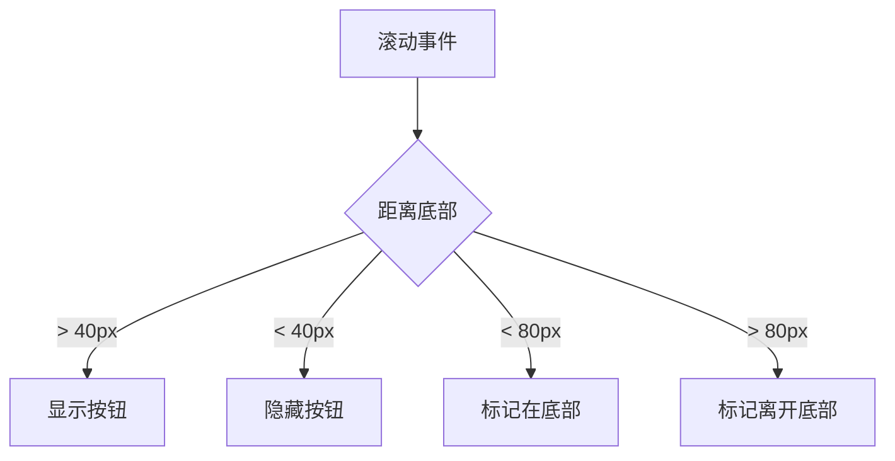
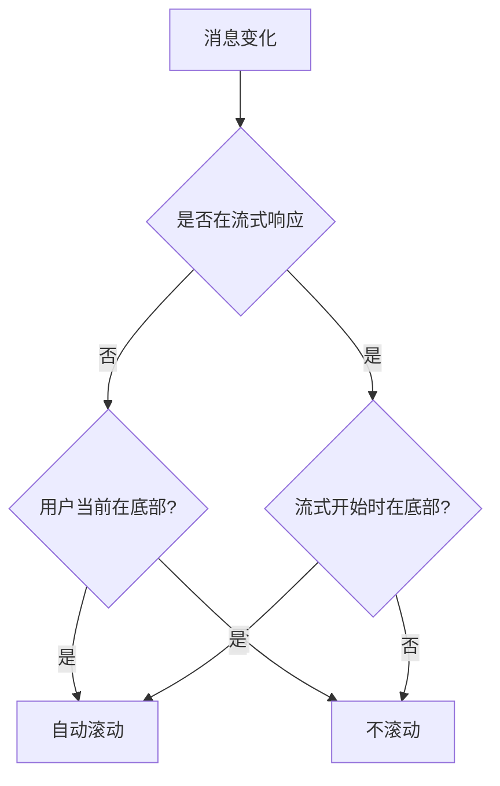

# useScrollToBottom Hook

## 概述

聊天消息自动滚动控制 Hook，智能管理滚动位置、"滚动到底部"按钮显示和自动滚动行为。

**核心能力**：

- 实时跟踪用户滚动位置
- 智能控制"滚动到底部"按钮显隐
- 流式响应时保持用户滚动意图

## 使用场景

| 场景     | 说明                                  |
| -------- | ------------------------------------- |
| 聊天界面 | 新消息到达时自动滚动到底部            |
| 流式响应 | AI 回复时根据用户位置决定是否自动滚动 |
| 历史消息 | 用户查看历史时不干扰滚动位置          |

## API

### 参数

```typescript
interface UseScrollToBottomProps<T> {
  parsedMessages: T // 解析后的消息列表（任意类型）
  isChating: boolean // 是否正在流式响应中
}
```

| 参数           | 类型    | 说明                               | 必填 |
| -------------- | ------- | ---------------------------------- | ---- |
| parsedMessages | T       | 消息列表，变化时触发滚动逻辑       | ✓    |
| isChating      | boolean | 流式响应状态，用于判断自动滚动策略 | ✓    |

### 返回值

```typescript
{
  chatContainerRef: RefObject<HTMLDivElement>  // 绑定到滚动容器
  showScrollBottom: boolean                    // 是否显示"滚动到底部"按钮
  scrollToBottom: () => void                   // 手动滚动到底部方法
}
```

| 返回项           | 类型       | 说明                     |
| ---------------- | ---------- | ------------------------ |
| chatContainerRef | RefObject  | 需绑定到聊天容器的 ref   |
| showScrollBottom | boolean    | 距离底部 >40px 时为 true |
| scrollToBottom   | () => void | 平滑滚动到底部           |

## 核心逻辑

### 滚动状态判定



**阈值说明**：

- 40px：显示/隐藏按钮的临界值
- 80px：判定"在底部"的容差范围

### 自动滚动策略



**策略说明**：

1. **非流式**：仅当用户在底部时自动滚动
2. **流式中**：根据流式开始时的位置决定
   - 开始时在底部 → 持续自动滚动
   - 开始时不在底部 → 不自动滚动

## 使用示例

```typescript
import { useScrollToBottom } from '@/hooks/useScrollToBottom'

function ChatRoom() {
  const messages = useChatMessages()
  const isStreaming = useStreamingState()

  const { chatContainerRef, showScrollBottom, scrollToBottom } =
    useScrollToBottom({
      parsedMessages: messages,
      isChating: isStreaming
    })

  return (
    <div ref={chatContainerRef} className="chat-container">
      {messages.map(msg => <Message key={msg.id} {...msg} />)}

      {showScrollBottom && (
        <button onClick={scrollToBottom}>
          滚动到底部
        </button>
      )}
    </div>
  )
}
```

## 实现细节

### 状态管理

| 状态                            | 用途               | 更新时机               |
| ------------------------------- | ------------------ | ---------------------- |
| showScrollBottom                | 控制按钮显隐       | 每次滚动事件           |
| isAtBottom                      | 标记用户位置       | 每次滚动事件           |
| wasAtBottomWhenStreamingStarted | 记录流式开始时位置 | isChating 变为 true 时 |

### 性能优化

- **requestAnimationFrame**：滚动操作在下一帧执行，避免布局抖动
- **useCallback**：缓存滚动方法和事件处理器，减少重渲染
- **事件监听清理**：组件卸载时自动移除监听器

## 注意事项

1. **容器要求**：必须将 `chatContainerRef` 绑定到可滚动的容器元素
2. **消息依赖**：`parsedMessages` 变化会触发滚动判定，确保引用稳定
3. **阈值调整**：40px/80px 适用于常规聊天界面，特殊场景可调整
4. **平滑滚动**：使用 `behavior: 'smooth'`，部分浏览器可能不支持

## 相关

- 代码实现：`@see packages/gel-ui/src/hooks/useScrollToBottom.ts`
- 使用示例：`@see packages/ai-ui/src/context/ChatRoom/base.tsx`
