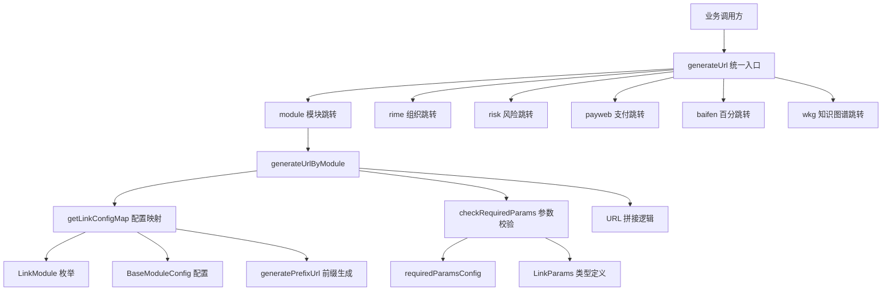
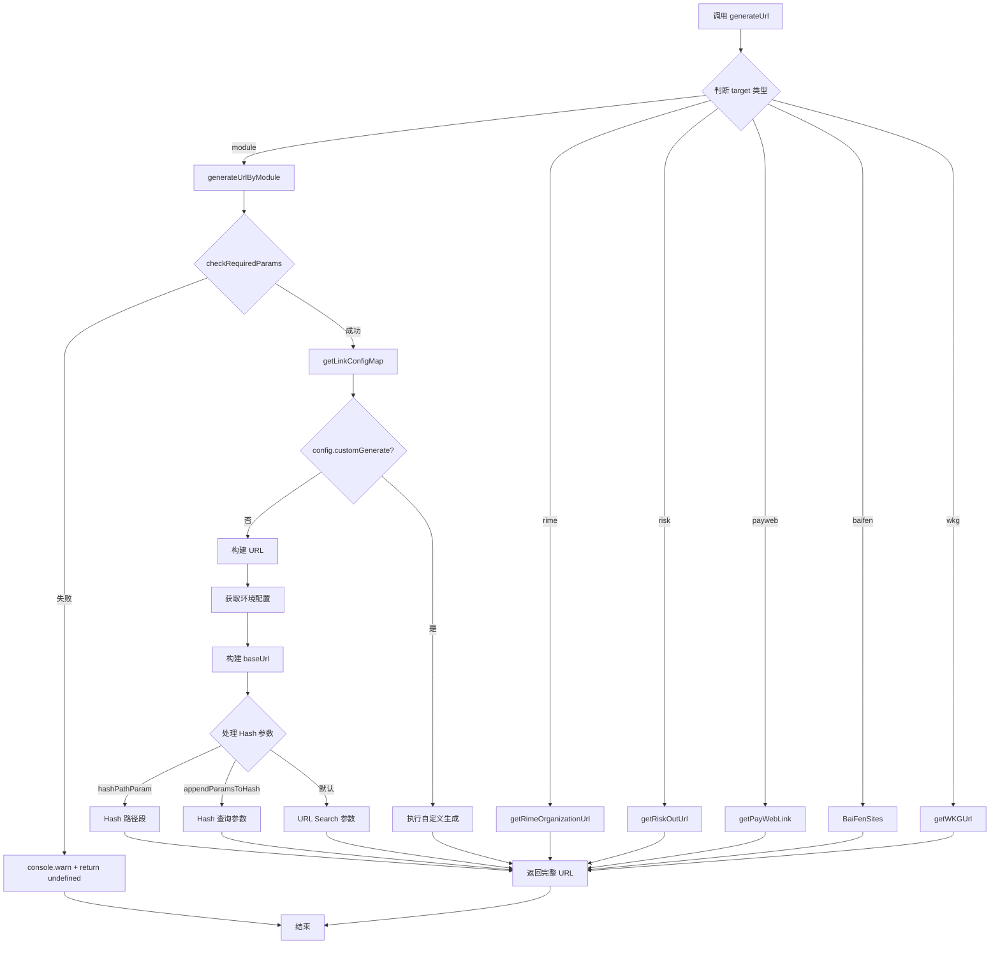
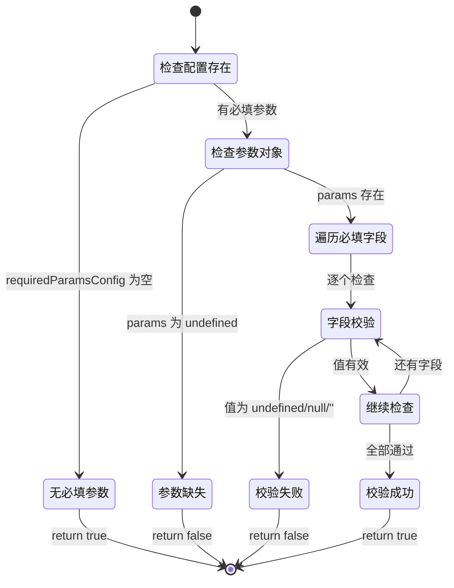

# 链接配置管理设计文档

## 概览

链接配置管理系统为 GEL 平台提供统一的 URL 生成与跳转能力，覆盖 30+ 业务模块（企业详情、AI 聊天、报告预览、图谱平台等），支持多环境（本地/测试/生产/终端）差异化配置。

**目标人群**：前端开发者、业务集成方  
**关键场景**：

1. 业务模块间跳转（如从企业详情跳转到图谱平台）
2. 多环境 URL 适配（本地开发、测试站、生产环境、终端内嵌）
3. 参数校验与 URL 拼接（必填参数检查、Hash/Query 参数处理）

## 信息架构

## 页面蓝图

### 核心配置结构

| 区域                 | 展示数据                       | 可交互动作                  | 可见条件 |
| -------------------- | ------------------------------ | --------------------------- | -------- |
| LinkModule 枚举      | 30+ 业务模块标识               | 作为配置 key 使用           | 始终可用 |
| BaseModuleConfig     | hash、prefixPath、envConfig 等 | 被 generateUrlByModule 读取 | 始终可用 |
| LinkParams           | 各模块参数类型定义             | 类型校验与参数拼接          | 始终可用 |
| requiredParamsConfig | 必填参数配置                   | 运行时参数校验              | 始终可用 |

### 环境配置差异

| 环境                 | prefixPath 规则           | origin 规则    | 典型场景      |
| -------------------- | ------------------------- | -------------- | ------------- |
| local                | 自定义或 `/`              | 自定义或当前域 | 本地开发      |
| web/webTest          | `/WFC/PC.Front/{service}` | 当前域         | 测试/生产环境 |
| terminal/terminalWeb | `/WFC/PC.Front/{service}` | 指定域名       | 终端内嵌      |

## 任务流程

### URL 生成主流程

### 参数校验流程

## 数据与状态

### 配置数据来源

| 字段                 | 来源                    | 刷新策略   | 示例                                     |
| -------------------- | ----------------------- | ---------- | ---------------------------------------- |
| LinkModule           | 枚举定义                | 编译时固定 | `LinkModule.COMPANY_DETAIL`              |
| BaseModuleConfig     | getLinkConfigMap(isDev) | 运行时生成 | `{ hash: 'customer', envConfig: {...} }` |
| LinkParams           | 类型定义                | 编译时固定 | `{ companycode: string }`                |
| requiredParamsConfig | 静态配置                | 编译时固定 | `{ [LinkModule.GROUP]: ['id'] }`         |

### URL 拼接规则

| 参数处理方式    | 触发条件                   | 结果示例                   |
| --------------- | -------------------------- | -------------------------- |
| Hash 路径段     | `hashPathParam` 存在       | `#chat/123?other=value`    |
| Hash 查询参数   | `appendParamsToHash: true` | `#customer?type=mydata`    |
| URL Search 参数 | 默认                       | `?companycode=ABC123#hash` |

### 环境判断逻辑

根据 `isDev` 和 `envParam` 确定当前环境，不同环境使用不同的路径前缀规则。终端/Web 环境使用标准前缀，本地环境使用根路径。

`@see src/link/prefixUrl.ts` 中的 `generatePrefixUrl` 函数实现

## 组件复用

### 核心函数

| 函数                  | 职责                          | 错误处理       | 代码位置                                        |
| --------------------- | ----------------------------- | -------------- | ----------------------------------------------- |
| `generateUrl`         | 统一 URL 生成入口，支持 6 类  | 降级到搜索首页 | `@see src/link/handle/index.ts`                 |
| `generateUrlByModule` | 模块 URL 生成，处理环境与参数 | 返回 undefined | `@see src/link/handle/index.ts`                 |
| `checkRequiredParams` | 必填参数校验                  | 返回 false     | `@see src/link/config/params/requiredParams.ts` |
| `generatePrefixUrl`   | 环境前缀路径生成              | 返回空字符串   | `@see src/link/prefixUrl.ts`                    |

### 调用方式

业务方通过 `generateUrl` 统一入口调用，传入 `target` 类型（module/rime/risk/payweb/baifen/wkg）及对应参数。

调用示例详见 `@see src/link/handle/index.ts` 中的 `GenerateUrlInput` 类型定义与函数实现

### 错误捕获点

1. **参数校验失败**：返回 `undefined` 并输出警告，调用方需处理空值
2. **配置缺失**：返回 `undefined` 并输出错误，调用方需处理空值
3. **URL 构建异常**：返回 `undefined` 并输出错误，调用方需处理空值
4. **统一入口异常**：降级到搜索首页 URL，确保始终有可用链接

## 状态说明

### 加载状态

- 配置在运行时通过 `getLinkConfigMap(isDev)` 同步生成，无异步加载

### 空状态

- 参数缺失：返回 `undefined` 并输出警告
- 配置缺失：返回 `undefined` 并输出错误

### 错误状态

- 参数校验失败：`console.warn` + 返回 `undefined`
- URL 构建异常：`console.error` + 返回 `undefined`
- 统一入口异常：降级到 `LinkModule.SEARCH_HOME`

### 成功状态

- 返回完整 URL 字符串，可直接用于 `window.open` 或 `<a href>`

## 扩展指南

### 新增业务模块

1. 在 `LinkModule` 枚举中添加模块标识 `@see src/link/config/linkModule.ts`
2. 在 `getLinkConfigMap` 中添加配置 `@see src/link/config/urlConfig.ts`
3. 在 `LinkParams` 中定义参数类型（如需）`@see src/link/config/params/facade.ts`
4. 在 `requiredParamsConfig` 中声明必填参数（如需）`@see src/link/config/params/requiredParams.ts`

配置项说明：

- `hash`：URL hash 值
- `prefixPath`：路径前缀，可使用 `generatePrefixUrl` 生成
- `appendParamsToHash`：参数是否附加到 hash 后
- `hashPathParam`：用于 hash 路径段的参数名
- `envConfig`：环境特定配置覆盖

### 自定义 URL 生成

对于特殊 URL 生成逻辑，可在配置中添加 `customGenerate` 函数，接收配置对象并返回完整 URL。

实现示例详见 `@see src/link/config/urlConfig.ts` 中的 `BaseModuleConfig` 类型定义

## 相关文档

- [TypeScript 规范](../../../docs/rule/code-typescript-style-rule.md)
- [API 请求规范](../../../docs/rule/code-api-client-rule.md)
- [项目结构规范](../../../docs/rule/code-project-structure-rule.md)

