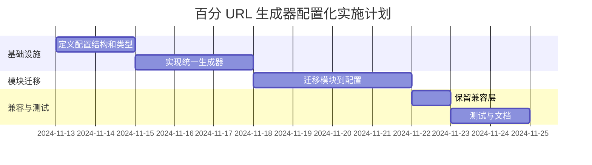

# 百分 URL 生成器实施计划

> 回链：[README.md](./README.md) | 状态：🔄 编写中

## 一、实施阶段

### 阶段 1：基础设施（1-2 天）

**目标：** 定义配置结构和类型

| 任务                         | 负责人 | 交付物   |
| ---------------------------- | ------ | -------- |
| 定义 BaiFenModule 枚举       | 待定   | types.ts |
| 定义参数接口                 | 待定   | types.ts |
| 定义 BaiFenModuleParams 映射 | 待定   | types.ts |
| 定义 BaiFenModuleConfig 接口 | 待定   | types.ts |
| 定义 CustomGenerateContext   | 待定   | types.ts |

**验收标准：**

- [ ] 所有类型定义完成
- [ ] 无 TypeScript 编译错误

### 阶段 2：统一生成器（2-3 天）

**目标：** 实现配置驱动的 URL 生成逻辑

| 任务                   | 负责人 | 交付物       |
| ---------------------- | ------ | ------------ |
| 实现 generateBaiFenUrl | 待定   | generator.ts |
| 实现参数验证逻辑       | 待定   | generator.ts |
| 实现参数合并逻辑       | 待定   | generator.ts |
| 实现参数序列化逻辑     | 待定   | generator.ts |
| 实现占位符替换逻辑     | 待定   | generator.ts |
| 实现环境判断逻辑       | 待定   | generator.ts |
| 实现自定义生成器调用   | 待定   | generator.ts |

**验收标准：**

- [ ] generateBaiFenUrl 实现完成
- [ ] 单元测试覆盖率 ≥ 90%

### 阶段 3：模块迁移（3-4 天）

**目标：** 将现有模块迁移到配置化方式

| 任务                  | 负责人 | 交付物               |
| --------------------- | ------ | -------------------- |
| 迁移简单模块（10+）   | 待定   | config.ts            |
| 迁移参数模块（5+）    | 待定   | config.ts            |
| 迁移特殊模块（2+）    | 待定   | config.ts, custom.ts |
| 验证生成的 URL 一致性 | 待定   | 测试报告             |

**验收标准：**

- [ ] 所有模块迁移完成
- [ ] 生成的 URL 与原实现一致
- [ ] 测试覆盖率 ≥ 85%

### 阶段 4：兼容层（1 天）

**目标：** 保持向后兼容

| 任务                         | 负责人 | 交付物    |
| ---------------------------- | ------ | --------- |
| 保留 BaiFenSites 函数        | 待定   | compat.ts |
| 保留 BaiFenPathConstants     | 待定   | compat.ts |
| 保留 getGovMapUrl 等独立函数 | 待定   | compat.ts |
| 验证兼容性                   | 待定   | 测试报告  |

**验收标准：**

- [ ] 现有调用无需修改
- [ ] 功能不受影响

### 阶段 5：测试与文档（1-2 天）

**目标：** 完善测试和文档

| 任务             | 负责人 | 交付物                        |
| ---------------- | ------ | ----------------------------- |
| 编写单元测试     | 待定   | **tests**/baiFen.test.ts      |
| 编写集成测试     | 待定   | **tests**/integration.test.ts |
| 更新使用文档     | 待定   | README.md                     |
| 编写迁移指南     | 待定   | MIGRATION.md                  |
| 编写配置扩展指南 | 待定   | CONTRIBUTING.md               |

**验收标准：**

- [ ] 测试覆盖率 ≥ 90%
- [ ] 文档完整且与代码同步

## 二、实施顺序

## 三、验收标准

### 3.1 功能验收

| 场景                 | 预期结果                       | 验证方式 |
| -------------------- | ------------------------------ | -------- |
| 简单模块（终端）     | 正确的 URL                     | 单元测试 |
| 简单模块（Web）      | 登录页 URL                     | 单元测试 |
| 参数模块             | 带正确参数的 URL               | 单元测试 |
| 参数模块（占位符）   | 占位符被正确替换               | 单元测试 |
| 特殊模块（地图）     | 参数名映射正确，使用 qs 序列化 | 单元测试 |
| 特殊模块（财报流程） | URL 格式为 `/govbusiness/?...` | 单元测试 |
| 类型检查（正确）     | TypeScript 编译通过            | 类型测试 |
| 类型检查（错误）     | TypeScript 编译错误            | 类型测试 |
| 参数缺失             | 抛出 LinkGenerationError       | 单元测试 |
| 兼容层               | 与新 API 生成的 URL 一致       | 单元测试 |

### 3.2 非功能验收

| 指标       | 标准                         | 验证方式            |
| ---------- | ---------------------------- | ------------------- |
| 类型安全   | 无 TypeScript 编译错误和警告 | `tsc --noEmit`      |
| 代码质量   | 无 ESLint 警告               | `eslint`            |
| 测试覆盖率 | ≥ 90%                        | `vitest --coverage` |
| 向后兼容   | 现有调用无需修改             | 集成测试            |
| 性能       | URL 生成时间 < 1ms           | 性能测试            |
| 文档完整性 | 所有配置项有说明             | 文档审查            |

## 四、风险控制

| 风险                  | 影响 | 概率 | 应对措施                       |
| --------------------- | ---- | ---- | ------------------------------ |
| 类型转换隐藏错误      | 高   | 中   | 充分的单元测试，运行时参数验证 |
| 配置错误导致 URL 错误 | 高   | 低   | 配置验证工具，集成测试         |
| 自定义生成器逻辑错误  | 中   | 中   | 详细的代码注释，单独测试       |
| 向后兼容性问题        | 高   | 低   | 保留兼容层，充分的回归测试     |
| 性能下降              | 低   | 低   | 性能测试，配置缓存             |

## 五、上线计划

### 5.1 灰度发布

| 阶段   | 范围     | 时长 | 回滚策略 |
| ------ | -------- | ---- | -------- |
| 内测   | 开发环境 | 1 周 | 立即回滚 |
| 小范围 | 测试环境 | 1 周 | 快速回滚 |
| 全量   | 生产环境 | 2 周 | 分批回滚 |

### 5.2 监控指标

- 链接生成成功率
- 链接生成耗时
- 错误日志数量
- 用户反馈

## 六、后续优化

| 阶段          | 优化内容                             |
| ------------- | ------------------------------------ |
| 短期（1-2月） | 配置缓存、性能监控、边界测试         |
| 中期（3-6月） | 配置可视化、配置校验、链接有效性检查 |
| 长期（6+月）  | 插件机制、配置继承、监控与日志系统   |

## 更新记录

| 日期       | 修改人 | 更新内容     |
| ---------- | ------ | ------------ |
| 2024-11-13 | Kiro   | 创建实施计划 |
