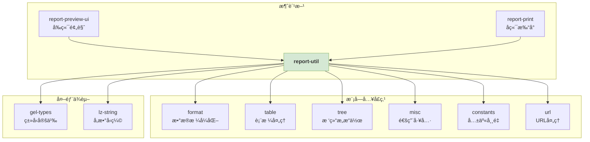
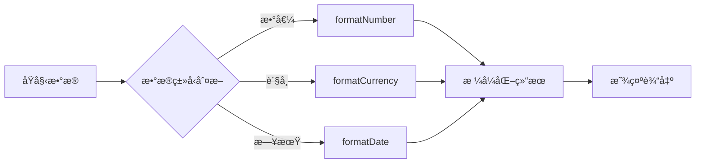
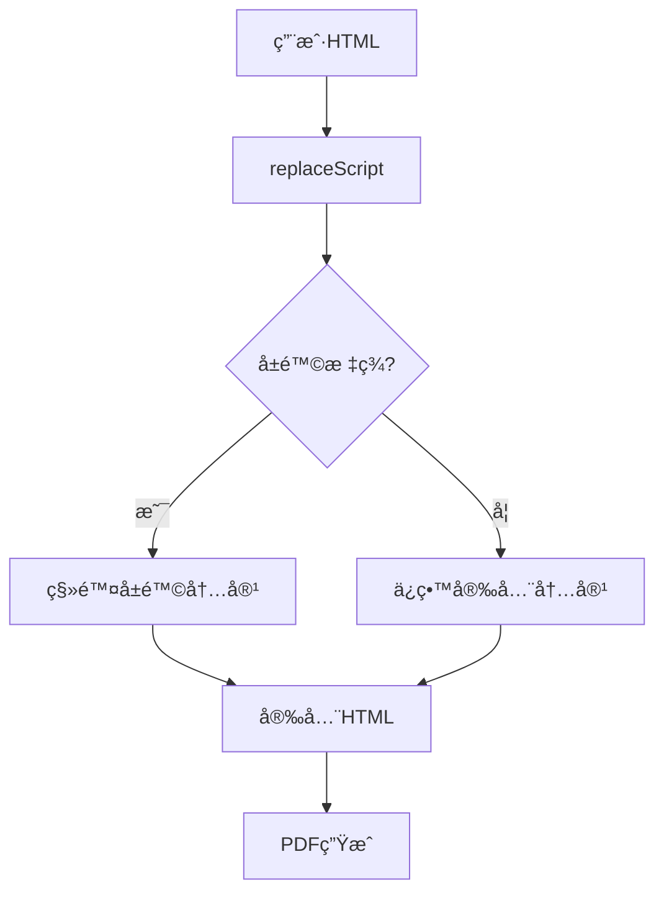
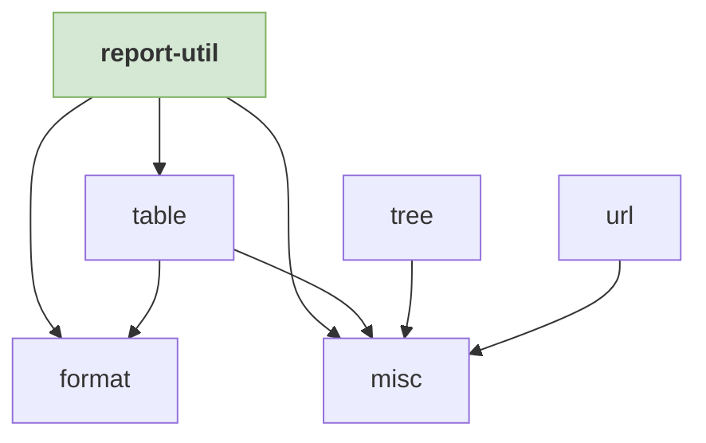

# report-util 设计文档

## 🯠概览

**功能范围**: 为报告系统æ供底层工具函数，支撑数æ®æ ¼å¼åŒ–ã€è¡¨æ ¼å¤„ç†ã€æ ‘状æ“作等核心能力。

**目标用户**: å‰ç«¯æŠ¥å‘Šé¢„览组件 (`report-preview-ui`)ã€å端PDF打å°æœåŠ¡ (`report-print`) çš„å¼€å‘者。

**关键用例**:
- ç¡®ä¿é¢„览ä¸æ‰“å°çš„æ•°æ®æ ¼å¼åŒ–一致性
- æ供安全的HTML处ç†ï¼Œé˜²æ­¢XSS攻击
- 支æŒæŠ¥å‘Šé…置在页é¢é—´çš„URL传递

## ğŸ—ï¸ ä¿¡æ¯æ¶æ„

```mermaid
graph TD
    subgraph "消费方"
        A["report-preview-ui<br/>å‰ç«¯é¢„览"] --> E["report-util"]
        B["report-print<br/>å端打å°"] --> E
    end

    subgraph "模å—å…¥å£ç‚¹"
        E --> F["format<br/>æ•°æ®æ ¼å¼åŒ–"]
        E --> G["table<br/>表格处ç†"]
        E --> H["tree<br/>树结æ„æ“作"]
        E --> I["misc<br/>通用工具"]
        E --> J["constants<br/>共享常é‡"]
        E --> K["url<br/>URL处ç†"]
    end

    subgraph "外部ä¾èµ–"
        E --> L["gel-types<br/>ç±»å‹å®šä¹‰"]
        E --> M["lz-string<br/>å‚æ•°å‹ç¼©"]
    end

    style E fill:#D5E8D4,stroke:#82B366,font-weight:bold
```

**路由/å…¥å£è¯´æ˜**: 通过 package.json çš„ `exports` 字段定义多个模å—å…¥å£ç‚¹ï¼Œæ”¯æŒæŒ‰éœ€å¯¼å…¥ã€‚

## 🨠模å—è“图

| æ¨¡å— | 核心èŒè´£ | 输入 | 输出 | 状æ€å¤„ç† |
| :--- | :--- | :--- | :--- | :--- |
| **format** | æ•°æ®æ ¼å¼åŒ– | 数值ã€é…ç½® | æ ¼å¼åŒ–字符串 | 容错返å›`'--'` |
| **table** | 表格é…ç½®å¤„ç† | åŸå§‹é…ç½® | 标准化é…ç½® | 加载/空/错误 |
| **tree** | 树状æ€ç®¡ç† | 节点ã€çŠ¶æ€ | éšè—节点数组 | 状æ€ä¼ æ’­ |
| **misc** | 通用工具 | å„ç§æ•°æ® | 处ç†ç»“æœ | 安全过滤 |

## 🔄 任务æµç¨‹

### æ•°æ®æ ¼å¼åŒ–æµç¨‹

```mermaid
flowchart LR
    A["åŸå§‹æ•°æ®"] --> B{"æ•°æ®ç±»å‹åˆ¤æ–­"}
    B -->|数值| C["formatNumber"]
    B -->|è´§å¸| D["formatCurrency"]
    B -->|日期| E["formatDate"]
    C --> F["æ ¼å¼åŒ–结æœ"]
    D --> F
    E --> F
    F --> G["显示输出"]
```

### 安全处ç†æµç¨‹

```mermaid
flowchart TD
    A["用户HTML"] --> B["replaceScript"]
    B --> C{"å±é™©æ ‡ç­¾?"}
    C -->|是| D["移除å±é™©å†…容"]
    C -->|å¦| E["ä¿ç•™å®‰å…¨å†…容"]
    D --> F["安全HTML"]
    E --> F
    F --> G["PDF生æˆ"]
```

## 📊 æ•°æ®æµ

| æ¨¡å— | 输入 | 输出 | é”™è¯¯å¤„ç† |
| :--- | :--- | :--- | :--- |
| **format** | 数值ã€é…ç½® | æ ¼å¼åŒ–字符串 | è¿”å›`'--'` |
| **tree** | 节点ã€çŠ¶æ€ | éšè—节点数组 | ç±»å‹æ ¡éªŒ |
| **misc** | å„ç§æ•°æ® | 处ç†ç»“æœ | 安全过滤 |

## 🧩 组件å¤ç”¨

### 模å—ä¾èµ–关系

```mermaid
graph TD
    A["report-util"] --> B["format"]
    A --> C["misc"]
    A --> D["table"]
    D --> B
    D --> C
    E["tree"] --> C
    F["url"] --> C

    style A fill:#D5E8D4,stroke:#82B366,font-weight:bold
```

## 📖 代ç å…³è”

- [æ ¼å¼åŒ–核心](../src/format/formatNumber.ts) - 数值格å¼åŒ–算法
- [安全处ç†æ ¸å¿ƒ](../src/misc/replaceScript.ts) - XSS防护å®ç°
- [技术约æŸè¯´æ˜](./technical-constraints.md) - wkhtmltopdf兼容è¦æ±‚
- [测试覆盖](../src/__test__/) - å„模å—å•å…ƒæµ‹è¯•

---

*设计文档ä¸ä»£ç åŒæ­¥ï¼Œé‡å¤§å˜æ›´éœ€åŒæ­¥æ›´æ–°ã€‚*