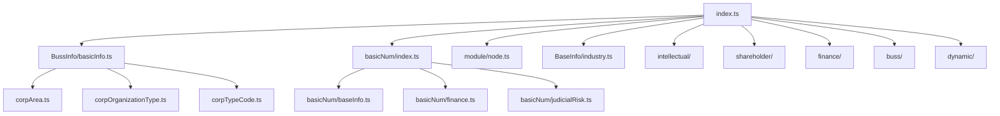

# 企业类型定义模块 (Corp Types)

> 企业信息相关的 TypeScript 类型定义库，为企业信息系统提供完整的类型支持。

## 📁 目录结构

```
corp/
├── index.ts                          # 主导出文件，统一导出所有类型
├── BaseInfo/                         # 基础信息模块
│   ├── index.ts                      # 基础信息导出
│   └── industry.ts                   # 行业分类类型定义
├── BussInfo/                         # 商业信息模块
│   ├── index.ts                      # 商业信息导出
│   ├── basicInfo.ts                  # 企业基本信息核心类型
│   ├── cardInfo.ts                   # 企业卡片展示类型
│   ├── corpArea.ts                   # 企业地区代码
│   ├── corpOrganizationType.ts       # 企业组织类型
│   ├── corpTypeCode.ts               # 企业类型代码
│   ├── corpTypeCodeTitle.ts          # 企业类型代码标题
│   └── otherInfo.ts                  # 其他商业信息
├── basicNum/                         # 基础数字统计模块
│   ├── index.ts                      # 统计数据主导出
│   ├── baseInfo.ts                   # 基础信息统计
│   ├── bussRisk.ts                   # 经营风险统计
│   ├── common.ts                     # 通用布尔标志统计
│   ├── finance.ts                    # 财务数据统计
│   ├── history.ts                    # 历史数据统计
│   ├── intellectual.ts               # 知识产权统计
│   ├── judicialRisk.ts               # 司法风险统计
│   ├── misc.ts                       # 前端解析杂项统计
│   └── qualification.ts              # 资质数据统计
├── buss/                             # 业务模块
│   ├── index.ts                      # 业务模块导出
│   └── bid.ts                        # 投标相关类型
├── dynamic/                          # 动态信息模块
│   ├── index.ts                      # 动态信息导出
│   ├── businessOpportunity.ts        # 商业机会类型
│   └── event.ts                      # 事件相关类型
├── finance/                          # 财务模块
│   ├── index.ts                      # 财务模块导出
│   └── bussData.ts                   # 业务数据类型
├── intellectual/                     # 知识产权模块
│   ├── index.ts                      # 知识产权导出
│   ├── PatentBasicNumData.ts         # 专利基础数据
│   └── TrademarkBasicNumData.ts      # 商标基础数据
├── module/                           # 模块化配置
│   ├── index.ts                      # 配置主导出
│   ├── node.ts                       # 企业详情节点键定义
│   ├── section.ts                    # 章节定义
│   ├── map.ts                        # 映射配置
│   └── type.ts                       # 类型定义
└── shareholder/                      # 股东模块
    ├── index.ts                      # 股东模块导出
    └── ShareRateIdentifier.ts        # 股权比例展示标识
```

## 🎯 关键文件说明

### `index.ts` - 主入口文件
- 统一导出所有子模块类型定义
- 提供 `CorpInfoTableCol` 企业信息表格列类型
- 作为外部引用的唯一入口点

### `BussInfo/basicInfo.ts` - 企业核心信息
- **`CorpBasicInfo`**: 企业基础信息核心接口，包含工商信息、法定代表人、注册资本等完整企业数据
- **`CorpAnotherNameList`**: 企业曾用名列表类型
- 支持企业基本信息展示和详情页面

### `basicNum/index.ts` - 统计数据聚合
- **`CorpBasicNum`**: 企业综合统计数据接口，集成各类风险、财务、基础信息统计
- **`CorpBasicNumFront`**: 前端展示用的统计数据类型
- **`CorpBasicNumBeneficial`**: 最终受益人统计
- **`CorpBasicNumStock`**: 股东相关统计

### `module/node.ts` - 节点配置定义
- **`TCorpDetailNodeKey`**: 企业详情页所有节点键类型
- 涵盖工商信息、业务数据、金融行为、经营信息、知识产权、行政许可、风险信息、历史信息等8大类
- 支持企业详情页面的动态渲染和模块化展示

## 🔗 依赖关系



## 📊 数据流向

该模块主要服务于企业信息系统的前端展示层：

1. **企业搜索结果**: 通过 `BussInfo/cardInfo.ts` 提供卡片展示数据
2. **企业详情页面**: 通过 `module/node.ts` 配置各模块节点，使用各子模块类型定义
3. **统计分析功能**: 通过 `basicNum/` 模块提供各类统计数据结构
4. **风险分析展示**: 通过 `basicNum/judicialRisk.ts`、`basicNum/bussRisk.ts` 等提供风险数据结构

## 📋 使用场景

- **企业详情页**: 完整的企业信息展示，包含基础信息、财务数据、风险信息等
- **企业搜索列表**: 企业卡片信息展示和快速筛选
- **统计分析报表**: 企业各类数据的统计分析和可视化
- **风险评估系统**: 企业司法风险、经营风险等风险信息的结构化展示

## 🔗 相关文档

- [TypeScript 规范](../../../docs/rule/typescript-rule.md)
- [项目结构规范](../../../docs/rule/project-structure.md)
- [API 请求规范](../../../docs/rule/api-request-rule.md)

---

*最后更新: 2025-11-03*