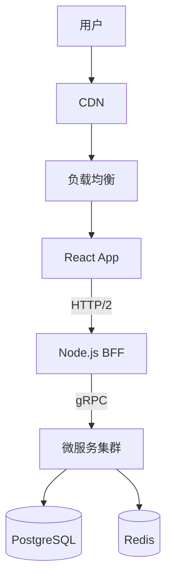

# 格式三：全景技术白皮书 (The Whitepaper)

- **定位**：技术资产的“冷存储”。
- **目标读者**：未来的自己 (复习)、同行 (博客分享)、AI (作为 Context 喂给 LLM)。
- **前置要求**：请先阅读并签署 [通用基线 (The Baseline Protocol)](./project-experience-baseline.md)。本规范旨在将代码转化为符合基线 **STAR-Plus** 标准的结构化资产。
- **AI 生成指令**：作为“首席架构师”，将项目从业务代码升华为技术文档，要求图文并茂、逻辑严密、有代码实证。

## 1. 知识提取框架 (Extraction Framework)

请按照以下五个维度对项目进行深度扫描与文档化，这些维度对应基线的 **STAR-Plus** 全流程：

### 维度一：全景架构 (The Big Picture) -> 对应 S (Situation) & T (Task)

- **生成目标**：让读者一眼看懂系统是怎么跑起来的。
- **必须包含**：
  1.  **业务背景**：一句话解释项目是干嘛的（e.g., "为金融分析师提供 AI 辅助的研报生成工具"）。
  2.  **架构图 (Mermaid)**：使用 Mermaid 绘制数据流向图或组件关系图。
  3.  **技术选型决策表 (ADR)**：
      - _Why Vite?_ -> 对比 Webpack 的构建速度数据。
      - _Why Zustand?_ -> 对比 Redux 的 Boilerplate 代码量。

### 维度二：核心功能实现 (Core Features & Implementation) -> 对应 A (Action - Construction)

- **生成目标**：记录业务系统的核心骨架，证明你不仅会修 Bug，更能“盖楼”。
- **标准结构**：
  1.  **功能模块 (Feature)**：列出 2-3 个核心业务模块（e.g., “即时通讯系统”、“动态表单引擎”）。
  2.  **实现逻辑 (Implementation)**：
      - _流程_：关键业务的时序图 (Sequence Diagram) 或 状态机 (State Machine)。
      - _数据设计_：核心 Model 结构 / 数据库 Schema 设计。
  3.  **复杂度 (Complexity)**：为什么这个功能难做？（e.g., “涉及多端状态同步”、“需要原子性操作”）。

### 维度三：核心难点攻坚 (Deep Dive Case Study) -> 对应 A (Action - Optimization) & R (Result)

- **生成目标**：证明你的技术深度超过 80% 的 CRUD 工程师。
- **标准结构**：
  1.  **现象 (Symptoms)**：具体的卡顿描述、报错信息、CPU/Memory 曲线图。
  2.  **排查 (Investigation)**：使用 DevTools / Profiler 发现的瓶颈点（附截图说明）。
  3.  **方案 (Solution)**：
      - _V1 (失败)_：试错过程（重要！）。
      - _V2 (成功)_：最终方案的原理。
  4.  **代码 (Code Snippet)**：粘贴关键函数（< 20 行），并加注释说明（**符合基线 Rule #1**）。

### 维度四：事故与反思 (Post-Mortem) -> 对应 A (Action) & L (Legacy)

- **生成目标**：展示成熟工程师的“反脆弱”能力。
- **标准结构**：
  1.  **Timeline**：事故发生 -> 发现 -> 止血 -> 修复的时间线。
  2.  **Root Cause**：根本原因（不仅是 Bug，可能是流程或设计缺陷）。
  3.  **Action Item**：如何保证下次不犯？（e.g., "增加 E2E 测试", "配置 CI 卡点"）。

### 维度五：知识库 (Wiki / Snippets) -> 对应 L (Legacy)

- **生成目标**：沉淀可复用的代码片段或生僻知识点。
- **内容**：
  - 复杂的正则校验。
  - Webpack/Vite 的特殊配置。
  - 遇到的坑（Browser Compatibility）。

## 2. 质量自检协议 (Quality Protocol)

AI 在生成完白皮书后，需依据 [通用基线](./project-experience-baseline.md) 运行以下检查：

- [ ] **Evidence Check (基线 Rule #1 & #2)**：所有的“性能提升”是否都有对应的“优化前/优化后”对比图或数据？代码片段是否真实存在？
- [ ] **Code Check**：代码片段是否脱敏？是否关键？（不要粘贴 import 语句）。
- [ ] **Logic Check (基线 Rule #3)**：技术选型是否有竞品对比？（不能只说“我用了 A”，要说“对比了 B，发现 A 更适合，因为...”）。

## 3. 示例：Mermaid 架构图模板

