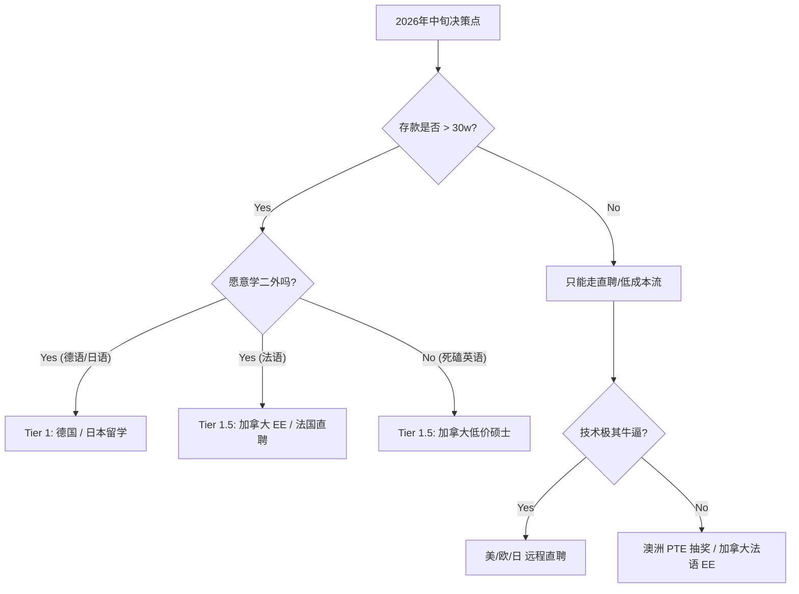

# 全球移民战略白皮书 (Global Immigration Strategy Whitepaper)

> **最后更新：** 2025.12
> **核心档案：** [个人职业档案](../carrier/background.md)
> **评估模型：** [移民决策评估模型](evaluation-model.md)
> **规划基准：** 2027 年 | 3-4 年经验 | ~30w RMB 存款 | 雅思 7.0 | 愿意学习 L3

---

## 1. 战略总览 (Strategic Overview)

基于 **2027 年的时间节点** 和 **30w RMB 的预算约束**，我们将全球主流移民目的地划分为三个梯队。

### 🏆 Tier 1: 黄金赛道 (Golden Paths)
**特征：** 预算覆盖无压力，身份获取路径清晰，ROI（投资回报率）最高。

| 国家 | 推荐路径 | 核心优势 | 关键动作 |
| :--- | :--- | :--- | :--- |
| **🇩🇪 德国** | **FH 留学 (免学费)** | 30w 完美覆盖生活费；工读机会多；身份稳。 | **德语 B1** + APS 审核 |
| **🇯🇵 日本** | **国公立/SGU 硕士** | “新卒”身份通杀；HSP 高度人才 1 年永居。 | **日语 N2** (或刷 LeetCode 走直聘) |

### 🥈 Tier 1.5: 战术突围 (Strategic Plays)
**特征：** 需要特定的战术动作（选校或学语言）才能把路走通。

| 国家 | 推荐路径 | 核心优势 | 关键动作 |
| :--- | :--- | :--- | :--- |
| **🇨🇦 加拿大** | **低成本硕士 / 法语 EE** | 只要选对省/学校，30w 刚好够；身份最稳。 | **选偏远学校** 或 **突击法语 CLB 7** |

### 🥉 Tier 2: 英语彩票 (English Lotteries)
**特征：** 留学买不起，直聘靠运气。适合作为海投的“副业”。

| 国家 | 推荐路径 | 核心分析 | 建议 |
| :--- | :--- | :--- | :--- |
| **🇦🇺 澳洲** | **直聘 (190/491)** | 留学学费天价；全靠 PTE 满分 + 州担保抽签。 | 考出 **PTE 79+**，递交 EOI 等运气。 |
| **🇩🇰🇸🇪 北欧** | **直聘 (English)** | 留学学费贵且有风险；适合纯英语海投。 | 关注 **The Hub**，只投英语岗。 |

### ❌ Tier 3: 资金劝退 (Financial Misalignment)
**特征：** 预算严重不足，性价比低，不建议作为核心目标。

| 国家 | 原因 |
| :--- | :--- |
| **🇸🇬 新加坡** | 硕士总成本 >45w RMB；PR 也就是个“玄学”。 |
| **🇬🇧 英国** | 硕士总成本 >45w RMB；工签薪资门槛暴涨至 £38.7k。 |
| **🇫🇷 法国** | 非法语类岗位极少；留学生活费在巴黎较贵。 |

---

## 2. 核心决策树 (Decision Tree)

在 2026 年中旬，你需要根据当时的 **存款** 和 **语言状态** 做出最终决定：

---

## 3. 详细国家报告 (Detailed Reports)

### 🇪🇺 欧洲大陆
*   [🇩🇪 德国 (Germany) - 推荐](countries/germany.md)
*   [🇩🇰 🇸🇪 北欧 (Nordics) - 备选](countries/nordics.md)
*   [🇫🇷 法国 (France) - 特殊](countries/france.md)
*   [🇬🇧 英国 (UK) - 不推荐](countries/uk.md)

### 🌏 亚太地区
*   [🇯🇵 日本 (Japan) - 推荐](countries/japan.md)
*   [🇸🇬 新加坡 (Singapore) - 不推荐](countries/singapore.md)
*   [🇦🇺 澳大利亚 (Australia) - 彩票](countries/australia.md)

### 🌎 北美
*   [🇨🇦 加拿大 (Canada) - 稳健](countries/canada.md)

---

## 4. 2025-2027 行动路线图 (Action Roadmap)

### Phase 1: 积累期 (Now - 2026.06)
*   **资金:** 强制储蓄，目标 30w。
*   **技术:** 达到 Senior Level，刷 LeetCode。
*   **语言 (关键):**
    *   **英语:** 保持雅思 7.0 / PTE 练习。
    *   **L3:** **做出选择。** (德语 vs 日语 vs 法语)。这是决定你走 Tier 1 还是 Tier 2 的关键。

### Phase 2: 申请期 (2026.06 - 2027.01)
*   **留学流:** 准备文书、APS (德国)、联系导师 (日本)。
*   **直聘流:** 优化 LinkedIn，开始关注目标国家的远程机会。

### Phase 3: 登陆期 (2027)
*   拿 Offer / 拿 Admission -> 办理签证 -> 润。