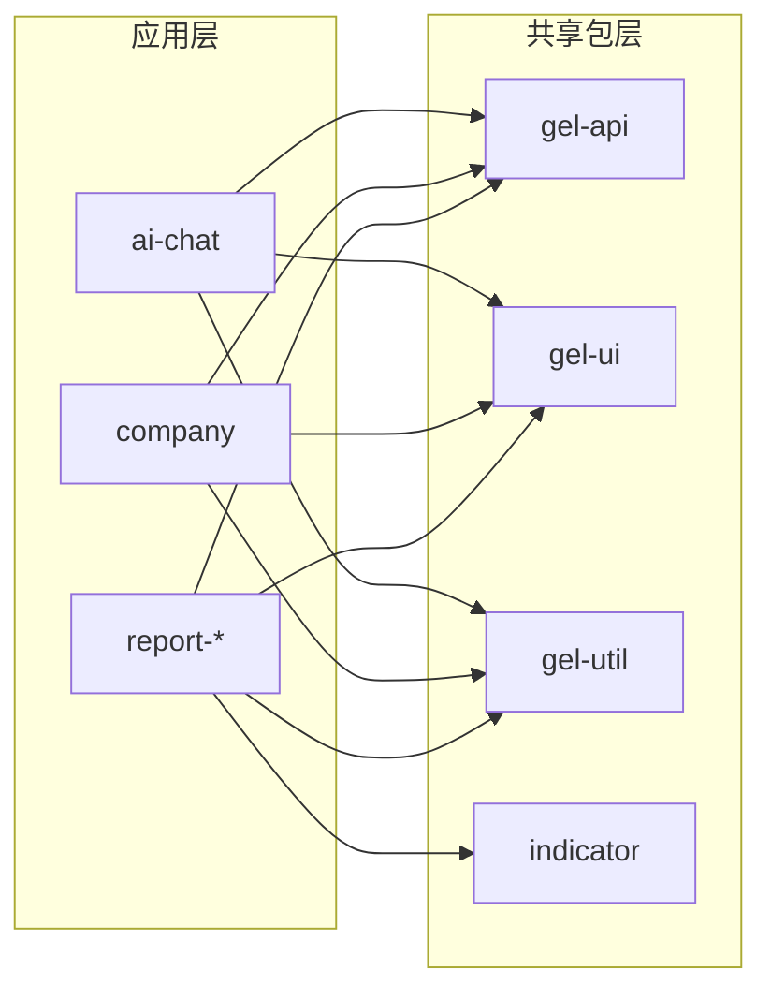

# GEL Workspace

基于 Monorepo 架构的前端项目，统一管理多个业务应用和共享包，提供完整的企业级开发框架。

## 目录结构

```
gel-workspace/
├── apps/                          # 应用程序层
│   ├── ai-chat/                   # AI聊天应用 (端口3000)
│   ├── company/                   # 企业管理系统 (端口3001)
│   ├── report-config/             # 报表配置应用 (端口3002)
│   ├── report-preview/            # 报表预览应用 (端口3003)
│   └── report-print/              # 报表打印应用 (端口3004)
├── packages/                      # 共享包层
│   ├── gel-api/                   # API统一管理包
│   ├── gel-ui/                    # UI组件库
│   ├── gel-util/                  # 工具函数库
│   ├── indicator/                 # 指标功能包
│   ├── cde/                       # CDE功能包
│   ├── detail-page-config/        # 详情页配置包
│   └── types/                     # 类型定义包
├── docs/                          # 文档目录
└── scripts/                       # 构建和部署脚本
```

## 关键文件

| 文件 | 作用 |
|------|------|
| `package.json` | 项目依赖和脚本配置 |
| `turbo.json` | Turborepo构建配置 |
| `pnpm-workspace.yaml` | pnpm工作空间配置 |
| `apps/*/vite.config.ts` | 各应用的Vite构建配置 |

## 依赖关系



## 快速开始

```bash
# 安装依赖
pnpm install

# 启动所有应用
pnpm dev

# 构建所有包
pnpm build
```

## 相关文档

- [开发规范](./docs/rule/) - TypeScript、React、样式等开发规范
- [脚本工具集](./scripts/README.md) - 构建、部署和开发工具
- [开发指南](./scripts/DEVELOPMENT.md) - 开发环境配置
- [本地部署](./scripts/LOCAL-DEPLOYMENT.md) - 本地部署流程
- [预发布部署](./scripts/staging/README.md) - 预发布环境部署
