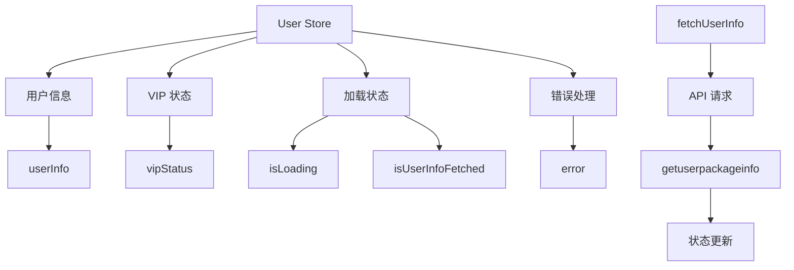
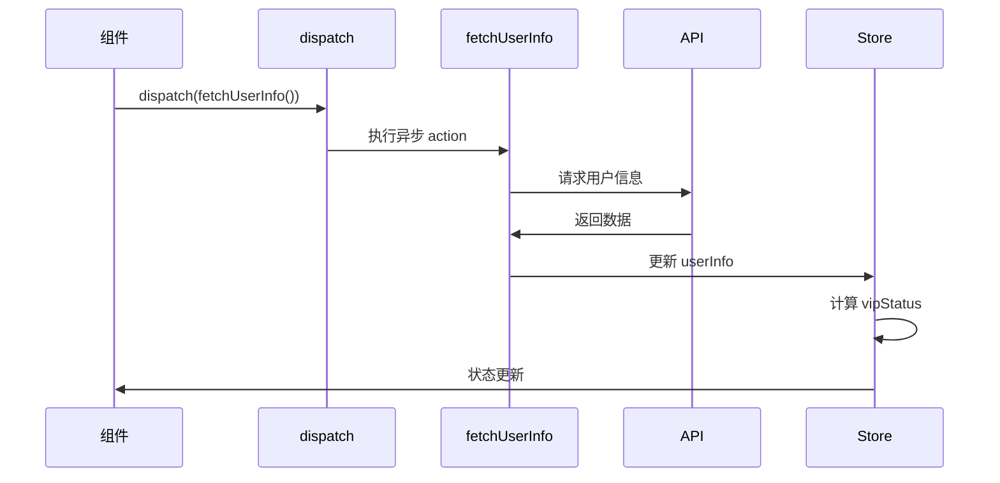

# User Store 设计文档

## 概述
管理应用的用户信息和 VIP 状态，通过异步 action 从后端获取用户套餐信息，在 Redux store 中提供全局访问。

## 状态架构



## 核心状态

### State 结构
| 属性 | 类型 | 描述 |
|------|------|------|
| `userInfo` | `UserInfo \| null` | 原始用户信息对象 |
| `vipStatus` | `VipStatusEnum` | 用户 VIP 等级 |
| `isUserInfoFetched` | `boolean` | 是否已获取用户信息 |
| `isLoading` | `boolean` | 异步操作是否进行中 |
| `error` | `string \| null` | 错误信息 |

### VIP 状态枚举
- `NORMAL`: 普通用户
- `VIP`: VIP 用户
- `SVIP`: 超级 VIP 用户

## 异步流程



## Selectors API

| Selector | 返回类型 | 描述 |
|----------|----------|------|
| `selectUserInfo` | `UserInfo` | 完整用户信息 |
| `selectVipStatus` | `VipStatusEnum` | VIP 状态 |
| `selectIsUserVip` | `boolean` | 是否为 VIP |
| `selectIsUserSVip` | `boolean` | 是否为 SVIP |
| `selectUserInfoFetched` | `boolean` | 是否已加载 |
| `selectUserLoading` | `boolean` | 是否加载中 |
| `selectUserError` | `string \| null` | 错误信息 |

## 使用示例
```typescript
const UserProfile = () => {
  const dispatch = useAppDispatch()
  const vipStatus = useAppSelector(selectVipStatus)
  const isLoading = useAppSelector(selectUserLoading)
  const isFetched = useAppSelector(selectUserInfoFetched)

  useEffect(() => {
    if (!isFetched) {
      dispatch(fetchUserInfo())
    }
  }, [dispatch, isFetched])

  if (isLoading) return <div>加载中...</div>

  return (
    <div>
      <h1>会员状态</h1>
      {vipStatus === VipStatusEnum.NORMAL && <p>普通用户</p>}
      {vipStatus === VipStatusEnum.VIP && <p>VIP 用户</p>}
      {vipStatus === VipStatusEnum.SVIP && <p>超级 VIP</p>}
    </div>
  )
}
```

## 设计特点
- **异步处理**: 完整的异步状态管理
- **状态缓存**: 避免重复请求
- **错误处理**: 完善的错误处理机制
- **类型安全**: 完整的 TypeScript 支持

## 关联文件
- @see apps/ai-chat/src/store/user/userSlice.ts
- @see [store README](../README.md)
