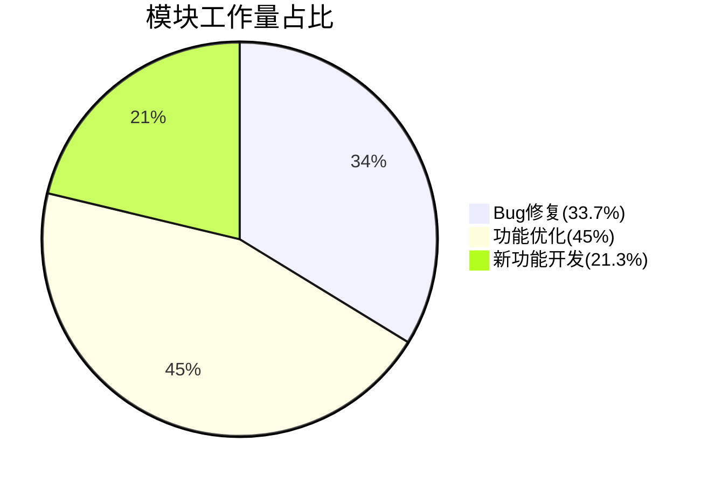

# Content Processors 插槽规则

## 插槽概述

插槽系统允许在处理 Markdown 内容时，在特定位置插入自定义的 React 组件。这种机制使得内容处理器更加灵活和可扩展。

## 插槽语法

### 1. 基础语法

```markdown
::: slot[slot-name]
内容
:::
```

### 2. 带参数的插槽

```markdown
::: slot[slot-name]{param1: "value1", param2: "value2"}
内容
:::
```

## 插槽类型

### 1. 内置插槽

#### 组件插槽 (component)

```markdown
::: slot[component]{name: "ButtonGroup"}
{
"buttons": [
{ "text": "确认", "type": "primary" },
{ "text": "取消", "type": "default" }
]
}
:::
```

#### 布局插槽 (layout)

```markdown
::: slot[layout]{type: "grid", columns: 2}
内容 1

---

内容 2
:::
```

#### 样式插槽 (style)

```markdown
::: slot[style]{margin: "16px", padding: "8px"}
需要添加样式的内容
:::
```

## 插槽实现规范

### 1. 插槽定义

```typescript
interface Slot {
  /** 插槽名称 */
  name: string
  /** 插槽参数类型 */
  params?: Record<string, unknown>
  /** 插槽内容 */
  children: React.ReactNode
}

interface SlotProcessor {
  /** 处理器名称 */
  name: string
  /** 检查函数 */
  check: (text: string) => boolean
  /** 处理函数 */
  process: (text: string) => SlotResult | null
}
```

### 2. 插槽注册

```typescript
// 在 src/utils/content-processors/slots/index.ts 中注册
export const slots: Record<string, SlotProcessor> = {
  component: componentSlot,
  layout: layoutSlot,
  style: styleSlot,
  // 添加自定义插槽
}
```

## 插槽使用规则

### 1. 命名规范

- 使用小写字母和连字符
- 名称应当清晰表达用途
- 避免与内置插槽名称冲突

### 2. 参数规范

- 参数名使用 camelCase
- 参数值使用 JSON 格式
- 必须参数应在文档中说明
- 可选参数应提供默认值

### 3. 内容规范

- 内容应符合插槽预期格式
- 支持 Markdown 语法（如适用）
- 支持嵌套其他插槽（如适用）
- 处理内容为空的情况

## 插槽开发指南

### 1. 创建新插槽

```typescript
// 在 src/utils/content-processors/slots/custom/index.ts 中创建
export const customSlot: SlotProcessor = {
  name: 'custom',
  check: (text: string) => {
    return /^:::slot\[custom\]/.test(text)
  },
  process: (text: string) => {
    // 实现处理逻辑
    return {
      content: <CustomComponent {...params}>{children}</CustomComponent>,
      remainingText: '',
    }
  },
}
```

### 2. 错误处理

- 验证插槽参数的合法性
- 处理内容解析错误
- 提供友好的错误提示
- 实现优雅降级方案

### 3. 性能考虑

- 优化正则表达式匹配
- 避免不必要的组件渲染
- 合理使用缓存机制
- 处理大量插槽的性能问题

## 测试规范

### 1. 单元测试

```typescript
describe('CustomSlot', () => {
  it('should correctly parse slot parameters', () => {
    const text = '::: slot[custom]{param: "value"}\ncontent\n:::'
    const result = customSlot.process(text)
    expect(result).toBeTruthy()
    expect(result.content).toBeDefined()
  })

  it('should handle errors gracefully', () => {
    const text = '::: slot[custom]{invalid json}\ncontent\n:::'
    const result = customSlot.process(text)
    expect(result).toBeNull()
  })
})
```

### 2. 集成测试

- 测试与其他插槽的交互
- 测试嵌套插槽场景
- 测试在不同上下文中的使用

## 示例

### 1. 基础示例

```markdown
::: slot[alert]{type: "warning", closable: true}
这是一个警告提示
:::
```

### 2. 嵌套示例

```markdown
::: slot[card]{title: "卡片标题"}
::: slot[alert]{type: "info"}
这是卡片内的提示信息
:::
正常的卡片内容
:::
```

### 3. 组合示例

````markdown
::: slot[layout]{type: "grid", columns: 2}
::: slot[chart]
以下是第四季度各项工作的占比分析：


````

从图表可以看出，功能优化占据了最大比重，说明本季度主要 focus 在系统优化上。
:::

---

::: slot[card]{title: "数据分析"}
根据工作量分析：

- Bug 修复任务占比 33.7%，共计 27 个任务
- 功能优化任务占比 45%，共计 36 个任务
- 新功能开发任务占比 21.3%，共计 17 个任务

总体来看，本季度的工作重点在于系统优化和稳定性提升。
:::
:::

```

## 最佳实践

### 1. 插槽设计

- 保持插槽功能单一
- 提供合理的默认值
- 支持灵活的配置选项

### 2. 参数设计

- 使用语义化的参数名
- 提供完整的类型定义
- 做好参数验证和错误处理

### 3. 错误处理

- 提供清晰的错误信息
- 实现容错机制
- 保持良好的用户体验

### 4. 文档维护

- 及时更新文档
- 提供详细的使用示例
- 说明注意事项和限制

## 注意事项

1. 插槽解析

   - 正确处理嵌套插槽
   - 避免循环引用
   - 处理转义字符

2. 参数解析

   - 验证 JSON 格式
   - 处理特殊字符
   - 类型转换安全

3. 性能优化

   - 避免深层嵌套
   - 控制插槽数量
   - 优化渲染性能

4. 安全考虑
   - 防止 XSS 攻击
   - 验证插槽内容
   - 限制插槽能力
```
