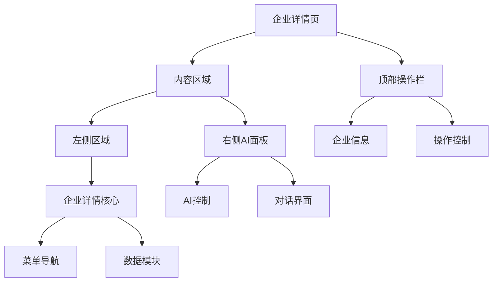
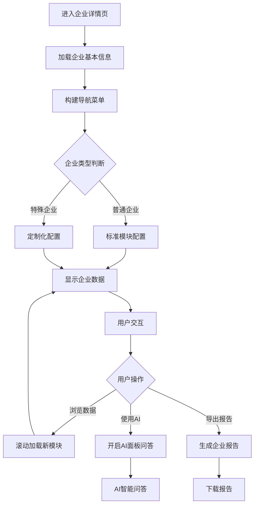
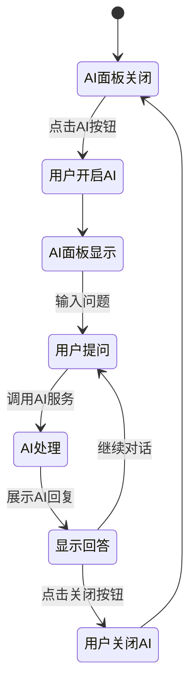

# 企业详情页（AI增强版）设计文档

## 概览

企业详情页AI增强版在传统企业详情展示基础上，集成右侧AI智能对话面板，形成上左右三区域布局。

**功能边界**：企业信息展示 + AI智能问答
**目标人群**：企业尽调人员、投资分析师、风控专员
**关键场景**：企业基础信息查询、财务数据分析、AI智能问答、报告导出

## 信息架构



## 页面蓝图

| 区域 | 展示数据 | 可交互动作 | 可见条件 |
|------|----------|------------|----------|
| **顶部操作栏** | 企业名称、收藏状态 | 收藏/导出/AI切换 | 完整页面模式 |
| **左侧区域** | 企业介绍、菜单导航、数据模块 | 搜索菜单/点击导航/数据交互 | 始终显示 |
| **右侧AI面板** | AI对话界面 | 智能问答/调节宽度/关闭面板 | 可显示/隐藏 |

## 任务流程

### 主要任务流程



### AI对话流程



## 数据与状态

### 核心数据字段

| 字段 | 来源 | 用途 |
|------|------|------|
| `companycode` | URL参数 | 企业标识 |
| `basicNum` | 企业统计API | 控制模块显示 |
| `corpCategory` | 企业类型识别 | 菜单配置 |
| `showRight` | 组件状态 | AI面板显示 |
| `collectState` | 收藏API | 收藏状态 |

### 状态规则

- 企业基本信息：页面级缓存，页面刷新时更新
- 菜单结构：企业类型变化时重新构建
- AI对话历史：会话级保持，页面刷新时清空
- 用户权限：登录状态变化时同步更新

## 组件复用

### 核心组件层级

```
CompanyDetailAIRight @see apps/company/src/views/CompanyDetailAIRight/index.tsx
├── LayoutHeader @see apps/company/src/views/CompanyDetailAIRight/Left.tsx
│   └── OperatorHeader @see apps/company/src/views/CompanyDetailAIRight/comp/OperatorHeader/index.tsx
├── Left @see apps/company/src/views/CompanyDetailAIRight/Left.tsx
│   └── CompanyDetail @see apps/company/src/views/CompanyDetailAIRight/CompanyDetail.tsx
│       ├── CorpDetailMenu @see apps/company/src/views/Company/comp/menu/index.tsx
│       └── CompanyBase @see apps/company/src/components/company/CompanyBase
└── Right @see apps/company/src/views/CompanyDetailAIRight/Right.tsx
    └── ChatMessageCore @see apps/company/src/views/CompanyDetailAIRight/comp/ChatMessageCore/ChatMessageCore.tsx
```

### 组件边界

- **CompanyDetailAIRight**：整体布局协调、状态管理
- **LayoutHeader**：企业信息展示、操作控制
- **CompanyDetail**：菜单导航、数据展示、滚动同步
- **Right**：AI对话界面、面板控制
- **ChatMessageCore**：消息渲染、对话管理

## 相关文档

- [主容器布局设计](./layout-container.md) - 布局管理
- [顶部操作栏设计](./layout-header.md) - 操作控制
- [左侧区域设计](./layout-left.md) - 内容区布局
- [核心业务设计](./layout-middle.md) - 业务逻辑
- [右侧AI面板设计](./layout-right.md) - AI交互