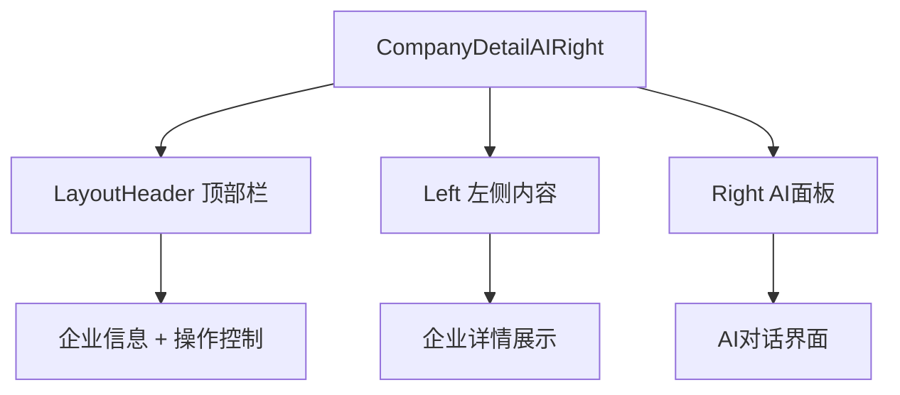
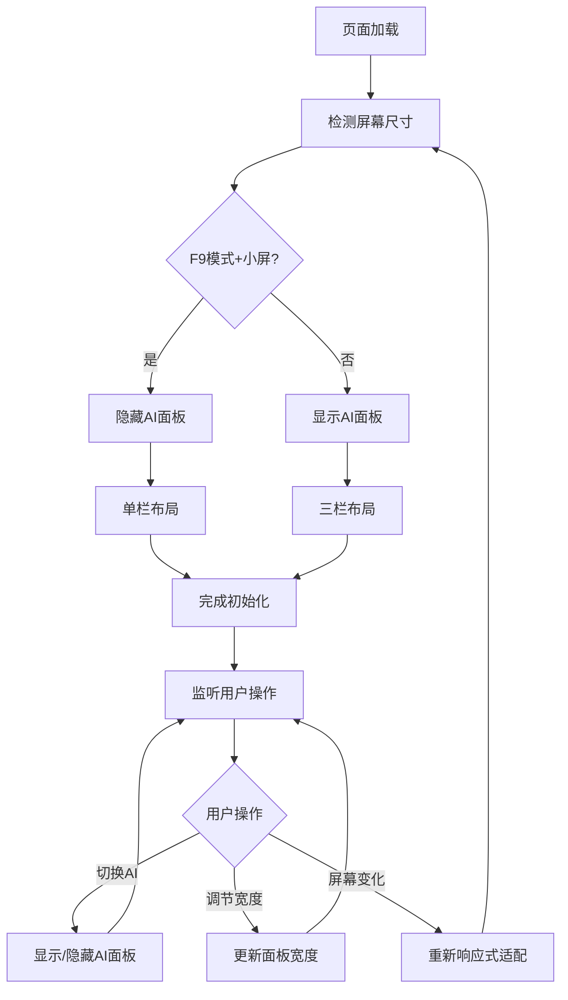

# 企业详情页主容器布局设计

## 概述

主容器负责协调顶部操作栏、左侧内容区和右侧AI面板的布局与交互，实现响应式布局适配、状态协调和性能优化。

**功能边界**：页面布局协调、响应式适配、区域间状态同步
**目标人群**：前端开发人员、UI/UX设计师
**关键场景**：页面初始化布局、AI面板显示/隐藏、响应式切换

## 信息架构



## 页面蓝图

| 区域 | 显示内容 | 可交互动作 | 可见条件 |
|------|----------|------------|----------|
| **LayoutHeader** | 企业名称、收藏状态、操作按钮 | 收藏/导出/AI切换 | 完整页面模式 |
| **Left** | 企业详情内容 | 浏览/搜索/导航 | 始终显示 |
| **Right** | AI对话界面 | 智能问答/调节宽度/关闭面板 | 可显示/隐藏 |

### 响应式策略

| 屏幕类型 | 布局模式 | AI面板状态 |
|----------|----------|------------|
| **大屏(>1200px)** | 标准三栏 | 默认显示 |
| **中屏(768-1200px)** | 紧凑三栏 | 默认显示 |
| **小屏F9模式(<768px)** | 单栏模式 | 默认隐藏 |

## 任务流程



## 数据与状态

### 核心状态字段

| 字段 | 类型 | 用途 | 初始值 |
|------|------|------|--------|
| `showRight` | boolean | AI面板显示控制 | 根据屏幕尺寸 |
| `rightWidth` | '25%'\|'50%' | AI面板宽度 | '25%' |
| `corpNameIntl` | string | 国际化企业名称 | '' |

### 状态同步机制

- **布局状态**：主容器统一管理，向各区域传递状态
- **企业信息**：页面级缓存，切换企业时更新
- **AI面板状态**：独立管理，支持显示/隐藏切换

## 组件复用

### 核心组件结构

```
CompanyDetailAIRight @see apps/company/src/views/CompanyDetailAIRight/index.tsx
├── LayoutHeader @see apps/company/src/views/CompanyDetailAIRight/Left.tsx
├── Left @see apps/company/src/views/CompanyDetailAIRight/Left.tsx
└── Right @see apps/company/src/views/CompanyDetailAIRight/Right.tsx
```

### 组件边界

- **CompanyDetailAIRight**：布局协调、状态管理、响应式适配
- **LayoutHeader**：企业信息展示、操作控制
- **Left**：企业详情内容展示、菜单导航
- **Right**：AI对话界面、面板控制

## 错误处理

| 错误场景 | 处理方式 | 降级方案 |
|----------|----------|----------|
| **布局计算失败** | 回退到默认布局 | 强制显示左侧内容 |
| **状态同步失败** | 记录错误日志 | 保持当前状态 |
| **组件渲染失败** | 显示错误占位符 | 不影响其他区域 |

## 相关文档

- [总体设计文档](./design.md) - 整体架构
- [顶部操作栏设计](./layout-header.md) - 操作控制
- [左侧区域设计](./layout-left.md) - 内容区布局
- [右侧AI面板设计](./layout-right.md) - AI交互

## 检查清单

- [x] 布局适配规则明确
- [x] 状态同步机制清晰
- [x] 错误处理策略完整
- [x] 文档长度控制在1页内