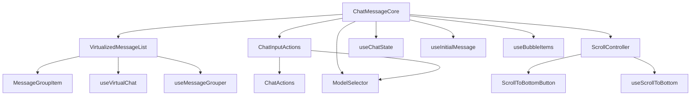
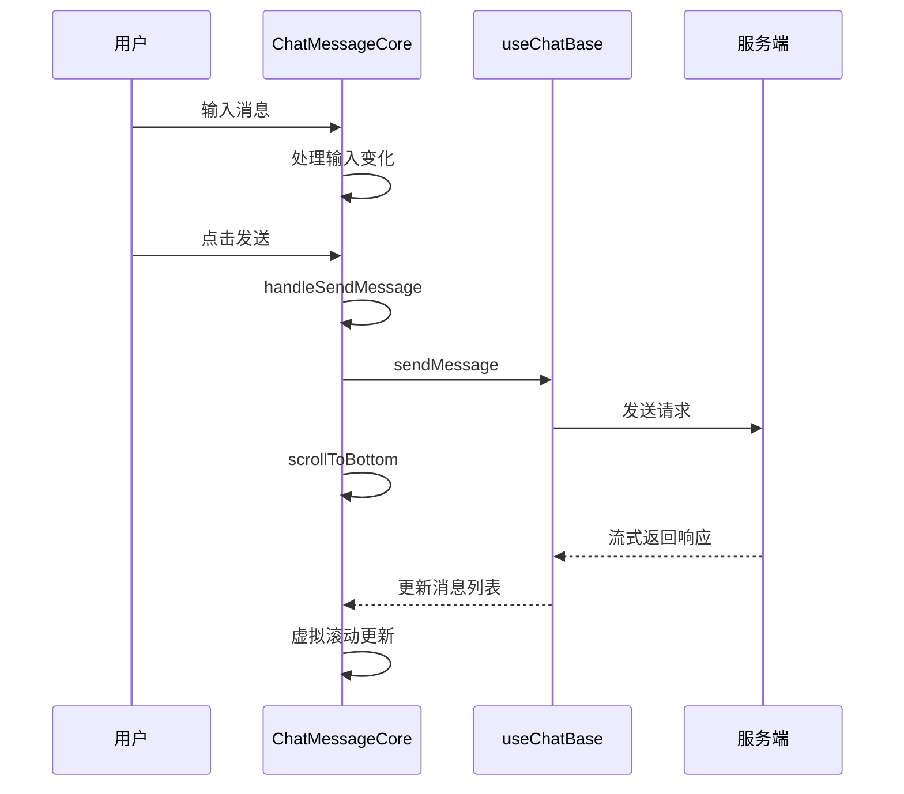

# ChatMessageCore 组件文档

## 组件概述

ChatMessageCore 是企业详情 AI 聊天功能的核心展示组件，负责渲染完整的聊天界面，包括消息列表、输入框、模型选择等所有 UI 元素。

## 组件结构



## 文件结构

```
ChatMessageCore/
├── index.tsx                    # 容器组件（255行）
├── ChatMessageCore.tsx          # 核心展示组件（719行）
├── COMPONENT.md                 # 组件文档
├── ChatMessageCore.module.less  # 样式文件
├── hooks/
│   └── useVirtualChat.ts        # 虚拟滚动 Hook
├── SelectWithIcon.tsx           # 带图标的选择器
└── index.ts                     # 导出文件
```

## 核心功能

### 1. 消息渲染
- **虚拟滚动**: 使用 `@tanstack/react-virtual` 优化大量消息性能
- **消息分组**: 以用户消息为界线进行分组，提升渲染效率
- **气泡列表**: 基于 `@ant-design/x` 的消息气泡展示

### 2. 用户交互
- **消息输入**: 支持多行输入，快捷键发送
- **模型选择**: 开发者模式可选择不同 AI 模型
- **深度思考**: 支持开启/关闭 AI 深度思考模式

### 3. 滚动控制
- **自动滚动**: 新消息到达时自动滚动到底部
- **手动控制**: 提供滚动到底部按钮
- **历史加载**: 滚动到顶部自动加载更多历史消息

### 4. 状态管理
- **聊天状态**: 管理是否正在聊天、消息列表等
- **UI 状态**: 控制加载状态、错误状态等
- **用户设置**: 记住模型选择、深度思考模式等偏好

## 核心属性

### ChatMessageCoreProps

| 属性名 | 类型 | 说明 | 必填 |
|---|---|---|---|
| `roles` | `RolesTypeCore` | 角色配置，定义 AI 和用户的头像、名称等 | ✓ |
| `chatId` | `string` | 会话 ID，用于历史消息恢复 | ✓ |
| `roomId` | `string` | 房间 ID，前端会话标识 | ✓ |
| `parsedMessages` | `MessageInfo<MsgParsedDepre>[]` | 解析后的消息列表 | ✓ |
| `content` | `string` | 输入框当前内容 | ✓ |
| `isChating` | `boolean` | 是否正在聊天中 | ✓ |
| `handleContentChange` | `(content: string) => void` | 输入框内容变化处理函数 | ✓ |
| `sendMessage` | `SendMessageFn` | 发送消息函数 | ✓ |
| `cancelRequest` | `() => void` | 取消当前请求函数 | ✓ |
| `PlaceholderNode` | `PlaceholderPromptsComp` | 占位符提示组件 | ✓ |
| `initialMessage` | `string \| null` | 初始消息（从 URL 参数带入） | ✗ |
| `initialDeepthink` | `ChatThinkSignal['think'] \| null` | 初始深度思考模式 | ✗ |
| `entityType` | `string` | 实体类型（如 'company'） | ✗ |
| `entityName` | `string` | 实体名称（如公司名称） | ✗ |
| `showPlaceholderWhenEmpty` | `boolean` | 空消息时是否显示占位内容 | ✗ |
| `bubbleLoading` | `boolean` | 历史消息加载状态 | ✗ |
| `hasMore` | `boolean` | 是否还有更多历史消息 | ✗ |
| `onLoadMore` | `() => void` | 加载更多历史消息函数 | ✗ |

## 主要 Hook

### useVirtualChat
```typescript
const { rowVirtualizer } = useVirtualChat(
  groupedBubbleItemsWithKeys,
  chatContainerRef
)
```
- 提供虚拟滚动能力
- 优化大量消息的渲染性能

### useMessageGrouper
- 将消息按用户消息分组
- 缓存历史消息分组结果
- 管理新消息的动态分组

### useScrollToBottom
```typescript
const { chatContainerRef, showScrollBottom, scrollToBottom } = useScrollToBottom({
  parsedMessages,
  isChating,
  hasMore,
  bubbleLoading,
  onLoadMore,
  loadMoreThreshold: 100
})
```
- 管理滚动行为
- 自动处理新消息滚动
- 提供滚动到底部控制

## 性能优化

### 1. React 优化
- **React.memo**: 避免不必要的重渲染
- **useMemo**: 缓存计算结果（角色配置、消息分组等）
- **useCallback**: 稳定函数引用

### 2. 虚拟滚动
- 只渲染可见区域的消息
- 支持动态高度计算
- 自动处理滚动位置保持

### 3. 缓存策略
- 历史消息分组缓存
- 角色配置缓存
- 气泡项处理结果缓存

## 消息分组与虚拟滚动契约

| 数据结构 | 定义来源 | 说明 |
| --- | --- | --- |
| `bubbleItems` | `useBubbleItems(parsedMessages, …)` | 将解析后的消息映射为 `@ant-design/x` 气泡项，保留原始顺序；欢迎态时包含默认欢迎气泡。 |
| `groupedBubbleItems` | `useMemo` in `ChatMessageCore.tsx` | 以「用户消息 + AI 回复」为单位进行分组；无历史分页时首个分组为欢迎消息；历史分页通过 `historyGroupedItems` 缓存。 |
| `groupedBubbleItemsWithKeys` | `useMemo` in `ChatMessageCore.tsx` | 为每个分组生成稳定 `key`（默认取分组首条消息的 `key`），供虚拟滚动和 React diff 使用。 |
| `virtualItems` | `rowVirtualizer.getVirtualItems()` | 虚拟滚动器根据分组数量返回的渲染窗口，索引需与 `groupedBubbleItemsWithKeys` 对齐。 |

### 渲染流程

1. `bubbleItems` 根据是否包含历史数据决定是否追加默认欢迎消息。
2. `groupedBubbleItems` 使用分组缓存与用户消息边界控制性能，在加载历史分页时优先拼接缓存，保持顺序稳定。
3. `groupedBubbleItemsWithKeys` 将分组包装成 `{ key, items }`，供 `VirtualBubbleList` 消费。
4. `VirtualBubbleList` 依据虚拟行索引渲染每组气泡，并在最后一组或无分组场景下拼接 `PresetQuestions`。

> 若修改分组策略，必须同时更新上述四个数据结构的契约以及 `VirtualBubbleList/README.md`，否则会造成虚拟滚动定位或预设问句展示异常。

## 交互流程



## 使用示例

```typescript
<ChatMessageCore
  roles={rolesBase}
  chatId={chatId}
  roomId={roomId}
  entityType="company"
  entityName="某某公司"
  initialMessage={urlParams.initialMessage}
  initialDeepthink={urlParams.initialDeepthink}
  isChating={isChating}
  PlaceholderNode={PlaceholderBase}
  content={content}
  parsedMessages={parsedMessages}
  handleContentChange={handleContentChange}
  sendMessage={sendMessage}
  cancelRequest={cancelRequest}
  bubbleLoading={bubbleLoading}
  hasMore={hasMore}
  onLoadMore={loadMoreMessages}
/>
```

## 关键依赖

| 依赖包 | 用途 | 版本要求 |
|---|---|---|
| `@ant-design/x` | 聊天 UI 组件库 | ^1.0.0 |
| `@tanstack/react-virtual` | 虚拟滚动 | ^3.0.0 |
| `ai-ui` | AI UI 组件库 | 内部包 |
| `gel-api` | API 类型定义 | 内部包 |
| `gel-ui` | 通用 UI 组件 | 内部包 |

## 注意事项

1. **性能要求**: 组件设计支持大量消息（1000+）的流畅渲染
2. **内存管理**: 虚拟滚动和历史消息缓存需要注意内存占用
3. **错误处理**: 需要配合错误边界组件使用
4. **国际化**: 组件内置国际化文本支持
5. **响应式**: 支持移动端和桌面端适配

## 相关文档

- [重构计划](../../../../docs/specs/chat-message-core-refactoring-plan.md)
- [React 开发规范](../../../../../../../docs/rule/react-rule.md)
- [文档编写规范](../../../../../../../docs/rule/documentation-rule.md)
- [企业详情 AI 功能设计](../../docs/company-detail-ai-design.md)

## 已知问题

1. 组件代码行数较多（719行），计划进行重构拆分
2. 消息分组逻辑复杂，存在优化空间
3. 模型选择功能仅对开发者开放

@see ChatMessageCore.tsx:210
@see index.tsx:62
