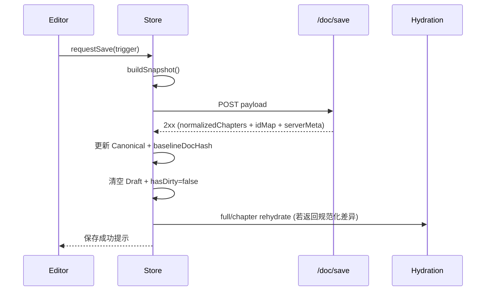

# 用户编辑与保存场景（纵向手册）

> 专门描述 TinyMCE 编辑 → Draft/哈希 → 单飞保存 → 成功/失败回调 的纵向流程。横向机制详见 [data-layer-guide.md](./data-layer-guide.md)，互斥关系见 [lifecycle-flow.md](./lifecycle-flow.md)。

## 0. 文档定位

- **范围**：监听用户输入、判定 `hasDirty`、触发自动/手动保存、守卫场景的“保存并离开”，以及失败重试逻辑。
- **假设**：保存为文档级全量上传，单人单端，无协同；保存期间允许继续输入但不会触发下一次保存。
- **依赖**：
  - 数据层：`data-layer-guide §2.3–§2.7`
  - 展示层：`../RPEditor/rendering-and-presentation-guide.md §5–§6`（解析 DOM、注水结果刷新 UI）
  - 互斥：`lifecycle-flow §4.3`

## 1. 参与模块

| 角色                        | 职责                                               | 关键文件                                                                 |
| --------------------------- | -------------------------------------------------- | ------------------------------------------------------------------------ |
| TinyMCE `onChange`          | 收集最新 HTML，触发规范化/哈希                      | `components/ReportEditor/ReportEditor.tsx`                              |
| `useEditorDraftSync`        | 规范化 HTML、计算 `currentDocHash`、维护 Draft     | `store/reportContentStore/hooks/useEditorDraftSync.ts`                  |
| `useReportContentPersistence` | 调度自动/手动保存、构建 payload、管理单飞状态       | `store/reportContentStore/hooks/useReportContentPersistence.ts`         |
| `documentDraft` & `hasDirty` | 记录脏状态、局部哈希                               | `store/reportContentStore/reducers/draftReducers.ts`                    |
| `/doc/save` API             | 接收全量结构，返回规范化结果与 `idMap`             | `apps/report-ai/src/store/reportContentStore/services`                  |
| Hydration/渲染模块          | 保存成功后注水最新 Canonical                       | `../RPEditor/rendering-and-presentation-guide.md`, `HYDRATION.md`                            |

## 2. 生命周期速览

| 阶段            | 触发条件                                 | 关键状态                              | 主要动作                                                                                             |
| --------------- | ---------------------------------------- | ------------------------------------- | ---------------------------------------------------------------------------------------------------- |
| 0. 输入监听     | TinyMCE `onChange`                       | `currentDocHash`, `hasDirty`          | 规范化 HTML → 计算 hash → 更新 Draft 元信息 → 基于 hash 判断是否脏。                                 |
| 1. 等待触发     | `hasDirty = true`                        | `documentStatus = 'idle'`             | 计时/用户操作触发保存；若 `inFlight = true` 则排队等待。                                             |
| 2. 构建快照     | 自动/手动/守卫/生成前置触发保存         | `inFlight = false`                    | 解析 DOM → 合并 Draft 元信息 → 生成 payload。                                                       |
| 3. 单飞保存     | Payload 就绪                             | `inFlight = true`, `documentStatus='saving'` | 调用 `/doc/save`（文档级全量），阻止并发保存，允许继续输入但不触发下一轮。                         |
| 4. 成功回调     | API 返回 2xx                             | `hasDirty = false`, Draft 清空        | Canonical/基线刷新，应用 `idMap`，触发注水，恢复 `documentStatus='idle'`。                          |
| 5. 失败回调     | API/网络失败                              | `documentStatus='error'`, Draft 保留  | 保留用户输入，提示重试或放弃；`inFlight` 释放，允许下一次保存。                                     |

## 3. 输入监听与脏判定（Stage 0）

1. TinyMCE `onChange` → `useEditorDraftSync` 防抖调用规范化函数：
   - 去除 TinyMCE 噪声属性；
   - 统一空行、排序属性；
   - 返回规范化 HTML。
2. 根据 HTML 计算 `currentDocHash`，与 `baselineDocHash` 对比：
   - 相等 → `hasDirty = false`，Draft 清空。
   - 不等 → `hasDirty = true`，记录 `lastDirtyAt`。
3. 通过 DOM 解析生成 Draft Tree（仅节点元信息），供 LiveOutline 与状态提示使用。

## 4. 保存触发策略（Stage 1）

| 触发来源         | 条件                                                         | 说明                                                                               |
| ---------------- | ------------------------------------------------------------ | ---------------------------------------------------------------------------------- |
| 自动保存         | `hasDirty = true` 且距离 `lastSyncAt` 超过阈值（默认 30–60s） | 阈值可根据输入频率/网络状况动态调整；若 `inFlight = true` 则顺延。                |
| 手动保存         | 用户点击“保存”                                               | 立即尝试，若 `inFlight` 则弹提示“上一轮仍在保存”。                                 |
| 离开/守卫        | `hasDirty = true` 且用户选择“保存并离开”                     | 进入保存流程，成功后继续离开；失败则让用户决定重试或留在页面。                    |
| AIGC 前置校验    | 触发生成前检测到 `hasDirty = true`                           | 自动触发保存，成功后再进入生成；失败则终止生成并提示。                            |

## 5. 构建保存快照（Stage 2）

1. 解析 TinyMCE DOM → `parseDocumentChapterTree` 生成章节结构（含临时 ID）。
2. 合并 Draft 元信息（`dirty`, `baselineHash`, `order` 等）。
3. 组装 payload：

```json
{
  "chapters": [...],        // 章节树
  "outline": {...},         // 可选：摘要/目录
  "docHash": "xxxx",        // currentDocHash
  "draftMeta": {...},       // Draft 状态
  "reportId": "...",
  "txId": "...",            // 可用于日志追踪
  "trigger": "auto|manual|guard|aigc"
}
```

4. 设置 `inFlight = true`, `documentStatus = 'saving'`。

## 6. 单飞保存与回调（Stage 3–5）



### 成功逻辑

- Canonical 替换为 `normalizedChapters`；`baselineDocHash = currentDocHash`。
- `idMap` 应用到 Draft/Outline/TinyMCE（通常通过注水 + OutlineVM 更新实现）。
- `documentStatus = 'idle'`, `inFlight = false`, `lastSyncAt = now`。
- 自动保存可记录成功时间，用于下一次触发节奏。

### 失败逻辑

- `documentStatus = 'error'`, `inFlight = false`。
- Draft 和 TinyMCE DOM 不变；`hasDirty` 保持 true。
- UI 提示“保存失败”，可提供重试按钮；若失败发生在守卫场景，提示用户选择“继续留在页面”或“放弃草稿”。
- 日志需记录 `docHash`, `txId`, 错误类型（网络/服务端/校验），便于监控。

## 7. 守卫与特殊场景

| 场景             | 处理方式                                                                                          |
| ---------------- | ------------------------------------------------------------------------------------------------- |
| 离开页面         | 若 `hasDirty` → 弹窗：保存并离开 / 放弃草稿 / 留在页面；根据用户选择触发 Stage 2–5 或清空 Draft。 |
| 历史版本还原     | 提前提示保存；若放弃 → 直接重注水历史 Canonical；若保存 → 等待成功后再改写 Canonical。          |
| 缺失章节补齐     | 期间禁用编辑；补齐完成后触发全量注水，`hasDirty` 置 false。                                      |
| 断网/离线        | 可选：写入 IndexedDB；恢复网络后比较哈希再触发保存。                                             |

## 8. 监控与调试

- 指标：保存成功率、平均/ P95 延迟、自动保存触发频次、失败类型分布、`docHash` 重复失败次数。
- 日志字段：`txId`, `docHash`, `trigger`, payload 大小、响应时长、错误码。
- 调试：配合 Redux DevTools 查看 `hasDirty`, `documentStatus`, `inFlight`, `lastSyncAt`；排查 DOM 解析问题时检查 `parseDocumentChapterTree` 输出。

## 9. 相关文档与代码

- [数据层指南 §2.3–§2.7](./data-layer-guide.md#23-规范化与文档级哈希)
- [渲染与展示层完整指南 §5](../RPEditor/rendering-and-presentation-guide.md#5-查询与解析)
- [生命周期文档 §4.3](./lifecycle-flow.md#43-用户编辑与保存单飞)
- Hooks：`useEditorDraftSync`, `useReportContentPersistence`
- Reducers：`draftReducers`, `canonicalReducers`
- Selectors：`selectHasDirty`, `selectDocumentStatus`

> 一句话：监听 TinyMCE 输入 → 规范化 + 哈希判定脏 → 自动/手动/守卫触发单飞保存 → 成功刷新 Canonical + 基线，失败保留 Draft 并提示重试；整个链路依赖哈希与 `inFlight` 控制，确保用户内容始终可恢复。
