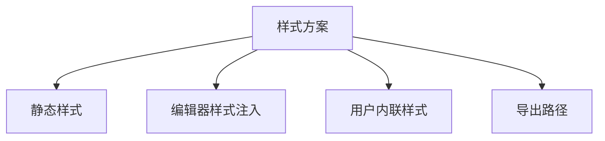
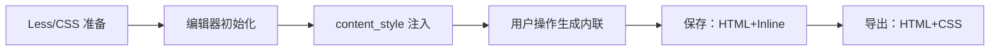
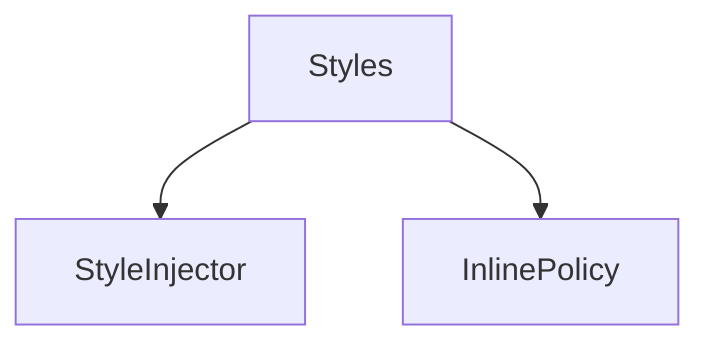

# 样式方案 前端设计文档（布局与功能）

## 🧭 设计概览

- 目标：定义“内容样式如何组织与注入编辑器”的功能路径，保障导出一致性与编辑体验。
- 范围：样式来源与层次、注入路径、运行期行为、存储策略；不列视觉规范细节（颜色/字体/间距）。

## 🗺 信息架构与导航

## 🧱 蓝图（样式层级与职责）

| 层级       | 职责             | 显示数据      | 行为           | 备注       |
| ---------- | ---------------- | ------------- | -------------- | ---------- |
| 静态样式   | 统一内容基础规范 | 基础排版规则  | 构建期产出 CSS | Less → CSS |
| 编辑器样式 | 编辑区可视一致   | content_style | 运行时注入     | 与主题解耦 |
| 用户内联   | 个性化局部样式   | 内联属性      | 由工具栏生成   | 随内容存储 |
| 自定义类   | 特殊需求         | class/style   | 高级用法       | 可选       |

## 🔄 流程与状态

- 规则表
  | 触发条件 | 系统行为 | 用户反馈 | 可撤销 | 备注 |
  | -------- | -------- | -------- | ------ | ---- |
  | 编辑器初始化 | 注入基础样式 | 编辑区呈现一致 | 是 | 与主题隔离 |
  | 用户改样式 | 生成内联属性 | 就地变化 | 是（撤销） | 进入保存内容 |
  | 导出执行 | 提供 HTML+CSS 路径 | 进度/结果 | 否 | 后端转换 |

## 🧮 数据与本地状态（技术无关）

- 存储：仅保存包含内联样式的 HTML 内容
- 提供：导出时提供 HTML 与 CSS 路径

## 🧩 组件分解与复用

- 输入：CSS 路径、编辑器引用
- 输出：注入结果、变更策略

## 🚫 非目标

- 不列配色/字体/间距等视觉规范
- 不描述编辑器以外的主题系统

## ✅ 检查清单

- [ ] 样式层级与职责清晰
- [ ] 注入与保存路径明确
- [ ] 导出依赖说明完整
