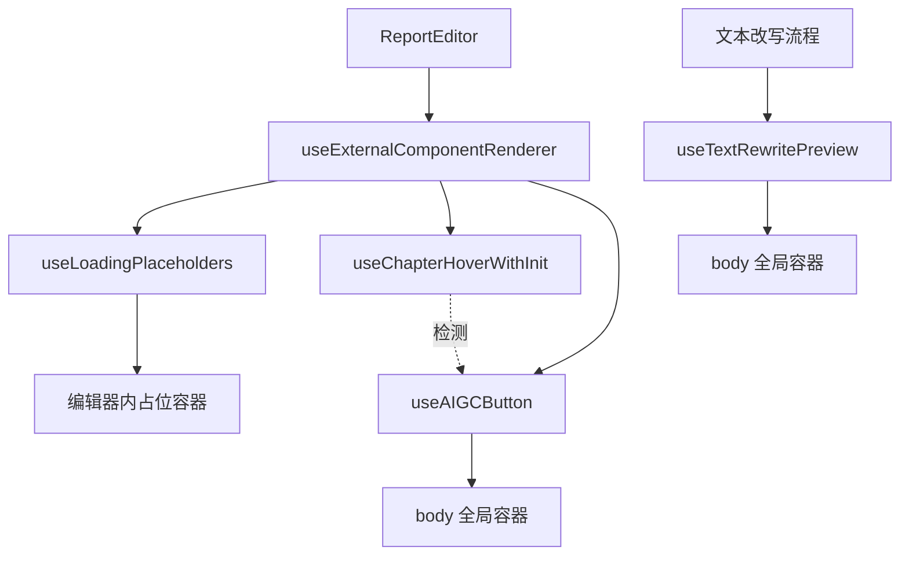

# ReportEditor 外部组件渲染设计

> 📖 本文档遵循 [设计文档编写规范](../../../docs/rule/design-doc.md)  
> ↩️ 回链：[ReportEditor 设计](./design.md)

## 🧭 设计概览

在 TinyMCE iframe 外部渲染 React 组件（加载占位、AIGC 按钮、文本改写预览），提供实时反馈与交互提示。

## 🗺 架构与组件关系



**分层职责**：

- 协调层：`useExternalComponentRenderer` 统一调度加载占位与 AIGC 按钮
- 独立层：`useTextRewritePreview` 独立管理文本改写预览
- 检测层：`useChapterHoverWithInit` 提供章节悬停检测

## 🧱 渲染策略

| 组件类型     | 渲染位置        | 生命周期     | 定位方式 | 实现 Hook                |
| ------------ | --------------- | ------------ | -------- | ------------------------ |
| 加载占位     | 编辑器内部 DOM  | 跟随章节内容 | 静态内联 | `useLoadingPlaceholders` |
| AIGC 按钮    | `document.body` | 悬停期间     | 绝对定位 | `useAIGCButton`          |
| 文本改写预览 | `document.body` | 改写会话期间 | 绝对定位 | `useTextRewritePreview`  |

**渲染时机**：使用 `Promise.resolve().then(() => requestAnimationFrame(...))` 延迟，避免与流式 DOM 更新竞争。

## 🔄 核心 Hook

### useExternalComponentRenderer（协调器）

统一调度加载占位与 AIGC 按钮的渲染时机。

**代码**：`@/components/ReportEditor/hooks/useExternalComponentRenderer.tsx`

---

### useLoadingPlaceholders（加载占位）

在章节生成时渲染加载动画与停止按钮。

**流程**：查找 `[data-chapter-loading="true"]` 容器 → 创建挂载点 `loading-mount-{chapterId}` → 渲染 `<AliceGenerating />` → 清理已消失章节。

**代码**：`@/components/ReportEditor/hooks/useLoadingPlaceholders.tsx`  
**工具**：`@/components/ReportEditor/hooks/utils/loadingPlaceholderDomUtils.ts`

---

### useChapterHoverWithInit（悬停检测）

检测鼠标悬停在章节标题（h1-h6）上的状态。

**策略**：

- 使用 `document.elementFromPoint` 快速定位
- 在 `requestAnimationFrame` 中执行检测
- 按钮守卫：标题离开时不立即清空，等待按钮接管；按钮 hover 期间锁定章节信息

**输出**：

```typescript
interface ChapterHoverInfo {
  chapterId: string;
  element: HTMLElement;
  position: { top: number; left: number };
}
```

**代码**：`@/components/ReportEditor/hooks/useChapterHoverWithInit.tsx`  
**工具**：`@/components/ReportEditor/hooks/utils/chapterHoverDomUtils.ts`

---

### useAIGCButton（AIGC 按钮）

在悬停章节标题时显示 AIGC 按钮。

**策略**：

- 全局容器：在 `document.body` 创建固定定位容器
- 按钮实例：每个章节对应一个实例，复用 React Root
- 显示控制：通过 CSS `display` 切换可见性

**流程**：检测章节悬停 → 计算位置（基于 `getBoundingClientRect()` + iframe 偏移） → 创建/复用实例 → 渲染组件 → 鼠标移动到按钮时锁定 → 离开时隐藏。

**代码**：`@/components/ReportEditor/hooks/useAIGCButton.tsx`  
**工具**：`@/components/ReportEditor/hooks/utils/aigcButtonDomUtils.ts`

---

### useTextRewritePreview（文本改写预览）

在文本改写时显示悬浮预览组件。

**生命周期**：mount（创建容器 + 加载状态） → update（流式更新，100ms 节流） → complete（显示最终内容 + 操作按钮） → unmount（用户决策后清理）。

**定位**：基于选区位置，优先下方，空间不足时上方，边界处理降级到居中。

**模块**：`hook.tsx`（主 Hook）、`types.ts`（类型）、`utils/calculatePreviewPosition.ts`（位置）、`utils/previewContainerManager.ts`（容器）、`utils/previewRenderer.tsx`（渲染）。

**代码**：`@/components/ReportEditor/hooks/useTextRewritePreview/`  
**设计**：`@/docs/specs/text-ai-rewrite-preview-floating/spec-preview-floating-v1.md`

## 🛠 通用工具

### positionCalculator

统一的浮层位置计算逻辑。

**代码**：`@/components/ReportEditor/hooks/utils/positionCalculator.ts`

---

### editorDomUtils

编辑器 DOM 操作工具：`isEditorReady()`、`getEditorBody()`、`getEditorFrameOffset()`、`applyStylesToElement()`、`deferredCleanup()`。

**代码**：`@/components/ReportEditor/hooks/utils/editorDomUtils.ts`

## 📋 错误处理

| 场景           | 处理策略                 |
| -------------- | ------------------------ |
| 编辑器未就绪   | 静默跳过渲染             |
| 容器查找失败   | 静默跳过，等待下次渲染   |
| React 渲染异常 | 捕获错误，清理容器，日志 |
| 定位计算失败   | 降级到居中布局           |

**原则**：外部组件渲染失败不影响编辑器核心功能，所有错误静默处理。

## 相关文档

- [ReportEditor 设计](./design.md)
- [文本改写预览 Spec](../../specs/text-ai-rewrite-preview-floating/spec-preview-floating-v1.md)
