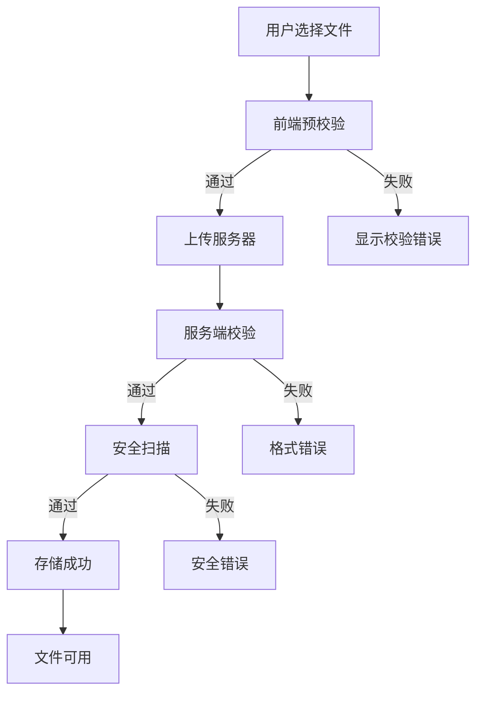

# 文件上传需求规格

## 概述

定义报告 AI 系统文件上传功能的需求规格，包括功能需求、验收标准、技术约束和异常处理。

## 用户故事

### 核心功能需求

#### US001 - 多方式文件上传
**作为**报告 AI 用户，**我希望**能通过点击/拖拽/粘贴方式上传文件，**以便**为 AI 提供报告生成所需的参考文档。

#### US002 - 文件格式支持
**作为**报告 AI 用户，**我希望**支持 PDF、Word、Excel 等格式，**以便**上传不同类型的企业资料。

#### US003 - 安全性保障
**作为**报告 AI 用户，**我希望**系统能检测恶意文件，**以便**确保文件安全和系统稳定。

#### US004 - 智能错误提示
**作为**报告 AI 用户，**我希望**获得精准的错误提示，**以便**快速理解并解决问题。

#### US005 - 批量文件处理
**作为**报告 AI 用户，**我希望**能同时上传多个文件，**以便**一次性提供完整参考资料。

## 功能流程

## 验收标准

### 功能验收

| 功能项 | 验收标准 | 优先级 |
| ---- | ---- | ---- |
| 文件选择 | 支持点击、拖拽、粘贴 | P0 |
| 前端校验 | 大小、格式正确校验 | P0 |
| 服务端校验 | MIME类型、文件头校验 | P0 |
| 安全扫描 | 病毒和恶意代码检测 | P0 |
| 错误处理 | 错误码对应提示 | P0 |
| 成功反馈 | 文件可供 AI 引用 | P0 |
| 批量处理 | 支持多文件上传 | P1 |

### 安全验收

| 场景 | 验收标准 | 优先级 |
| ---- | ---- | ---- |
| 病毒文件 | 正确拦截 | P0 |
| 恶意代码 | 正确拦截 | P0 |
| 文件伪装 | 正确识别 | P0 |
| 文件损坏 | 正确提示 | P1 |
| 安全提示 | 明确用户提示 | P0 |

### 性能验收

| 指标 | 验收标准 | 优先级 |
| ---- | ---- | ---- |
| 响应时间 | 文件选择 < 100ms | P1 |
| 上传速度 | 小文件 < 3s | P1 |
| 并发处理 | 支持5个文件 | P2 |
| 内存占用 | 无内存溢出 | P1 |

## 技术约束

### 文件约束

| 约束项 | 限制 | 说明 |
| ---- | ---- | ---- |
| 支持格式 | PDF/DOC/DOCX/TXT/JPG/PNG/XLS/XLSX | 报告相关格式 |
| 文件大小 | ≤50MB | 单个文件上限 |
| 文件数量 | ≤5个 | 单次上传限制 |
| 安全扫描 | 必须通过 | 病毒和恶意代码检测 |

### 兼容性要求
- 支持现代浏览器：Chrome 70+、Firefox 65+、Safari 12+、Edge 79+
- 支持移动端：iOS Safari 12+、Android Chrome 70+

### 安全要求

- **病毒扫描**: 所有文件必须通过病毒检测
- **恶意代码检测**: 防止恶意脚本上传
- **类型验证**: 前后端双重验证，防止文件伪装
- **完整性检查**: 检测文件损坏和篡改

## 异常处理

### 文件验证异常

| 异常类型 | 处理方式 | 用户提示 |
| ---- | ---- | ---- |
| 格式不支持 | 拒绝上传 | "请选择PDF、Word等文档文件" |
| 文件过大 | 拒绝上传 | "文件大小超过50MB限制" |
| 文件损坏 | 拒绝上传 | "文件可能已损坏，请检查完整性" |
| 空文件 | 拒绝上传 | "文件内容为空，请选择有效文件" |

### 网络异常

| 异常类型 | 处理方式 | 用户提示 |
| ---- | ---- | ---- |
| 网络中断 | 暂停等待恢复 | "网络连接中断，正在重试..." |
| 上传超时 | 自动重试3次 | "上传超时，正在重试..." |
| 服务器错误 | 显示错误信息 | "服务器异常，请稍后重试" |
| 权限不足 | 停止上传 | "上传权限不足，请联系管理员" |

### 用户操作异常

| 异常类型 | 处理方式 | 用户提示 |
| ---- | ---- | ---- |
| 重复点击 | 防抖处理 | 无提示 |
| 离开页面 | 确认提示 | "文件正在上传，确定要离开吗？" |
| 重复文件 | 允许上传 | 无特殊提示 |
| 浏览器不兼容 | 降级处理 | "浏览器版本过低，建议升级" |

## 国际化支持
- 按钮文本、错误提示、状态信息支持多语言
- 文件大小、时间、数字格式支持本地化

## 监控需求

### 基础指标
- 上传成功率
- 平均上传耗时
- 错误类型统计

### 关键事件
- 开始上传
- 上传成功/失败
- 取消上传

## 关联引用

- @see ../design.md - 交互设计规范
- @see ../api.md - API接口文档
- @see ../best-practices.md - 最佳实践指南
