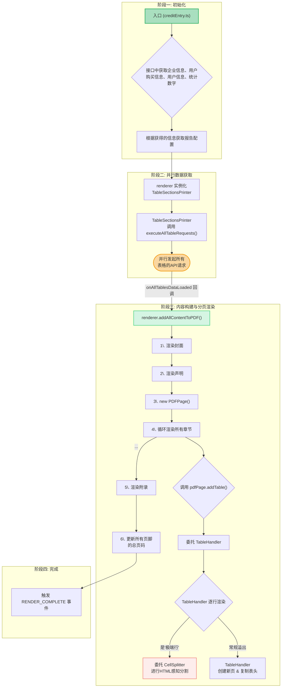

# 🖨️ `report-print` - PDF 报告生成引擎

## 🎯 它是什么？

`report-print` 是报告生成生态系统的**最终执行引擎**。它是一个纯粹的 JavaScript 应用，被设计为在 `wkhtmltopdf` 环境中运行，其唯一目标是**动态生成用于打印为 PDF 的静态 HTML 页面**。

它不包含 React 或任何现代 UI 框架，其核心是一系列原生 JS 脚本，负责获取数据、处理配置，并以编程方式构建出完整的、用于打印的报告 HTML。

## ❗ 核心原则：为 `wkhtmltopdf` 而生 ❗

**警告：此项目的所有运行时代码，最终都在 `wkhtmltopdf` 的老旧 JavaScript 引擎 (约等于 ES5) 中执行。这是整个生态系统中最需要关注兼容性的地方。**

任何违反兼容性的代码都会导致 PDF 生成过程**无声地失败**。开发此项目必须遵守以下**最高优先级**的原则：

| 规则 | 说明 |
| :--- | :--- |
| **禁止现代 JS** | **严禁**使用任何 ES6+ 语法或 API。必须使用 `report-util` 中提供的、经过兼容性验证的函数。 |
| **核心技术栈** | 项目的核心技术栈为 **ES6 (编译为 ES5)** 和 **jQuery**。禁止引入其他外部库。 |
| **CSS 兼容性** | 所有 CSS 必须以 `wkhtmltopdf` 的渲染结果为准。Flexbox 和 Grid 等需谨慎使用。分页控制 (`page-break-inside: avoid;`) 至关重要。 |
| **强制测试** | **任何代码变更**都必须通过实际运行 `pnpm run export-credit` 生成 PDF 进行端到端测试。这是**唯一**的验收标准。 |

## 工作原理

### 开发者工作流 (如何使用)

开发和测试围绕一个 Node.js 脚本 `scripts/export.cjs` 展开，该脚本封装了调用 `wkhtmltopdf` 的所有复杂逻辑。

1.  **修改代码**: 在 `src/` 目录下修改渲染逻辑。
2.  **执行命令**: 运行 `pnpm run export-credit` (或其他导出命令)。
3.  **检查产物**: 脚本会自动启动服务、执行 `wkhtmltopdf` 命令，并最终在项目根目录生成 `output-xxx.pdf` 文件和详细日志。

## 核心架构：多层职责分离

`report-print` 的核心是围绕多个职责明确的类构建的，它们协同工作，将配置和数据转换为最终的、可分页的 HTML。

| 组件 (Component) | 职责 |
| :--- | :--- |
| **渲染器 (`Renderer`)** | **总指挥**。负责获取数据和配置，实例化 `PDFPage`，并驱动整个报告的构建流程。|
| **`PDFPage`** | **页面管理器**。管理物理页面，处理常规内容添加，并在遇到表格时将任务**委托**给`TableHandler`。|
| **`TableHandler`** | **表格分页专家**。负责大型表格的**逐行渲染**和**跨页处理**，并在需要时**委托**`CellSplitter`。|
| **`CellSplitter`** | **微观分割器**。处理最复杂的"**极端行**"（单行超一页），以感知HTML的方式进行行内分割。|

这个单向、非交互的构建流程，确保了职责的清晰分离：`Renderer` 驱动 `PDFPage`，`PDFPage` 驱动 `TableHandler`，`TableHandler` 驱动 `CellSplitter`。

## 核心流程详解

下图描绘了从应用入口到最终 PDF 渲染的完整工作流程，体现了数据加载、配置处理和多阶段内容构建的真实顺序。

## 关键实现方案

### 表格渲染
项目采用组件化设计，将表格功能拆分为**基础渲染器**和**业务逻辑层**，以实现关注点分离。
- **`basicTable.js`**: 纯粹的 UI 组件，接收数据和配置，渲染出 HTML `<table>`。无业务逻辑。
- **`nodeTableRenderer.js`**: 业务逻辑层，负责调用 API 获取特定节点的数据，然后实例化 `BasicTable` 进行渲染。

### 自动分页
为了处理动态内容（特别是长表格）的自动跨页，项目实现了一套复杂而稳健的三层分页机制。
- **`PDFPage`**: 页面管理器 (物理层)。
- **`TableHandler`**: 表格处理器 (逻辑层)。
- **`CellSplitter`**: 单元格分割器 (微观层)。

这套方案的完整设计思路、组件职责和工作流程在以下文档中有详细阐述：
-   **[PDF自动分页设计方案](./docs/PDF分页设计方案.md)**
-   **[感知HTML的内容分割](./docs/感知HTML的内容分割.md)**
