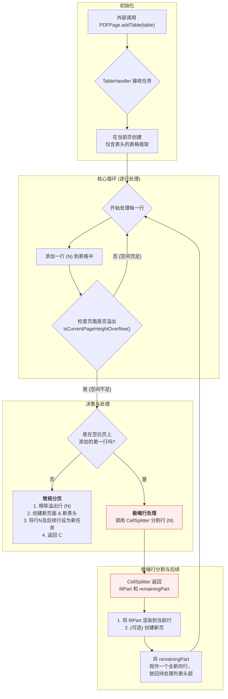

# PDF 自动分页设计方案

## 1. 核心问题与目标

在将 HTML 动态生成为多页 PDF 时，核心挑战在于如何自动、智能地处理不确定高度的内容（特别是长表格），确保其能无缝地跨页分布，同时保持布局的完整性。

**设计目标：**

-   **自动分页**：当内容超出单页容量时，能自动创建新页并迁移内容。
-   **上下文保持**：跨页的表格必须在每个新页的顶部自动重复渲染其表头。
-   **处理极端情况**：必须能处理**单行内容高度超过一整页**的极端情况，通过智能分割将其分布在多页上。
-   **关注点分离**：将页面管理、内容处理、内容分割的职责清晰地分离到独立的模块中。

## 2. 核心架构：三层职责分离

PDF 分页功能由三个核心组件协同工作完成，构成了一个职责清晰的三层架构：

| 组件 (Component) | 层级 (Layer) | 核心职责 (Core Responsibility) |
| :--- | :--- | :--- |
| **`PDFPage`** | **页面管理器 (物理层)** | 作为顶层协调者，管理物理页面。不关心内容，只负责**创建页面**、**添加页眉/页脚**，并提供关键的**状态监测**接口。 |
| **`TableHandler`**| **表格处理器 (逻辑层)** | 专门处理表格等大型可分页内容。负责**逐行渲染**、**处理常规分页**（在行与行之间分页），并在必要时**调度**`CellSplitter`处理极端行。|
| **`CellSplitter`**| **单元格分割器 (微观层)**| 处理最复杂的"行内分页"情况。负责接收`TableHandler`传递过来的"极端行"，并以**感知HTML结构**的方式，将其智能地分割为"适配部分"和"剩余部分"。 |

> `CellSplitter` 的详细设计在另一份文档中有详细阐述: **[基于DOM节点的行分割方案](./基于DOM节点的行分割方案.md)**。

## 3. 整体工作流程

以下是系统从接收一个表格到最终完成分页的完整工作流程。

### 3.1. 流程图

### 3.2. 步骤详解

1.  **启动与委托**: 外部调用 `PDFPage.addTable()`，`PDFPage` 将任务委托给 `TableHandler`。
2.  **框架初始化**: `TableHandler` 分析表格，提取所有行 (`<tr>`)，并在当前页面创建仅包含表头 (`<thead>`) 的表格框架。
3.  **逐行添加循环**: `TableHandler` 开始遍历所有待处理的行。在每一次循环中，它执行以下操作：
    a.  将当前行追加到表格的 `<tbody>` 中。
    b.  立即调用 `PDFPage.isCurrentPageHeightOverflow()` 检查页面是否溢出。
4.  **基于溢出状态的决策**:
    -   **情况A：未溢出 (Happy Path)**：页面空间充足，循环继续，处理下一行。
    -   **情况B：常规溢出**: 如果添加行导致溢出，且**不是**在空白页上添加的第一行，则执行**常规分页**：
        1.  移除导致溢出的那一行。
        2.  调用 `PDFPage.addPage()` 创建一个新页面。
        3.  在新页面上重新创建表格框架（含表头）。
        4.  将刚刚移除的行及所有后续行作为新的任务列表，返回步骤3的核心循环。
    -   **情况C：极端行溢出**: 如果添加的行导致溢出，且这**是**在空白页上添加的第一行（即该行自身高度超过一整页），则执行**极端行处理**:
        1.  调用 `CellSplitter` 对该行进行微观分割，得到 `fitPart` (适配部分) 和 `remainingPart` (剩余部分)。
        2.  将 `fitPart` 的内容更新到当前行中，这部分保证了页面不会溢出。
        3.  将 `remainingPart` 视作一个全新的、待处理的行，将其放回待处理列表的**最前端**。
        4.  返回步骤3的核心循环。`remainingPart` 在下一次迭代中会被处理，它自身也可能是一个极端行，会被再次分割。

通过这种宏观（页面管理）、中观（行处理）和微观（单元格内容分割）的三层架构，系统得以稳定、可靠地处理各种复杂的自动分页场景。
